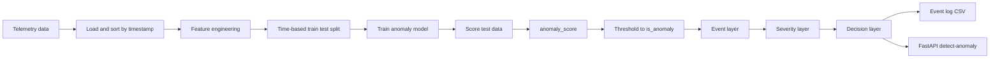

# 01 Architecture Pipeline

## Pipeline tổng quan

Project đi theo pipeline AIoT thực tế:

```text
telemetry -> feature engineering -> anomaly model -> anomaly_score -> event layer -> decision layer -> API
```

Điểm quan trọng là pipeline không dừng ở model. Trong hệ thống AIoT, model chỉ là một thành phần. Kết quả model phải được chuyển thành event có ý nghĩa vận hành trước khi gửi cho dashboard, rule engine, operator hoặc hệ thống điều khiển.

## Sơ đồ Mermaid



## Offline flow: train và đánh giá model

Offline flow được chạy bằng script:

```powershell
python src/download_data.py
python src/train_anomaly.py
python src/plot_results.py
```

Flow chi tiết:

1. `src/download_data.py` tải dữ liệu NAB hoặc dùng sample fallback.
2. `src/utils.py` đọc CSV, parse timestamp, sort theo thời gian, tạo label nếu thiếu.
3. `add_time_features()` tạo các feature như rolling mean, rolling std, delta, z-score và stuck flag.
4. `time_split()` chia train/test theo thứ tự thời gian.
5. `train_isolation_forest()` train model trên dữ liệu bình thường nếu có label.
6. Model tạo raw score, sau đó được normalize thành `anomaly_score`.
7. Threshold theo quantile biến `anomaly_score` thành `is_anomaly`.
8. `evaluate_detection()` tạo Precision, Recall, F1 và Confusion Matrix.
9. `build_events()` biến anomaly thành event có `severity`, `event_type`, `decision`.
10. Output được lưu vào `models/`, `outputs/`, `figures/`.

## Online flow: API nhận telemetry mới

Online flow được chạy bằng:

```powershell
uvicorn src.app:app --reload
```

Flow khi gọi `/detect-anomaly`:

1. Client gửi một danh sách `history` gồm nhiều điểm telemetry.
2. API chuyển JSON thành DataFrame.
3. API parse timestamp và sort theo thời gian.
4. API gọi `add_time_features()` để tạo feature giống training.
5. API lấy dòng mới nhất để score.
6. Model Isolation Forest trả raw score.
7. API chuyển raw score thành score demo bằng sigmoid.
8. API suy ra `is_anomaly`.
9. API tạo event gồm `event_type`, `severity`, `decision`, `explanation`.
10. API trả JSON cho client.

## Input và output chính

Input batch training:

```text
data/ambient_temperature_system_failure_labeled.csv
columns: timestamp, value, label
```

Input API:

```json
{
  "history": [
    {
      "timestamp": "2013-07-05 09:00:00",
      "value": 27.5,
      "device_id": "room_temp_01"
    }
  ]
}
```

Output model:

```text
anomaly_score
is_anomaly
model_version
```

Output event:

```text
event_type
severity
decision
explanation
safety_note
```

## Vì sao cần event layer?

`anomaly_score` là tín hiệu kỹ thuật từ model. Nó không tự trả lời đầy đủ câu hỏi vận hành.

Ví dụ:

- Score 0.90 trên cảm biến nhiệt độ kho lạnh có thể là sự cố nghiêm trọng.
- Score 0.90 trên cảm biến môi trường phòng học có thể chỉ cần cảnh báo.
- Score 0.60 lặp lại 30 lần trong 10 phút có thể nghiêm trọng hơn một spike score 0.85 duy nhất.

Event layer giúp đưa thêm ngữ cảnh:

- Thiết bị nào bị ảnh hưởng?
- Loại bất thường là gì?
- Có dấu hiệu nhảy đột ngột hay sensor stuck không?
- Có cần cảnh báo ngay không?
- Có cần xác nhận thủ công trước khi điều khiển không?

## Hai pipeline cần tách biệt

### Test model trong notebook hoặc script

Mục tiêu là đánh giá chất lượng model. Nó chạy trên tập test nhiều dòng, có label, có metric và biểu đồ.

Output chính:

- `iforest_metrics.json`
- `iforest_test_predictions.csv`
- `anomaly_event_log.csv`
- `figures/*.png`

### Deploy model qua API

Mục tiêu là kiểm tra model có dùng được trong hệ thống không. API nhận telemetry mới, trả response có cấu trúc để service khác tiêu thụ.

Output chính:

- JSON response.
- Latency.
- Event object.
- Decision object.

## Nhận xét kỹ thuật

- Pipeline đã thể hiện đúng tư duy AIoT: không gọi model là kết thúc, mà chuyển model output thành event và decision.
- Feature engineering đang nằm chung trong `utils.py`, giúp training và API dùng lại cùng logic.
- API hiện chỉ score dòng mới nhất trong history. Đây là cách đơn giản, phù hợp demo.
- Cách normalize score trong API khác training. Đây là điểm cần cải tiến nếu muốn score có ý nghĩa ổn định.

## Đề xuất cải tiến

- Tách `scoring.py` để dùng chung cho training và API.
- Lưu calibration metadata cùng model: threshold, score min/max, quantile, feature list, model version.
- Thêm stream processor cho dữ liệu real-time thay vì chỉ nhận request HTTP.
- Thêm event store để lưu mọi event thay vì chỉ trả JSON.
- Thêm rule engine riêng cho severity và decision.
