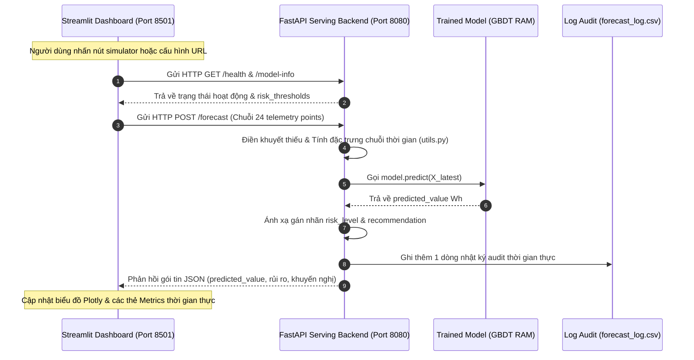

# HƯỚNG DẪN VẬN HÀNH BẢNG ĐIỀU KHIỂN AIoT FORECASTING DASHBOARD

Bảng điều khiển **AIoT Energy Forecasting Dashboard** được phát triển bằng ngôn ngữ Python sử dụng hai thư viện giao diện và đồ thị hàng đầu hiện nay là **Streamlit** và **Plotly**. 

Ứng dụng đóng vai trò là giao diện hiển thị thông tin quản lý năng lượng tòa nhà thông minh thời gian thực (Building Energy Management System - BEMS), kết nối trực tiếp với máy chủ FastAPI phục vụ mô hình học máy.

---

## 🚀 Tính năng vượt trội của Dashboard

1.  **Giao diện Dark Theme Premium**: Thiết kế tối sâu chuyên nghiệp, phù hợp với các phòng điều hành trung tâm giám sát năng lượng đô thị thông minh (Smart City Grid).
2.  **Chỉ số đo đạc tức thời (Real-time Telemetry Cards)**: Hiển thị phụ tải Wh hiện tại, dự báo Wh cho 10 phút tiếp theo, chân trời dự báo và phiên bản mô hình học máy đang chạy.
3.  **Tầng đánh giá rủi ro động (Dynamic Risk & Recommendation Panels)**: Tích hợp cảnh báo rủi ro 4 cấp độ (NORMAL, WARNING, HIGH, CRITICAL) và hành động khuyến nghị tự động tương ứng, đi kèm ghi chú an toàn khóa chốt biên nhúng.
4.  **Simulated Telemetry Bridge**: Cho phép người dùng bấm nút giả lập gửi chuỗi 24 điểm đo từ Client lên FastAPI Server để suy diễn và cập nhật kết quả dự báo tức thời lên màn hình BEMS.
5.  **Đồ thị tương tác Plotly (Interactive Charts)**:
    *   Đồ thị **Actual vs Forecasted** hiển thị trực quan mức độ lệch pha của phụ tải, đi kèm 2 đường ngưỡng rủi ro tĩnh Warning/Critical.
    *   Đồ thị **Sai số tức thời (Forecast Error)** đo đạc mức độ lệch cao (Overestimation) hay lệch thấp (Underestimation) của mô hình.
6.  **Nhật ký đối soát thời gian thực**: Đọc và hiển thị bảng đối soát chi tiết từ tệp tin audit `outputs/forecast_log.csv` dưới dạng bảng dữ liệu có thể cuộn, tìm kiếm, lọc và sắp xếp.

---

## 🛠️ Hướng dẫn cài đặt và Khởi chạy

Để chạy Bảng điều khiển, bạn chỉ cần thực hiện 3 bước đơn giản trên Terminal tại thư mục gốc của dự án:

### Bước 1: Cài đặt các thư viện bổ trợ (Streamlit & Plotly)
Chạy lệnh sau trên terminal để tải các gói giao diện cần thiết:
```bash
pip install streamlit plotly requests
```

### Bước 2: Đảm bảo máy chủ FastAPI Server đang hoạt động
Bảng điều khiển kết nối trực tiếp với API Serve thông qua giao thức HTTP REST. Đảm bảo bạn đã bật FastAPI trên cổng **`8080`**:
```bash
uvicorn src.app:app --reload --port 8080
```

### Bước 3: Khởi chạy Bảng điều khiển Streamlit
Mở một cửa sổ Terminal mới (đảm bảo đang đứng ở thư mục gốc của dự án) và chạy lệnh:
```bash
streamlit run dashboard/app.py
```

*Đường dẫn truy cập*: Trình duyệt web sẽ tự động mở trang web Bảng điều khiển tại địa chỉ:
👉 **`http://localhost:8501/`**

---

## 🏗️ Kiến trúc & Luồng Dữ liệu (Data Flow Architecture)

Sơ đồ Mermaid dưới đây biểu diễn cách thức luân chuyển dữ liệu và tương tác giữa các cấu phần trong hệ thống:



---

## 🔮 Đề xuất hướng phát triển tiếp theo

1.  **Auto-refresh & WebSockets**: Tích hợp cơ chế tự động làm mới trang sau mỗi 10 phút (chu kỳ đo IoT) để giao diện luôn cập nhật phụ tải mới nhất mà không cần bấm nút thủ công.
2.  **Tích hợp MQTT Broker Listener**: Chuyển luồng Simulator từ HTTP REST sang cơ chế lắng nghe trực tiếp luồng bản tin MQTT EMQX từ các cảm biến vật lý thực tế gửi lên.
3.  **Bản đồ nhiệt 3D (Building heat map)**: Tích hợp thư viện đồ thị 3D của Plotly để hiển thị bản đồ nhiệt độ tòa nhà dựa trên các biến cảm biến `T1` đến `T9` trong dataset UCI, giúp quản trị viên tối ưu hóa vị trí lắp đặt HVAC.
