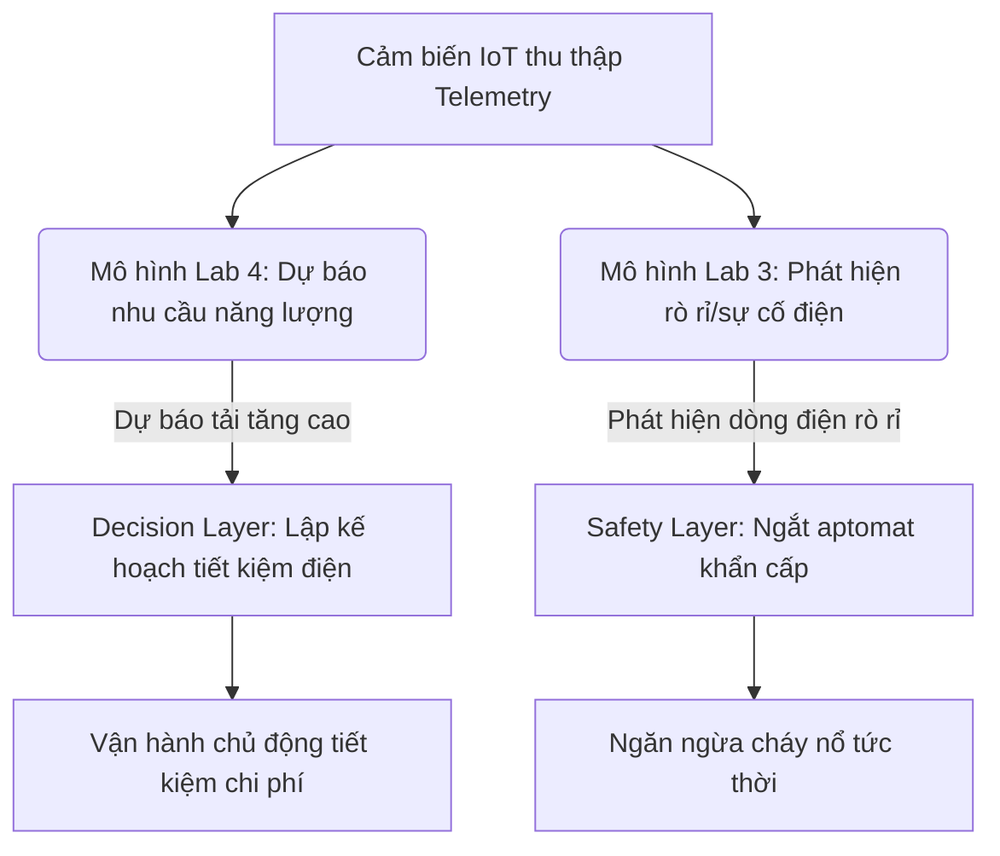

# TỔNG QUAN DỰ ÁN LAB 4: FORECASTING & PREDICTIVE ANALYTICS

## 1. Giới thiệu Bài toán và Mục tiêu học tập

Trong kỷ nguyên của **Internet vạn vật kết hợp Trí tuệ nhân tạo (AIoT)**, dữ liệu cảm biến được thu thập liên tục từ môi trường xung quanh. Tuy nhiên, nếu chỉ dừng lại ở việc xem xét trạng thái hiện tại (giám sát thời gian thực), hệ thống sẽ ở thế bị động. Để tối ưu hóa chi phí vận hành, tiết kiệm năng lượng và đưa ra các quyết định chủ động, hệ thống AIoT cần có khả năng **"nhìn trước tương lai"**.

**Lab 4: Forecasting & Predictive Analytics** tập trung vào bài toán dự báo chuỗi thời gian (time-series forecasting). Cụ thể, hệ thống sẽ sử dụng dữ liệu tiêu thụ điện của các thiết bị gia dụng trong quá khứ cùng với thông số thời tiết và cảm biến nhiệt độ/độ ẩm trong nhà để **dự báo lượng điện tiêu thụ trong 10 phút tiếp theo (`Appliances` Wh)**. 

### Mục tiêu học tập cốt lõi của sinh viên:
1.  **Hiểu phương pháp mô hình hóa chuỗi thời gian**: Cách biến dữ liệu chuỗi thời gian thô thành dữ liệu học có giám sát (supervised learning table).
2.  **Làm chủ kỹ nghệ đặc trưng (Feature Engineering) cho IoT**: Biết cách tính toán đặc trưng độ trễ (Lag), cửa sổ trượt (Rolling), sai phân (Delta), và biến đổi tuần hoàn thời gian (Cyclic Time).
3.  **Kỹ năng đánh giá mô hình hồi quy (Regression)**: Phân biệt và tính toán các chỉ số sai số vật lý như MAE, RMSE, MAPE và xu hướng lệch dự báo (Forecast Bias).
4.  **Tư duy phản biện về mô hình Baseline**: Hiểu rõ tại sao một mô hình AI phức tạp chỉ có giá trị khi nó vượt qua được các quy tắc suy diễn cơ bản (Last Value, Moving Average).
5.  **Triển khai kiến trúc API & Lớp quyết định an toàn**: Hiểu cơ chế đóng gói model bundle và triển khai thành API FastAPI phục vụ dự báo động, đồng thời tích hợp lớp cảnh báo rủi ro an toàn trước khi gửi lệnh điều khiển phần cứng.

---

## 2. Sự khác biệt bản chất: Lab 4 (Forecasting) vs Lab 3 (Anomaly Detection)

Một trong những sai lầm phổ biến nhất của sinh viên là đánh đồng bài toán **Dự báo (Forecasting)** với **Phát hiện bất thường (Anomaly Detection)**. Mặc dù cả hai đều phục vụ mục đích quản lý vận hành, chúng khác nhau hoàn toàn về triết lý thiết kế hệ thống, thuật toán, dữ liệu mục tiêu và cách đánh giá.

Dưới đây là bảng so sánh chi tiết giữa hai dự án Lab:

| Tiêu chí | Lab 3: Anomaly Detection (Phát hiện bất thường) | Lab 4: Forecasting & Predictive Analytics (Dự báo) |
| :--- | :--- | :--- |
| **Câu hỏi cốt lõi** | *"Hệ thống có đang xảy ra sự cố hay bất thường tại thời điểm hiện tại không?"* | *"Giá trị của thông số đo đạc trong tương lai gần (t+1, t+n) sẽ là bao nhiêu?"* |
| **Dòng chảy sự kiện** | **Event Pipeline**: Phân tích tức thời từng mẫu dữ liệu đơn lẻ (point-in-time) để phân loại. | **Forecasting Pipeline**: Tích lũy dữ liệu lịch sử liên tục để ngoại suy xu hướng tương lai. |
| **Dữ liệu mục tiêu (Target)** | Không có target tự nhiên (Unsupervised) hoặc nhãn nhị phân: `0` (Bình thường), `1` (Bất thường). | Có target tự nhiên liên tục trong tương lai: Công suất điện tiêu thụ thực tế `Appliances` Wh tại thời điểm $t + 1$. |
| **Kỹ nghệ đặc trưng** | Tập trung vào phân phối dữ liệu hiện tại, khoảng cách đa chiều (ví dụ: Isolation Forest, Elliptic Envelope). | Tập trung vào cấu trúc tự tương quan (autocorrelation), độ trễ (lag), cửa sổ trượt (rolling), tính tuần hoàn (cyclic time). |
| **Độ chia dữ liệu (Data Split)** | Thường dùng Random Split hoặc huấn luyện trên dữ liệu bình thường (semi-supervised). | Bắt buộc phải dùng **Chronological Split** (phân chia theo dòng thời gian) để tránh rò rỉ dữ liệu tương lai. |
| **Chỉ số đánh giá (Metrics)** | Chỉ số phân loại (Classification Metrics): **Precision, Recall, F1-Score, AUC-ROC**. | Chỉ số sai số hồi quy (Regression Errors): **MAE, RMSE, MAPE, Forecast Bias**. |
| **Đầu ra API (Output)** | `anomaly_score` (độ bất thường), `severity` (mức nghiêm trọng), cảnh báo nhị phân. | `predicted_value` (giá trị dự báo), `risk_level` (mức rủi ro), `recommendation` (hành động khuyến nghị). |
| **Hành động hệ thống** | Kích hoạt chuông báo động, gửi thông báo khẩn cấp, cô lập thiết bị lỗi ngay lập tức. | Hoạch định kế hoạch dịch chuyển phụ tải, tối ưu hóa năng lượng, chuẩn bị kịch bản dự phòng bảo trì. |

---

## 3. Tại sao hai bài toán này lại bổ trợ cho nhau trong AIoT?

Trong một hệ thống quản lý năng lượng tòa nhà (BEMS - Building Energy Management System) thực tế, Lab 3 và Lab 4 được tích hợp song song tạo thành một vòng lặp quản lý thông minh khép kín:

*   **Tính chủ động (Proactive - Lab 4)**: Giúp người quản lý biết trước phụ tải điện sẽ tăng vọt vào lúc 18:00 tối nay để chủ động sạc đầy pin lưu trữ điện mặt trời từ lúc 14:00 chiều (khi trời nắng to và giá điện rẻ).
*   **Tính phản ứng (Reactive - Lab 3)**: Giúp ngắt dòng điện ngay lập tức khi phát hiện dòng rò hoặc thiết bị chập cháy đột ngột ngoài kịch bản dự báo thông thường.

Sự kết hợp này đảm bảo hệ thống AIoT vừa **đạt hiệu quả kinh tế tối đa**, vừa **đảm bảo an toàn kỹ thuật tuyệt đối**.
