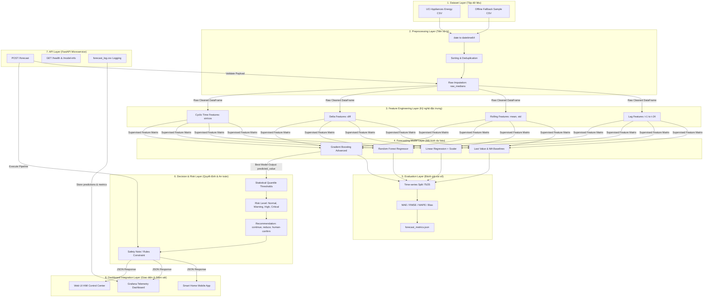
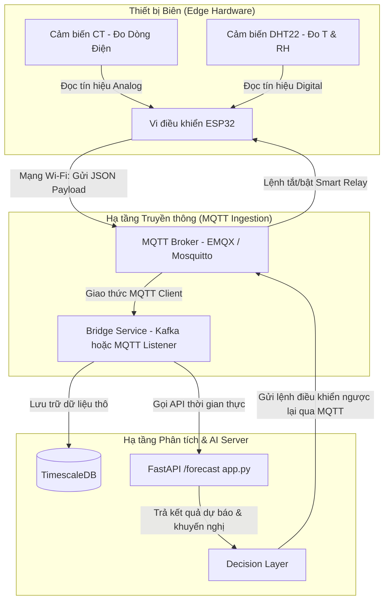

# KIẾN TRÚC HỆ THỐNG AIoT DỰ BÁO PHỤ TẢI ĐIỆN THÔNG MINH

Hệ thống dự báo phụ tải năng lượng (Load Forecasting) trong một ngôi nhà thông minh hoặc tòa nhà thương mại đòi hỏi sự phối hợp nhịp nhàng giữa thiết bị phần cứng cảm biến và hạ tầng phần mềm phân tích dữ liệu chuỗi thời gian.

Tài liệu này trình bày chi tiết kiến trúc phân tầng chuyên sâu của dự án **Lab 4**, phân tích nơi trí tuệ nhân tạo (AI) vận hành, cách hệ thống ánh xạ vào thực tế tòa nhà thông minh, và kịch bản mở rộng tích hợp phần cứng ESP32 qua giao thức MQTT.

---

## 1. Sơ đồ Kiến trúc Tổng thể (High-Level Architecture Diagram)

Dưới đây là sơ đồ Mermaid mô tả chi tiết kiến trúc phân tầng tích hợp đa lớp của hệ thống AIoT từ tầng thu thập dữ liệu biên cho đến tầng hiển thị và ra quyết định:



---

## 2. Giải thích Chi tiết Từng Lớp Kiến trúc (Eight-Layer Explanation)

Kiến trúc hệ thống của Lab 4 được chia thành 8 lớp chức năng độc lập, có ranh giới module rõ ràng:

### 1. Dataset Layer (Lớp dữ liệu nguồn)
*   **Chức năng**: Cung cấp nguồn dữ liệu thô đầu vào phản ánh hoạt động tiêu thụ năng lượng thực tế.
*   **Trong bài Lab**: Bao gồm tệp dữ liệu chính thống từ kho UCI `energydata_complete.csv` (nếu tải online) hoặc tệp fallback offline `sample_energydata_complete.csv` đặt trong thư mục `data/`. Dữ liệu chứa các mốc thời gian cách nhau 10 phút, lượng điện tiêu thụ của thiết bị (`Appliances`) và các thông số cảm biến môi trường.

### 2. Preprocessing Layer (Lớp tiền xử lý & làm sạch)
*   **Chức năng**: Chuẩn hóa kiểu dữ liệu, bảo đảm tính tuần tự của chuỗi thời gian và loại bỏ nhiễu.
*   **Trong bài Lab**: Cài đặt trong hàm `load_dataset()` và `fill_missing_for_api()`. Nó chuyển cột `date` sang kiểu datetime, sắp xếp tăng dần, xóa các dòng trùng lặp mốc thời gian và điền các giá trị cảm biến bị thiếu bằng bộ trung vị thô `raw_medians` được lưu từ quá trình huấn luyện.

### 3. Feature Engineering Layer (Lớp kỹ nghệ đặc trưng)
*   **Chức năng**: Chuyển đổi dữ liệu cảm biến thô tĩnh thành các đặc trưng chuỗi thời gian động biểu diễn xu hướng lịch sử và tính tuần hoàn sinh hoạt.
*   **Trong bài Lab**: Cài đặt trong hàm `add_time_features()` và `add_lag_rolling_features()`. Nó tạo ra:
    *   **Lag features**: Lượng điện tiêu thụ ở các thời điểm trước ($t-1$, $t-2...$ lên tới 4 tiếng trước).
    *   **Rolling features**: Trung bình trượt và độ lệch chuẩn của lượng điện trong các cửa sổ 30 phút, 1 tiếng, 2 tiếng, 4 tiếng gần nhất.
    *   **Delta features**: Gia tốc thay đổi phụ tải điện năng.
    *   **Cyclic Time features**: Phép quay lượng giác Sin/Cos của giờ trong ngày và ngày trong tuần để bảo toàn khoảng cách thời gian liền kề (ví dụ: mốc 23:50 tối rất gần 00:10 sáng hôm sau).

### 4. Forecasting Model Layer (Lớp mô hình dự báo)
*   **Chức năng**: Thực hiện suy luận toán học từ véc-tơ đặc trưng đầu vào để ngoại suy giá trị phụ tải điện tiêu thụ trong 10 phút tiếp theo.
*   **Trong bài Lab**: Cài đặt trong `train_forecast.py` và nạp phục vụ trong `app.py`. Nó chứa đồng thời các mô hình Baseline để đối chứng (`Last Value`, `Moving Average 6`) và các mô hình Học máy từ tuyến tính đơn giản đến phi tuyến phức tạp (`Linear Regression`, `Random Forest`, `Gradient Boosting`). Mô hình xuất sắc nhất sẽ được chọn tự động để đưa vào sản xuất.

### 5. Evaluation Layer (Lớp đánh giá sai số ngoại tuyến)
*   **Chức năng**: Kiểm định nghiêm ngặt chất lượng dự báo của mô hình trước khi cho phép triển khai lên môi trường thực tế.
*   **Trong bài Lab**: Cài đặt trong hàm `time_split()` và `regression_metrics()`. Nó phân chia dữ liệu theo dòng thời gian (Time-series Split 75% huấn luyện quá khứ, 25% kiểm thử tương lai) để tránh rò rỉ dữ liệu, và tính toán 4 chỉ số sai số toán học: **MAE, RMSE, MAPE, và Forecast Bias**, lưu kết quả tại `outputs/forecast_metrics.json`.

### 6. Decision & Risk Layer (Lớp quyết định & Phân cấp rủi ro)
*   **Chức năng**: Ánh xạ giá trị dự báo năng lượng thô (Wh) sang các hành động vận hành an toàn trong thực tế tòa nhà.
*   **Trong bài Lab**: Cài đặt trong hàm `risk_from_prediction()` và `recommendation_from_risk()`. Sử dụng các ngưỡng phân vị xác suất ($70\%, 90\%, 97\%$) từ tập huấn luyện để xếp hạng rủi ro (**NORMAL, WARNING, HIGH, CRITICAL**) kèm khuyến nghị tương ứng (**CONTINUE, REDUCE, HUMAN_CONFIRM**). Lớp này tích hợp cảnh báo an toàn (`safety_note`) yêu cầu con người phê duyệt trước khi kích hoạt bộ chấp hành.

### 7. API Layer (Lớp dịch vụ phục vụ trực tuyến)
*   **Chức năng**: Phơi mô hình học máy ra môi trường mạng dưới dạng Web Service để tiếp nhận dữ liệu thời gian thực và trả kết quả tức thời.
*   **Trong bài Lab**: Cài đặt trong file `src/app.py` sử dụng thư viện **FastAPI**. API thực hiện nạp tệp `.joblib` khi khởi động (cold start), cung cấp các endpoint `/health` (kiểm tra trạng thái), `/model-info` (thông tin mô hình & sai số) và `/forecast` (suy diễn thời gian thực từ dữ liệu lịch sử thô gửi lên), đồng thời ghi nhật ký dự báo đồng thời vào file nhật ký hệ thống `forecast_log.csv`.

### 8. Dashboard Integration Layer (Lớp giao diện & Giám sát)
*   **Chức năng**: Trực quan hóa dữ liệu đo đạc cảm biến và kết quả dự báo của mô hình để người dùng hoặc kỹ sư tòa nhà dễ dàng theo dõi.
*   **Trong bài Lab**: Được biểu diễn thông qua các tệp xuất bản đồ thị trong `figures/` (như biểu đồ so sánh thực tế vs dự báo, sai số theo thời gian và so sánh mô hình), tương đương với việc tích hợp các đồ thị này lên các hệ thống hiển thị trực quan chuyên dụng như **Grafana** hay giao diện ứng dụng Smart Home trên điện thoại.

---

## 3. Trí tuệ Nhân tạo (AI) "Sống" ở Đâu trong Hệ thống?

Trong kiến trúc hệ thống AIoT của Lab 4, Trí tuệ nhân tạo (AI/ML) không phải là một thực thể chạy tự do mà "sống" tập trung tại **hai trạng thái vận hành cụ thể**:

```mermaid
graph LR
    subgraph "A. Trạng thái Huấn luyện Ngoại tuyến (Offline Training)"
        A1[train_forecast.py] -->|Đọc dữ liệu lịch sử| A2[Trích xuất Đặc trưng]
        A2 -->|Học trọng số tuyến tính / Chia nhánh cây quyết định / Sửa sai Gradient| A3[Tạo Model Bundle .joblib]
    end

    subgraph "B. Trạng thái Suy diễn Trực tuyến (Online Serving)"
        B1[app.py FastAPI] -->|Nạp Model từ RAM| B2[Chờ Request POST /forecast]
        B2 -->|Tính đặc trưng động tại điểm t| B3[Inference: model.predict]
        B3 -->|Trả kết quả dự báo Wh| B4[Decision Layer]
    end
    
    A3 -->|Deploy| B1
```



### 1. Nơi trú ngụ trong giai đoạn Huấn luyện Ngoại tuyến (Offline Training Phase)
*   **AI sống trong**: File `src/train_forecast.py`.
*   **Bản chất toán học**: AI học hỏi cấu trúc tự tương quan từ dữ liệu quá khứ.
    *   Đối với *Linear Regression*, AI sống trong **ma trận hệ số trọng số $W$ và hệ số chặn $b$** tìm được sau khi giải bài toán tối ưu hóa bình phương tối thiểu (OLS).
    *   Đối với *Random Forest* và *Gradient Boosting*, AI sống trong **cấu trúc phân nhánh phân cấp của hàng trăm cây quyết định** (chứa các quy tắc cắt ngưỡng đặc trưng $X_j > \text{threshold}$).
*   **Đóng gói**: Toàn bộ các tri thức toán học này được đóng băng (serialized) và lưu xuống ổ đĩa thành file nhị phân `models/forecast_model_bundle_v1.joblib`.

### 2. Nơi hoạt động trong giai đoạn Phục vụ Trực tuyến (Online Serving Phase)
*   **AI sống trong**: RAM của tiến trình FastAPI (`src/app.py`) khi nạp tệp `.joblib`.
*   **Bản chất vận hành**: Khi nhận được request `/forecast` chứa chuỗi dữ liệu thô lịch sử, AI thức tỉnh. Nó tiếp nhận các đặc trưng động thời gian thực tại mốc thời gian hiện tại $t$, thực hiện phép nhân ma trận (Linear Regression) hoặc duyệt qua hàng nghìn nút của các cây quyết định (Random Forest / Gradient Boosting) để suy diễn ra một con số dự báo Wh duy nhất cho 10 phút sau.
*   **Lợi ích**: Tách biệt pha huấn luyện (nặng nề, tốn tài nguyên) ra khỏi pha phục vụ (nhẹ nhàng, phản hồi tức thời < 50ms) giúp AI chạy mượt mà ngay trên các máy tính nhúng biên hoặc Edge Gateway.

---

## 4. Ánh xạ từ Bài Lab đến Hệ thống Vận hành Điện Tòa nhà Thực tế

Dự án **Lab 4** là một mô hình thu nhỏ hoàn hảo (Digital Twin) của một hệ thống quản lý năng lượng tòa nhà thông minh quy mô công nghiệp (BEMS - Building Energy Management System). Bảng dưới đây thể hiện sự tương thích ánh xạ $1:1$ giữa cấu phần bài Lab và hệ thống thực tế:

| Cấu phần trong Lab 4 | Tương đương trong Hệ thống Tòa nhà Thực tế (BEMS) |
| :--- | :--- |
| **`sample_energydata_complete.csv`** | Cơ sở dữ liệu lịch sử chuỗi thời gian lưu trữ tập trung (ví dụ: **InfluxDB** hoặc **TimescaleDB**) ghi nhận hàng năm trời tiêu thụ điện của tòa nhà. |
| **Cảm biến nhiệt độ/độ ẩm các phòng (`T1`-`T9`)** | Mạng lưới cảm biến môi trường IoT không dây (chuẩn giao thức **Zigbee/LoraWAN**) lắp đặt tại từng văn phòng, phòng họp, hành lang tòa nhà. |
| **Trạm thời tiết ngoài trời (`T_out`, `Windspeed`...)** | API dịch vụ dự báo thời tiết khí tượng thủy văn thời gian thực (ví dụ: **OpenWeatherMap API**) tích hợp trực tiếp vào hệ thống. |
| **`train_forecast.py`** | Pipeline tự động hóa huấn luyện mô hình (ML Pipeline) chạy định kỳ mỗi tuần một lần trên Cloud Server hoặc máy chủ ảo AWS/Azure EC2. |
| **`app.py` (FastAPI /forecast)** | Máy chủ phân tích thông minh đặt tại phòng điều khiển trung tâm (Edge Gateway) chạy liên tục $24/7$ để đưa ra dự báo phụ tải ngắn hạn. |
| **`forecast_log.csv`** | Nhật ký vận hành (Audit Log DB) dùng để đối soát sai lệch công suất, vẽ đồ thị giám sát độ lệch mô hình (Model Drift) phục vụ đội ngũ kỹ sư vận hành. |
| **`risk_level` & `recommendation`** | Bộ điều khiển tối ưu hóa phụ tải (Load Shedding Controller) đưa ra các tín hiệu điều khiển tòa nhà. |
| **`figures/` (forecast_vs_actual.png...)** | Giao diện giám sát vận hành trung tâm **Grafana Dashboard** hiển thị công suất dự báo vs thực tế cho giám đốc quản lý tòa nhà theo dõi. |

---

## 5. Kịch bản Mở rộng: Tích hợp Phần cứng ESP32, MQTT và Telemetry Thực tế

Để nâng cấp dự án Lab 4 từ mô hình giả lập offline thành một hệ thống AIoT chạy thực tế với thiết bị phần cứng, ta cần tích hợp thêm chip nhúng **ESP32** và giao thức truyền tin **MQTT**:



### 1. Thay đổi ở tầng thiết bị Biên (ESP32 Edge Hardware)
*   **Phần cứng**: Lắp đặt vi điều khiển **ESP32** kết nối với cảm biến dòng điện **non-invasive CT (SCT-013)** kẹp vào dây nguồn tổng để đo công suất `Appliances` thời gian thực, và cảm biến **DHT22** để đo nhiệt độ/độ ẩm phòng.
*   **Logic lập trình (C++ / MicroPython)**: ESP32 được lập trình để cứ mỗi 10 phút một lần, nó thu thập dữ liệu cảm biến, đóng gói thành gói tin JSON thô:
    ```json
    {
      "date": "2026-05-26 07:45:00",
      "Appliances": 120.0,
      "lights": 10.0,
      "T1": 25.4,
      "RH_1": 60.2,
      "T_out": 30.5
    }
    ```

### 2. Thay đổi ở tầng truyền thông (MQTT Ingestion)
*   **Giao thức**: Thay vì gọi HTTP POST trực tiếp lên FastAPI (giao thức HTTP nặng và tốn băng thông), ESP32 kết nối Wi-Fi và xuất bản (Publish) gói tin JSON trên vào một **MQTT Topic** (ví dụ: `smarthome/telemetry/raw`).
*   Một **MQTT Broker** trung gian (như *EMQX* hoặc *Mosquitto*) chịu trách nhiệm phân phối gói tin này.

### 3. Thay đổi ở tầng AI Server (MQTT Bridge Listener)
*   Chúng ta viết thêm một dịch vụ phụ trợ **MQTT Listener (Bridge)** bằng Python. Dịch vụ này đăng ký (Subscribe) topic `smarthome/telemetry/raw`:
    1.  Khi nhận được tin nhắn MQTT thô từ ESP32 gửi lên, Listener lập tức lưu dữ liệu thô này vào Database chuỗi thời gian (**TimescaleDB**).
    2.  Đồng thời, Listener truy vấn lịch sử 24 điểm gần nhất từ Database, gọi API `/forecast` của FastAPI để lấy kết quả dự báo, rủi ro và khuyến nghị.
    3.  Nếu cấp độ rủi ro là **HIGH** hoặc **CRITICAL** và được con người phê duyệt: Listener xuất bản một tin nhắn điều khiển ngược lại vào topic lệnh (ví dụ: `smarthome/actuator/control` với payload `{"relay_state": "OFF"}`).
    4.  ESP32 đăng ký topic lệnh này, nhận được tín hiệu và lập tức ngắt rơ-le vật lý (Smart Relay) kết nối với thiết bị để bảo vệ quá tải.
