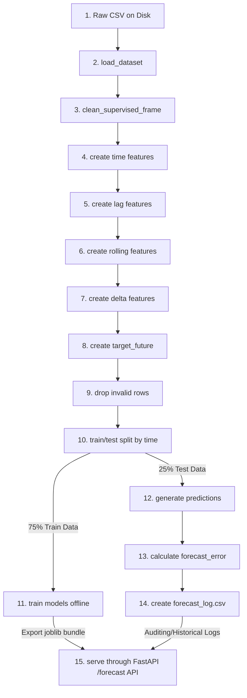

# PHÂN TÍCH CHUYÊN SÂU LUỒNG LUÂN CHUYỂN VÀ BIẾN ĐỔI DỮ LIỆU

Trong một hệ thống AIoT Dự báo chuỗi thời gian, dữ liệu không ở trạng thái tĩnh. Nó là một dòng chảy liên tục, trải qua hàng loạt các bước lọc, làm sạch, tính toán đặc trưng động, phân tách thời gian và suy diễn mô hình để cuối cùng trở thành các quyết định vận hành thời gian thực.

Tài liệu này phân tích chi tiết quy trình **15 bước biến đổi tuần tự của dòng dữ liệu** trong dự án **Lab 4**, cung cấp sơ đồ luồng dữ liệu chuẩn tắc, bảng theo dõi các sản phẩm trung gian, giải thích chi tiết đầu vào/đầu ra và cẩm nang xử lý lỗi thực tế.

---

## 1. Sơ đồ Luồng Biến đổi Tuần tự (Sequential Data Flow Chart)

Dưới đây là sơ đồ chi tiết biểu diễn hành trình 15 bước của dòng dữ liệu trong hệ thống Lab 4:



---

## 2. Bảng Theo dõi Sản phẩm Trung gian (Table of Intermediate Artifacts)

Mỗi bước biến đổi trong pipeline tạo ra các cấu trúc dữ liệu trung gian với số lượng cột và dòng thay đổi rõ rệt. Dưới đây là bảng thống kê chi tiết giúp kỹ sư dễ dàng kiểm soát dòng chảy:

| Bước | Cấu phần / Hàm | Loại dữ liệu / Sản phẩm | Định dạng vật lý | Số cột chính | Ghi chú & Trạng thái thay đổi dữ liệu |
| :--- | :--- | :--- | :--- | :--- | :--- |
| **1** | Thư mục `data/` | Dữ liệu thô ban đầu | File `.csv` | 29 cột | Chứa dữ liệu gốc UCI hoặc fallback sample. |
| **2** | `load_dataset()` | DataFrame gốc chuẩn hóa | Pandas DataFrame | 29 cột | Cột `date` chuyển sang datetime64, sắp xếp, xóa trùng. |
| **3** | `clean_supervised_frame` | DataFrame cơ sở sạch | Pandas DataFrame | 29 cột | Đảm bảo đủ cột, điền NaN nếu thiếu, ép kiểu numeric. |
| **4** | `add_time_features()` | DataFrame bổ sung mốc giờ | Pandas DataFrame | 37 cột | Thêm 8 cột: `hour`, `dayofweek`, `month`, `is_weekend`, và 4 cột sin/cos. |
| **5** | `add_lag_rolling_features` | DataFrame đặc trưng trễ | Pandas DataFrame | 43 cột | Thêm 6 cột đặc trưng trễ `appliances_lag_1` đến `lag_24`. |
| **6** | `add_lag_rolling_features` | DataFrame đặc trưng trượt | Pandas DataFrame | 49 cột | Thêm 6 cột đặc trưng cửa sổ trượt (Rolling Mean & Rolling Std). |
| **7** | `add_lag_rolling_features` | DataFrame đặc trưng sai phân | Pandas DataFrame | 52 cột | Thêm 3 cột sai phân vi phân `appliances_delta_1` đến `delta_6`. |
| **8** | `make_supervised_frame` | DataFrame học có giám sát | Pandas DataFrame | 53 cột | Thêm cột nhãn dịch chuyển tương lai `target_future`. |
| **9** | `clean_supervised_frame` | Ma trận đặc trưng không trống | Pandas DataFrame | 53 cột | **[QUAN TRỌNG]** Xóa bỏ các dòng NaN ở đầu chuỗi (thiếu Lag) và cuối chuỗi (thiếu nhãn). |
| **10** | `time_split()` | Tập Train & Test | 2x DataFrame | 53 cột | Phân cắt theo tỷ lệ tuyến tính 75% quá khứ, 25% tương lai. |
| **11** | `train_forecasting_models` | Trọng số / Cây quyết định học | File `.joblib` | N/A | Đóng gói mô hình tối ưu nhất kèm bộ Medians. |
| **12** | `model.predict()` | Mảng giá trị dự báo | NumPy Array | 1 cột | Dự đoán lượng điện tiêu thụ Wh của tập kiểm thử. |
| **13** | `regression_metrics()` | Mảng sai số tuyệt đối | NumPy Array | 1 cột | Độ lệch `predicted_value - actual_value` phục vụ đánh giá. |
| **14** | `build_forecast_log()` | Bảng nhật ký vận hành | File `.csv` | 9 cột | Lưu tại `outputs/forecast_log.csv` gồm timestamp, dự báo, rủi ro, khuyến nghị. |
| **15** | `app.py` | Gói tin phản hồi JSON | JSON Payload | N/A | Trả kết quả dự báo, rủi ro, khuyến nghị và safety note về Client. |

---

## 3. Mô tả Chi tiết Từng Bước Biến đổi (Inputs & Outputs Explanation)

### Bước 1: Raw CSV on Disk (Dữ liệu thô lưu trên đĩa)
*   **Đầu vào**: Tệp CSV thô chứa các hàng telemetry thu thập từ cảm biến vật lý.
*   **Đầu ra**: File lưu trữ vật lý tại `data/energydata_complete.csv`.
*   **Mô tả**: Dữ liệu có thể bị thiếu dòng, sai định dạng cột, hoặc các mốc thời gian bị xáo trộn do lỗi mạng khi lưu file.

### Bước 2: load_dataset (Nạp và chuẩn hóa cơ bản)
*   **Đầu vào**: Đường dẫn file CSV thô.
*   **Đầu ra**: Pandas DataFrame đã được định dạng và sắp xếp tuần tự theo thời gian.
*   **Mô tả**: Ép kiểu cột thời gian, thực hiện sắp xếp `sort_values("date")` và xóa bản ghi trùng lặp mốc giờ để chuẩn bị trục thời gian sạch.

### Bước 3: clean_supervised_frame (Lọc sạch DataFrame thô)
*   **Đầu vào**: DataFrame đã sắp xếp.
*   **Đầu ra**: DataFrame sạch, bảo đảm đầy đủ cấu trúc cột.
*   **Mô tả**: Nếu có bất kỳ cột cảm biến tùy chọn nào bị thiếu, hàm tự động tạo cột đó và điền giá trị `NaN` (tránh lỗi KeyError trong các bước sau).

### Bước 4: create time features (Kỹ nghệ đặc trưng thời gian tuần hoàn)
*   **Đầu vào**: DataFrame thô sạch.
*   **Đầu ra**: DataFrame bổ sung thêm 8 đặc trưng thời gian lượng giác.
*   **Mô tả**: Tính toán giờ trong ngày, ngày trong tuần, tháng trong năm và chuyển đổi giờ/ngày sang tọa độ lượng giác sin/cos để bảo toàn khoảng cách thời gian vật lý.

### Bước 5: create lag features (Tạo đặc trưng trễ lịch sử)
*   **Đầu vào**: DataFrame mốc giờ.
*   **Đầu ra**: DataFrame thêm 6 cột đặc trưng trễ `appliances_lag_k` ($k \in [1, 2, 3, 6, 12, 24]$).
*   **Mô tả**: Sử dụng hàm dịch chuyển xuôi `.shift(k)` của Pandas để lấy giá trị phụ tải điện của quá khứ làm đặc trưng đầu vào cho thời điểm hiện tại.

### Bước 6: create rolling features (Tạo đặc trưng cửa sổ trượt)
*   **Đầu vào**: DataFrame đặc trưng trễ.
*   **Đầu ra**: DataFrame thêm 6 cột trung bình trượt và độ lệch chuẩn trượt.
*   **Mô tả**: Tính toán thống kê trên cửa sổ thời gian trượt về quá khứ qua hàm `.rolling(window=W).mean()` và `.std()`.

### Bước 7: create delta features (Tạo đặc trưng sai phân gia tốc)
*   **Đầu vào**: DataFrame đặc trưng trượt.
*   **Đầu ra**: DataFrame thêm 3 cột delta thay đổi.
*   **Mô tả**: Tính toán mức độ chênh lệch phụ tải so với các mốc trước đó qua hàm `.diff(lag)`.

### Bước 8: create target_future (Thiết lập nhãn học có giám sát)
*   **Đầu vào**: DataFrame đầy đủ đặc trưng đầu vào.
*   **Đầu ra**: DataFrame thêm cột nhãn mục tiêu tương lai `target_future`.
*   **Mô tả**: Dịch ngược âm cột phụ tải: `target_future = Appliances.shift(-horizon_steps)` (đặt $h=1$, đoán trước 10 phút).

### Bước 9: drop invalid rows (Loại bỏ các dòng khuyết thiếu biên)
*   **Đầu vào**: DataFrame giám sát thô.
*   **Đầu ra**: DataFrame sạch hoàn toàn không chứa bất kỳ giá trị `NaN` nào.
*   **Mô tả**: 
    *   24 dòng đầu chuỗi thời gian sẽ bị rỗng (`NaN`) ở các cột Lag/Rolling lớn do chưa đủ lịch sử quá khứ.
    *   1 dòng cuối chuỗi sẽ bị rỗng ở cột `target_future` do chưa có thực tế tương lai của mốc tiếp theo.
    *   Hàm `clean_supervised_frame` thực hiện loại bỏ triệt để các dòng khuyết này để chuẩn bị ma trận toán học sạch huấn luyện mô hình.

### Bước 10: train/test split by time (Phân tách dữ liệu không rò rỉ)
*   **Đầu vào**: DataFrame sạch hoàn toàn.
*   **Đầu ra**: Hai DataFrame độc lập: `train_df` ($75\%$ dòng quá khứ) và `test_df` ($25\%$ dòng tương lai).
*   **Mô tả**: Phân chia theo dòng thời gian tuyến tính để ngăn ngừa triệt để hiện tượng rò rỉ thông tin tương lai về quá khứ.

### Bước 11: train models offline (Huấn luyện và đóng gói mô hình)
*   **Đầu vào**: Ma trận đặc trưng `X_train` và nhãn `y_train`.
*   **Đầu ra**: Tệp bundle nén `forecast_model_bundle_v1.joblib` lưu trữ mô hình tốt nhất cùng bộ Medians hỗ trợ điền khuyết thiếu trực tuyến.
*   **Mô tả**: Huấn luyện đồng thời các mô hình, so sánh tìm ra mô hình có MAE nhỏ nhất trên tập kiểm thử để đóng gói phục vụ sản xuất.

### Bước 12: generate predictions (Suy diễn trên tập kiểm thử)
*   **Đầu vào**: Ma trận kiểm thử `X_test` và mô hình đã huấn luyện.
*   **Đầu ra**: Mảng NumPy chứa giá trị công suất dự báo `predicted_value` cho toàn bộ tập kiểm thử.
*   **Mô tả**: Chạy phương thức `model.predict(X_test)` để giả lập hoạt động suy diễn thực tế ngoại tuyến.

### Bước 13: calculate forecast_error (Đánh giá sai số thực tế)
*   **Đầu vào**: Mảng dự báo `predicted_value` và mảng nhãn thực tế `target_future` của tập kiểm thử.
*   **Đầu ra**: Mảng sai số tức thời `forecast_error` và giá trị tuyệt đối sai số `abs_error`.
*   **Mô tả**: Phép tính trừ: $\text{Error} = \text{Predicted} - \text{Actual}$.

### Bước 14: create forecast_log.csv (Ghi nhật ký hệ thống)
*   **Đầu vào**: DataFrame kiểm thử và mảng giá trị dự báo kèm rủi ro/khuyến nghị đã ánh xạ.
*   **Đầu ra**: Tệp nhật ký lưu trữ tại `outputs/forecast_log.csv`.
*   **Mô tả**: Lưu trữ vĩnh viễn mốc thời gian, giá trị thực tế, giá trị dự báo, sai số, cấp rủi ro, khuyến nghị và phiên bản mô hình để phục vụ giám sát và hậu kiểm.

### Bước 15: serve prediction through /forecast API (Quy trình API thời gian thực)
*   **Đầu vào**: Client gửi gói tin HTTP POST chứa mảng JSON gồm 24 điểm telemetry gần nhất.
*   **Đầu ra**: Gói tin JSON trả về chứa kết quả suy diễn của mô hình tốt nhất, phân cấp rủi ro, khuyến nghị vận hành và safety note.
*   **Mô tả**: FastAPI Server nạp file `.joblib` vào RAM, tiếp nhận payload từ Client, thực thi tuần tự các bước điền khuyết dữ liệu thô, tính đặc trưng động thời gian thực tại mốc hiện tại $t$, chuyển ma trận qua mô hình suy diễn và trả kết quả phản hồi an toàn trong < 50ms.

---

## 4. Các lỗi Phổ biến & Cẩm nang Gỡ lỗi (Common Mistakes & Debugging)

Khi vận hành hoặc phát triển thêm hệ thống, kỹ sư thường gặp phải một số lỗi hệ thống kinh điển dưới đây:

### Lỗi 1: KeyError khi gọi API `/forecast` do thiếu cột
*   **Hiện tượng**: Khi gọi API dự báo thời gian thực, Server trả về lỗi `500 Internal Server Error` và terminal log báo lỗi `KeyError: 'lights'` hoặc `KeyError: 'T_out'`.
*   **Nguyên nhân**: Client (Gateway) gửi payload JSON bị thiếu một hoặc nhiều trường dữ liệu tùy chọn (ví dụ: cảm biến đo đèn bị hỏng nên Gateway không gửi trường `lights` lên API).
*   **Cách Debug & Khắc phục**:
    1.  *Kiểm tra*: Xem cấu trúc JSON gửi lên từ Client có khớp với Schema `TelemetryPoint` định nghĩa trong `app.py` hay không.
    2.  *Khắc phục*: Bảo đảm đã gọi hàm `fill_missing_for_api(df, model_bundle["raw_medians"])` ngay khi tiếp nhận DataFrame đầu vào trong `app.py` (Hàm này tự động tạo cột thiếu và điền trung vị thô lịch sử, ngăn chặn triệt để lỗi KeyError).

### Lỗi 2: Giá trị Dự báo trả về `NaN` hoặc `Null` ở thời gian thực
*   **Hiện tượng**: API trả phản hồi JSON thành công nhưng trường `predicted_value` lại là `NaN` hoặc `Null`.
*   **Nguyên nhân**: Client gửi chuỗi lịch sử quá ngắn (ví dụ chỉ gửi 10 điểm thay vì 24 điểm). Phép toán `.rolling(window=24).mean()` bị thiếu dữ liệu quá khứ nên trả về `NaN` cho đặc trưng cửa sổ trượt lớn nhất, dẫn đến mô hình hồi quy suy luận ra giá trị `NaN`.
*   **Cách Debug & Khắc phục**:
    1.  *Kiểm tra*: In ra số lượng bản ghi nhận được trong log FastAPI: `print(len(payload.history))`.
    2.  *Khắc phục*: Tích hợp lớp phòng vệ thứ hai điền khuyết đặc trưng bằng `feature_medians` lưu trong file `.joblib` trước khi đưa ma trận qua phương thức `.predict()`:
        ```python
        X = latest[feature_columns].fillna(model_bundle["feature_medians"]).fillna(0.0)
        ```

### Lỗi 3: Sai số MAE/RMSE cực thấp khi huấn luyện nhưng cực cao khi chạy API thực tế
*   **Hiện tượng**: Lúc huấn luyện offline đạt độ chính xác gần như hoàn hảo ($\text{MAE} \approx 2$ Wh), nhưng khi chạy API dự báo thực tế sai số nhảy vọt lên $\text{MAE} \gt 80$ Wh.
*   **Nguyên nhân**: Bị rò rỉ dữ liệu tương lai (Data Leakage) do phân chia dữ liệu ngẫu nhiên (Random Split) ở pha huấn luyện offline hoặc tính đặc trưng trễ bị dịch chuyển ngược hướng.
*   **Cách Debug & Khắc phục**:
    1.  *Kiểm tra*: Xem lại file `train_forecast.py` xem có vô tình sử dụng `train_test_split(..., shuffle=True)` hoặc dùng shift âm cho các đặc trưng đầu vào hay không.
    2.  *Khắc phục*: Bắt buộc sử dụng hàm phân tách tuyến tính thời gian `time_split()` và đảm bảo tất cả các đặc trưng Lag/Rolling đều dùng shift dương hướng về quá khứ.

### Lỗi 4: Lỗi định dạng mốc thời gian `date` khi tạo DataFrame
*   **Hiện tượng**: Hàm `make_supervised_frame` báo lỗi không thể tính toán đặc trưng tuần hoàn `hour` hoặc `dayofweek`.
*   **Nguyên nhân**: Cột `date` trong JSON gửi lên ở dạng chuỗi string chưa được định dạng thời gian.
*   **Cách Debug & Khắc phục**:
    1.  *Kiểm tra*: In ra kiểu dữ liệu của cột: `print(df["date"].dtype)`. Nếu ra kiểu `object` hoặc `string` là chưa chuyển đổi.
    2.  *Khắc phục*: Ép kiểu rõ ràng trước khi tính đặc trưng:
        ```python
        df["date"] = pd.to_datetime(df["date"])
        ```
