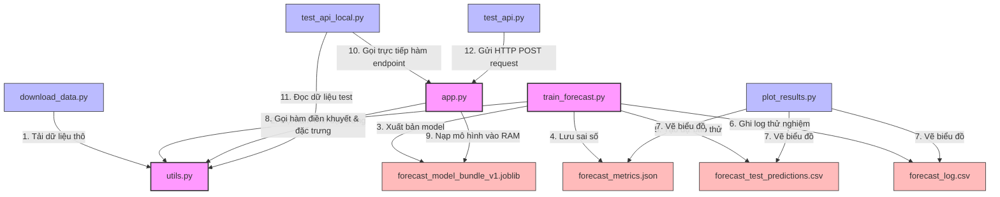
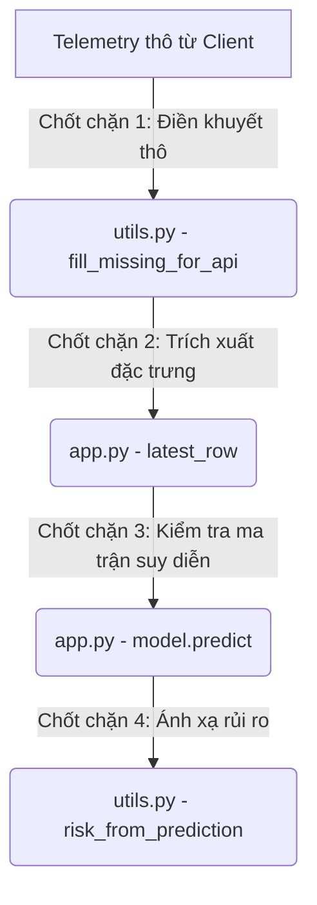

# PHÂN TÍCH LUỒNG THỰC THI RUNTIME VÀ PHỤ THUỘC FILE

Để làm chủ hệ thống mã nguồn **Lab 4**, một kỹ sư hoặc nhà phát triển cần hiểu rõ cách thức hoạt động của chương trình ở thời điểm chạy (Runtime): file nào gọi file nào, luồng dữ liệu biến đổi ra sao trên bộ nhớ RAM, cấu trúc phụ thuộc giữa các module, và các vị trí chốt chặn quan trọng để đặt điểm debug khi gặp sự cố.

Tài liệu này phân tích chi tiết luồng thực thi runtime, đồ thị phụ thuộc của hệ thống, phân loại mức độ an toàn chỉnh sửa của từng file và cẩm nang debug thực tế trong **Lab 4**.

---

## 1. Đồ thị Phụ thuộc giữa các File (Dependency Graph)

Mã nguồn được thiết kế theo nguyên lý mô-đun hóa, trong đó tệp `utils.py` đóng vai trò là thư viện tiện ích dùng chung (Core Utility Library) cấp thấp nhất, cung cấp logic cho tất cả các kịch bản chạy cấp cao hơn.

Dưới đây là đồ thị phụ thuộc giữa các file trong hệ thống:

---

## 2. Chi tiết Phụ thuộc, Đầu vào & Đầu ra của Từng File

Dưới đây là phân tích chi tiết vai trò, các file gọi và dữ liệu đầu vào/đầu ra của tất cả các file mã nguồn chính trong thư mục `src/`:

### 1. `utils.py` (Lõi tính toán & Tiện ích dùng chung)
*   **Các phụ thuộc (Imports)**: `pandas`, `numpy`, `pathlib`, `json`.
*   **Được gọi bởi**: `train_forecast.py`, `app.py`, `plot_results.py`, `test_api_local.py`, `download_data.py`.
*   **Dữ liệu đầu vào (Input)**: DataFrame thô hoặc mảng dữ liệu chuỗi thời gian.
*   **Dữ liệu đầu ra (Output)**: DataFrame đã được làm sạch, bổ sung đầy đủ các đặc trưng trễ (Lag), trượt (Rolling), sai phân (Delta), lượng giác tuần hoàn (Cyclic Time), và dịch chuyển nhãn tương lai (`target_future`).
*   **Ý nghĩa**: Đây là "lõi toán học" duy nhất của toàn hệ thống. Mọi thay đổi về đặc trưng tại đây sẽ lập tức ảnh hưởng đến cả pha huấn luyện offline và pha chạy online.

### 2. `train_forecast.py` (Chạy huấn luyện ngoại tuyến)
*   **Các phụ thuộc (Imports)**: `scikit-learn` (StandardScaler, LinearRegression, RandomForestRegressor, GradientBoostingRegressor), `joblib`, `utils.py`.
*   **Được gọi bởi**: Kỹ sư chạy thủ công bằng lệnh terminal: `python src/train_forecast.py`.
*   **Dữ liệu đầu vào (Input)**: Đọc file dữ liệu thô `data/energydata_complete.csv` từ đĩa cứng qua hàm `load_dataset()`.
*   **Dữ liệu đầu ra (Output)**:
    1.  Tệp nén mô hình: `models/forecast_model_bundle_v1.joblib`
    2.  Tệp chỉ số sai số: `outputs/forecast_metrics.json`
    3.  Bảng dự báo kiểm thử: `outputs/forecast_test_predictions.csv`
    4.  Nhật ký giả lập: `outputs/forecast_log.csv`

### 3. `app.py` (FastAPI Server Endpoint Phục vụ Online)
*   **Các phụ thuộc (Imports)**: `fastapi`, `pydantic`, `joblib`, `utils.py`.
*   **Được gọi bởi**: Trình chạy ASGI Uvicorn: `uvicorn src.app:app --reload`.
*   **Dữ liệu đầu vào (Input)**: Gói tin HTTP POST gửi lên JSON Payload chứa mảng lịch sử telemetry (`history`).
*   **Dữ liệu đầu ra (Output)**: Gói tin HTTP response JSON chứa giá trị dự báo Wh, cấp độ rủi ro, khuyến nghị và safety note. Đồng thời ghi thêm 1 dòng nhật ký vào `outputs/forecast_log.csv`.

### 4. `plot_results.py` (Vẽ biểu đồ kết quả)
*   **Các phụ thuộc (Imports)**: `matplotlib`, `pandas`, `json`, `utils.py`.
*   **Được gọi bởi**: Kỹ sư chạy lệnh terminal: `python src/plot_results.py`.
*   **Dữ liệu đầu vào (Input)**: Đọc các file kết quả trung gian: `outputs/forecast_test_predictions.csv`, `outputs/forecast_log.csv`, và `outputs/forecast_metrics.json`.
*   **Dữ liệu đầu ra (Output)**: Xuất ra 3 file ảnh đồ thị lưu tại thư mục `figures/`:
    *   `forecast_vs_actual.png`
    *   `forecast_error_over_time.png`
    *   `model_comparison_mae.png`

### 5. `download_data.py` (Tải dữ liệu tự động)
*   **Các phụ thuộc (Imports)**: `urllib.request`, `zipfile`, `tempfile`, `shutil`, `utils.py`.
*   **Được gọi bởi**: Kỹ sư chạy lệnh terminal: `python src/download_data.py`.
*   **Dữ liệu đầu vào (Input)**: Tải tệp zip công khai từ kho lưu trữ của UCI qua giao thức HTTP.
*   **Dữ liệu đầu ra (Output)**: Giải nén và lưu file `data/energydata_complete.csv`. Nếu không có internet, tự động kích hoạt fallback sử dụng dữ liệu mẫu lớp học.

### 6. `test_api_local.py` (Kiểm thử API cục bộ không mở port)
*   **Các phụ thuộc (Imports)**: `utils.py`, `app.py` (gọi trực tiếp hàm Python `forecast()`, `health()`, `model_info()`).
*   **Được gọi bởi**: Kỹ sư chạy lệnh: `python src/test_api_local.py`.
*   **Dữ liệu đầu vào (Input)**: Rút trích 36 dòng cuối cùng của DataFrame thô làm lịch sử giả lập.
*   **Dữ liệu đầu ra (Output)**: Xác thực Schema trả về của API và ghi kết quả test vào `outputs/api_test_result.json`.

---

## 3. Luồng Thực thi Runtime chi tiết (Execution Flow)

Hệ thống có hai luồng chạy runtime độc lập hoàn toàn, phân tách rõ ràng nhiệm vụ của kỹ sư dữ liệu (Offline) và dịch vụ web tự động (Online):

### Luồng A: Huấn luyện Ngoại tuyến (Offline Training Pipeline Execution)
Chạy tuần tự từ trên xuống dưới khi gọi `train_forecast.py`:
1.  **Nạp**: Đọc file dữ liệu từ đĩa $\rightarrow$ tạo Pandas DataFrame.
2.  **Tính**: Gọi `make_supervised_frame` thực hiện dịch chuyển mốc giờ tuần hoàn và tính Lag/Rolling/Delta cho toàn bộ hàng vạn dòng.
3.  **Lọc**: Xóa bỏ các dòng khuyết biên (`clean_supervised_frame`).
4.  **Chia**: Chia DataFrame thành 2 phần Train (75% đầu) và Test (25% cuối) theo mốc cắt dòng thời gian tuyến tính.
5.  **Học**: Khởi tạo 3 mô hình học máy. Gọi phương thức `.fit(X_train, y_train)` để học trọng số.
6.  **Đo**: Gọi `.predict(X_test)` trên tập Test để tính toán MAE/RMSE/MAPE và chọn ra mô hình tối ưu nhất.
7.  **Lưu**: Đóng gói mô hình tốt nhất cùng với các giá trị trung vị (`raw_medians`, `feature_medians`) vào bộ nhớ đĩa thành file `.joblib`.

### Luồng B: Phục vụ Dự báo Trực tuyến (Online Serving Inference Execution)
Chạy tức thời khi có Client gọi HTTP POST lên FastAPI Server `/forecast`:
1.  **Tiếp nhận**: FastAPI validate định dạng payload JSON đầu vào qua Pydantic schema `ForecastRequest`.
2.  **Chuyển đổi**: Chuyển mảng JSON gồm 24 điểm thô thành Pandas DataFrame gồm 24 dòng.
3.  **Làm sạch**: Gọi `fill_missing_for_api` để lấp đầy các cột cảm biến bị thiếu bằng `raw_medians` đã được nạp sẵn trên RAM từ file `.joblib`.
4.  **Kỹ nghệ**: Gọi `make_supervised_frame(include_target=False)` tính toán Lag, Rolling, Delta thời gian thực.
5.  **Trích xuất**: Lấy duy nhất hàng cuối cùng của DataFrame (`latest_row`), đại diện cho thời điểm hiện tại $t$.
6.  **Điền khuyết đặc trưng**: Điền các giá trị đặc trưng bị rỗng (do chuỗi lịch sử quá ngắn) bằng `feature_medians` từ RAM.
7.  **Suy diễn**: Chuyển ma trận đặc trưng qua mô hình tốt nhất: `model.predict(X)` $\rightarrow$ trả về `predicted_value` Wh.
8.  **Ánh xạ quyết định**: Đưa `predicted_value` qua bộ phân tích ngưỡng để gán nhãn `risk_level` và khuyến nghị `recommendation`.
9.  **Ghi log**: Ghi thêm 1 dòng nhật ký vào `outputs/forecast_log.csv`.
10. **Phản hồi**: Trả về gói tin JSON cấu trúc cho Client.

---

## 4. Các điểm đặt Debug quan trọng khi gặp Sự cố (Debugging Checkpoints)

Khi hệ thống gặp lỗi hoặc kết quả dự báo sai lệch bất thường, kỹ sư nên đặt điểm dừng (breakpoint) hoặc chèn lệnh in dữ liệu (`print()`) tại 4 chốt chặn runtime dưới đây:

### Chốt chặn 1: Kiểm tra Dữ liệu thô sau làm sạch
*   *Vị trí*: Cuối hàm `fill_missing_for_api` trong `utils.py`.
*   *Mục đích debug*: Kiểm tra xem dữ liệu thô gửi lên có bị khuyết thiếu quá nhiều hay không, và bộ trung vị `raw_medians` có điền chính xác giá trị hợp lý vật lý hay không.
*   *Lệnh debug*: `print(out.isnull().sum())` (Đảm bảo kết quả in ra toàn bộ là `0` - không còn giá trị rỗng).

### Chốt chặn 2: Kiểm tra Đặc trưng động tại thời điểm hiện tại $t$
*   *Vị trí*: Ngay sau dòng `latest = features_df.iloc[[-1]].copy()` trong file `app.py`.
*   *Mục đích debug*: Xác thực xem các đặc trưng trễ lớn (như `appliances_rolling_mean_24`) có bị rỗng `NaN` hay không (nếu rỗng nghĩa là client gửi chuỗi lịch sử ngắn hơn 24 điểm).
*   *Lệnh debug*: `print(latest[FEATURE_COLUMNS].to_dict(orient='records')[0])`.

### Chốt chặn 3: Kiểm tra Ma trận đầu vào trước khi gọi predict
*   *Vị trí*: Ngay trước dòng `predicted_value = float(model.predict(X)[0])` trong file `app.py`.
*   *Mục đích debug*: Đảm bảo ma trận `X` có số lượng cột và thứ tự cột hoàn toàn trùng khớp với danh sách đặc trưng đầu vào `FEATURE_COLUMNS` mà mô hình yêu cầu. Nếu lệch thứ tự hoặc thiếu cột, scikit-learn sẽ crash hệ thống.
*   *Lệnh debug*: `print(X.shape)` (Đảm bảo kích thước là `(1, 52)` - 1 hàng và 52 cột đặc trưng).

### Chốt chặn 4: Kiểm tra Logic phân cấp rủi ro
*   *Vị trí*: Trong hàm `risk_from_prediction` của `utils.py`.
*   *Mục đích debug*: Xác minh xem ngưỡng tĩnh `thresholds` nạp từ file bundle có khớp với giá trị phân vị tính toán lúc huấn luyện hay không.
*   *Lệnh debug*: `print("Pred:", predicted_value, "Thresholds:", thresholds)`.

---

## 5. Bản đồ Phân loại An toàn Chỉnh sửa File (File Modifiability Guide)

Để tránh làm sập hệ thống (break pipeline) khi phát triển mở rộng, hãy tuân thủ bảng phân loại cấp độ an toàn dưới đây:

### 🔴 CẬP ĐỘ 1: CỰC KỲ NGUY HIỂM (Core Pipeline Files)
*   **Tệp tin**: **`src/utils.py`** và **`src/train_forecast.py`**.
*   **Lý do**: Đây là các file cốt lõi chứa logic toán học của cả hệ thống. Một thay đổi nhỏ tại đây (ví dụ: đổi tên cột đặc trưng trong `FEATURE_COLUMNS` hoặc thay đổi cách tính sin/cos) sẽ lập tức làm mất tính tương thích giữa mô hình đã huấn luyện và API thời gian thực.
*   **Quy tắc**: Tuyệt đối không chỉnh sửa trực tiếp trên môi trường chạy thực tế. Mọi thay đổi bắt buộc phải được thử nghiệm đồng bộ trong Jupyter Notebook trước, sau đó tiến hành tái huấn luyện toàn bộ hệ thống để xuất bản file `.joblib` mới tương thích.

### 🟡 CẤP ĐỘ 2: CẦN THẬN TRỌNG (Deployment Files)
*   **Tệp tin**: **`src/app.py`**.
*   **Lý do**: File này chịu trách nhiệm phục vụ API trực tuyến. Chỉnh sửa tại đây không làm hỏng mô hình học máy, nhưng có thể làm thay đổi Schema JSON phản hồi, gây crash ứng dụng client (Gateway hoặc Mobile App) đang kết nối gọi API.
*   **Quy tắc**: Cho phép bổ sung thêm các endpoint phụ trợ (như `/health` hoặc endpoints cấu hình), nhưng hạn chế tối đa việc chỉnh sửa cấu trúc của payload yêu cầu `/forecast` trừ khi có sự đồng bộ từ phía phần cứng biên.

### 🟢 CẤP ĐỘ 3: AN TOÀN TUYỆT ĐỐI (Scripts & Visuals)
*   **Tệp tin**: **`src/plot_results.py`**, **`src/test_api_local.py`**, **`src/test_api.py`**, **`src/download_data.py`**.
*   **Lý do**: Đây là các file kịch bản (scripts) chạy độc lập bên ngoài pipeline chính, chỉ có nhiệm vụ vẽ biểu đồ, tải file hoặc gọi thử nghiệm API.
*   **Quy tắc**: Tự do chỉnh sửa, tối ưu hóa hoặc viết lại hoàn toàn để phục vụ nhu cầu làm báo cáo hoặc kiểm thử mở rộng hệ thống mà không sợ làm ảnh hưởng đến hoạt động dự báo của API thời gian thực.
