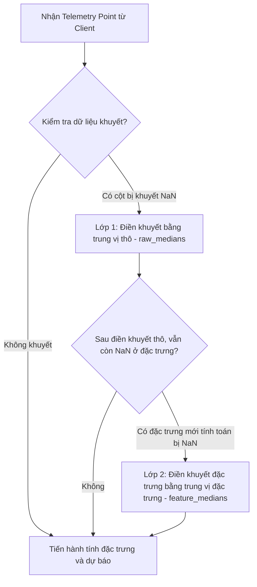

# CHI TIẾT TẬP DỮ LIỆU UCI APPLIANCES & CHIẾN LƯỢC ĐIỀN KHUYẾT THIẾU TELEMETRY

Để xây dựng một mô hình dự báo chính xác, kỹ sư AIoT cần thấu hiểu sâu sắc từng chiều thông tin trong tập dữ liệu đo đạc (telemetry schema) cả về ý nghĩa vật lý, tần suất thu thập lẫn chiến lược xử lý dữ liệu lỗi/khuyết thiếu trên thực tế.

Tài liệu này phân tích chi tiết cấu trúc tập dữ liệu **UCI Appliances Energy Prediction** và giải pháp điền khuyết dữ liệu thông minh khi đưa hệ thống vào phục vụ API thời gian thực.

---

## 1. Cấu trúc Schema Dữ liệu UCI Appliances

Tập dữ liệu gốc của UCI lưu trữ dữ liệu tiêu thụ năng lượng và thời tiết trong một ngôi nhà thông minh trong khoảng thời gian 4.5 tháng với tần suất **10 phút một lần (10-minute interval)**.

Bảng dưới đây trình bày chi tiết ý nghĩa và đơn vị vật lý của các cột dữ liệu chính:

| Tên Cột (Schema) | Ý nghĩa Vật lý | Đơn vị đo | Ghi chú & Tác động AIoT |
| :--- | :--- | :--- | :--- |
| **`date`** | Thời mốc ghi nhận dữ liệu | YYYY-MM-DD HH:MM:SS | Trục thời gian chính, dùng để sắp xếp tuần tự. |
| **`Appliances`** | **Lượng điện tiêu thụ của thiết bị gia dụng** | **Watt-giờ (Wh)** | **Biến mục tiêu cần dự báo (Target)**. |
| **`lights`** | Lượng điện tiêu thụ của hệ thống đèn | Watt-giờ (Wh) | Đặc trưng hỗ trợ phản ánh hoạt động của con người. |
| **`T1`, `RH_1`** | Nhiệt độ & Độ ẩm khu vực Bếp | °C, % | Khu vực bếp thường có nhiệt độ cao bất ngờ khi nấu ăn. |
| **`T2`, `RH_2`** | Nhiệt độ & Độ ẩm khu vực Phòng khách | °C, % | Phản ánh thói quen sinh hoạt tập trung đông người. |
| **`T3`, `RH_3`** | Nhiệt độ & Độ ẩm khu vực Phòng ngủ | °C, % | Phản ánh chu kỳ ngủ nghỉ ban đêm. |
| **`T4`, `RH_4`** | Nhiệt độ & Độ ẩm khu vực Văn phòng làm việc | °C, % | Ảnh hưởng bởi máy tính và đèn làm việc. |
| **`T5`, `RH_5`** | Nhiệt độ & Độ ẩm khu vực Phòng tắm | °C, % | Độ ẩm tăng đột biến khi có người tắm nước nóng. |
| **`T6`, `RH_6`** | Nhiệt độ & Độ ẩm phía bên ngoài tòa nhà | °C, % | Nằm ở mặt ngoài, phản ánh trực tiếp thời tiết cận biên. |
| **`T7`, `RH_7`** | Nhiệt độ & Độ ẩm khu vực Phòng ủi đồ | °C, % | Nơi có thiết bị tỏa nhiệt lớn (bàn là). |
| **`T8`, `RH_8`** | Nhiệt độ & Độ ẩm khu vực Phòng ngủ trẻ em | °C, % | Khu vực cần kiểm soát nhiệt độ nghiêm ngặt. |
| **`T9`, `RH_9`** | Nhiệt độ & Độ ẩm khu vực Phòng cha mẹ | °C, % | Đo đạc tiện nghi sinh hoạt. |
| **`T_out`** | Nhiệt độ ngoài trời (Trạm khí tượng Chievres) | °C | Yếu tố ngoại sinh quan trọng tác động đến HVAC. |
| **`Press_mm_hg`** | Áp suất khí quyển | mm Hg | Chỉ số dự báo thay đổi thời tiết. |
| **`RH_out`** | Độ ẩm ngoài trời | % | Ảnh hưởng tới hiệu suất làm lạnh của điều hòa. |
| **`Windspeed`** | Tốc độ gió | m/s | Ảnh hưởng tới sự thất thoát nhiệt của tòa nhà. |
| **`Visibility`** | Tầm nhìn xa | km | Tác động gián tiếp đến việc bật đèn sớm hay muộn. |
| **`Tdewpoint`** | Điểm sương | °C | Điểm ngưng tụ hơi nước, liên quan đến độ ẩm cảm giác. |

> [!NOTE]
> Hai cột `rv1` và `rv2` trong tập dữ liệu gốc của UCI là các biến ngẫu nhiên được thêm vào nhằm mục đích thử nghiệm nhiễu của các nhà nghiên cứu, chúng không mang giá trị vật lý hữu ích nên đã được chủ động loại bỏ khỏi danh sách đặc trưng đầu vào (`EXOGENOUS_COLUMNS`) trong file `utils.py`.

---

## 2. Thách thức Dữ liệu thực tế: Dữ liệu Khuyết thiếu (Missing Data)

Trong môi trường phòng thí nghiệm (Offline Training), tập dữ liệu thường sạch sẽ và liên tục. Tuy nhiên, khi triển khai vào hệ thống AIoT thực tế (Online Serving), hiện tượng khuyết thiếu dữ liệu xảy ra rất thường xuyên do các nguyên nhân:
1.  **Mất kết nối mạng cảm biến (Sensor Offline)**: Cảm biến Zigbee trong phòng ngủ bị hết pin, hoặc mất kết nối tạm thời tới Gateway.
2.  **Lỗi truyền tin (Network Packet Loss)**: Gói tin MQTT chứa thông số độ ẩm phòng khách bị rơi trên đường truyền Wi-Fi bị nghẽn.
3.  **Tần suất đo lệch pha**: Trạm thời tiết ngoài trời 30 phút mới gửi dữ liệu một lần, trong khi công tơ điện gửi dữ liệu 10 phút một lần.

Nếu Gateway gửi một bản tin API `/forecast` bị khuyết thiếu các cột nhiệt độ, độ ẩm hoặc đèn, mô hình học máy (`scikit-learn`) sẽ lập tức **ném ra lỗi lỗi crash hệ thống** vì các thuật toán như Regression hay Random Forest không thể tính toán trên các giá trị trống (`NaN`).

---

## 3. Chiến lược Điền Khuyết thiếu Thông minh trong Lab 4

Để đảm bảo tính liên tục và độ tin cậy cực cao của API dự báo (High Availability), Lab 4 thiết lập chiến lược điền khuyết dữ liệu qua 2 lớp phòng vệ trong `utils.py` và `app.py`:



### Lớp phòng vệ 1: Điền khuyết dữ liệu thô đầu vào (`raw_medians`)
Khi huấn luyện mô hình offline (`train_forecast.py`), hệ thống tự động tính toán giá trị **trung vị (Median)** của tất cả các cột cảm biến thô từ tập dữ liệu huấn luyện và đóng gói vào file bundle `.joblib`:
```python
raw_medians = df.drop(columns=[DATE_COL], errors="ignore").median(numeric_only=True).to_dict()
```
Khi gọi API `/forecast`, hàm `fill_missing_for_api(df, raw_medians)` trong `utils.py` sẽ duyệt qua toàn bộ bảng dữ liệu đầu vào. Bất kỳ cột cảm biến nào bị thiếu hoàn toàn hoặc chứa giá trị `NaN` sẽ được tự động lấp đầy bằng giá trị trung vị lịch sử tương ứng:
```python
def fill_missing_for_api(df: pd.DataFrame, medians: dict) -> pd.DataFrame:
    # ...
    for col, value in medians.items():
        if col in out.columns:
            out[col] = out[col].fillna(float(value))
    return out
```

### Lớp phòng vệ 2: Điền khuyết đặc trưng tính toán (`feature_medians`)
Sau khi điền khuyết thô, dữ liệu đi qua bước tính toán đặc trưng động (Lag, Rolling, Delta). Nếu chuỗi lịch sử gửi lên quá ngắn (ví dụ < 24 điểm), các đặc trưng cửa sổ trượt như `appliances_rolling_mean_24` hoặc `appliances_lag_24` sẽ không đủ dữ liệu quá khứ để tính toán và trả về `NaN`.

Để ngăn chặn lỗi này, trong file `app.py`, hệ thống thực hiện lớp phòng vệ thứ hai bằng cách điền khuyết các đặc trưng tính toán bằng giá trị trung vị của đặc trưng đã lưu trong tập huấn luyện (`feature_medians`):
```python
X = latest[feature_columns].replace([float("inf"), float("-inf")], pd.NA)
X = X.fillna(model_bundle.get("feature_medians", {})).fillna(0.0)
```

### Tại sao sử dụng Median (Trung vị) để điền khuyết thay vì Mean (Trung bình)?
*   **Chống nhiễu ngoại lai (Robust to Outliers)**: Trong dữ liệu IoT, các cảm biến có thể bị nhiễu tạo ra các gai nhọn cực lớn (ví dụ: nhiệt độ bếp vọt lên 100°C do lỗi cảm biến). Chỉ số trung bình (Mean) sẽ bị kéo lệch rất nhiều bởi các giá trị ngoại lai này. Trung vị (Median) chọn giá trị đứng ở giữa phân phối nên hoàn toàn không bị ảnh hưởng bởi nhiễu cực đoan, giúp mô hình giữ được sự ổn định dự báo.
