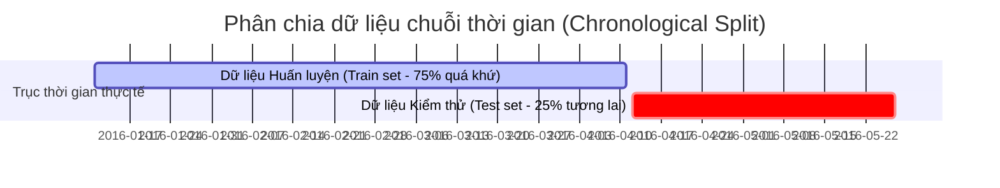

# MÔ HÌNH HỌC MÁY & CÁC CHỈ SỐ ĐÁNH GIÁ SAI SỐ TOÁN HỌC

Trong bài toán dự báo phụ tải điện năng (Load Forecasting), việc lựa chọn mô hình phù hợp và thiết lập hệ thống đánh giá sai số chính xác là điều kiện tiên quyết để xây dựng một hệ thống AIoT đáng tin cậy. 

Tài liệu này trình bày chi tiết cơ chế hoạt động của 5 mô hình được sử dụng trong **Lab 4**, lý do tối mật bắt buộc phải chia dữ liệu theo dòng thời gian (Time-series Split), và ý nghĩa toán học - vật lý của các chỉ số đánh giá sai số hồi quy.

---

## 1. Chi tiết 5 Mô hình dự báo trong Lab 4

Một mô hình Học máy phức tạp chỉ thực sự có giá trị khi và chỉ khi nó chứng minh được sự vượt trội vượt bậc so với các quy tắc dự báo cơ bản (Baseline). Lab 4 cài đặt đồng thời 2 mô hình Baseline đơn giản và 3 mô hình học máy tăng dần từ đơn giản đến phức tạp:

### Mô hình 1: Last Value Baseline (Dự báo giá trị liền kề)
*   **Cơ chế**: Đây là quy tắc đơn giản nhất trong chuỗi thời gian. Dự báo cho thời điểm tiếp theo chính là giá trị thực tế đo được tại thời điểm hiện tại:
    $$\hat{y}_{t+1} = y_t$$
*   **Ý nghĩa**: Đóng vai trò là "mốc đối chứng tối thiểu". Nếu một mô hình AI phức tạp không đạt được sai số thấp hơn Last Value Baseline, mô hình AI đó hoàn toàn vô dụng.
*    Trong code `train_forecast.py`:
    ```python
    "last_value_baseline": test_df[TARGET_COL].to_numpy(dtype=float)
    ```

### Mô hình 2: Moving Average Baseline (Dự báo bằng trung bình trượt)
*   **Cơ chế**: Dự báo cho thời điểm tiếp theo là trung bình cộng của $K$ bước đo đạc gần nhất trong quá khứ (bản lab chọn $K=6$, tương ứng trung bình trượt 1 tiếng gần nhất):
    $$\hat{y}_{t+1} = \frac{1}{6} \sum_{i=0}^{5} y_{t-i}$$
*   **Ý nghĩa**: Phản ánh xu hướng trung bình gần đây, giúp lọc bỏ các đỉnh nhọn bất thường mang tính tức thời.
*    Trong code `train_forecast.py`:
    ```python
    "moving_average_6_baseline": test_df["appliances_rolling_mean_6"].to_numpy(dtype=float)
    ```

### Mô hình 3: Linear Regression (Hồi quy tuyến tính)
*   **Cơ chế**: Giả định có mối liên hệ tuyến tính giữa các đặc trưng đầu vào $X$ và nhãn tương lai $y$. Mô hình tìm kiếm một véc-tơ trọng số $W$ và hệ số chặn $b$ sao cho tổng bình phương sai số là nhỏ nhất:
    $$\hat{y}_{t+1} = W^T X_t + b$$
*   **Đặc điểm**: Cực kỳ tường minh, dễ giải thích ý nghĩa các hệ số ảnh hưởng (feature coefficients) và tính toán siêu nhanh. Để mô hình hoạt động ổn định, các đặc trưng được đưa qua bộ chuẩn hóa `StandardScaler` để đưa về cùng phân phối chuẩn (trung bình bằng 0, phương sai bằng 1).
*    Trong code `train_forecast.py`:
    ```python
    Pipeline([
        ("scaler", StandardScaler()),
        ("model", LinearRegression())
    ])
    ```

### Mô hình 4: Random Forest Regressor (Rừng ngẫu nhiên)
*   **Cơ chế**: Phương pháp học quần thể (Ensemble Learning) sử dụng kỹ thuật Bagging. Nó xây dựng rất nhiều cây quyết định (Decision Trees) độc lập trên các mẫu dữ liệu khác nhau. Kết quả dự báo cuối cùng là trung bình cộng kết quả của tất cả các cây:
    $$\hat{y}_{t+1} = \frac{1}{M} \sum_{m=1}^{M} Tree_m(X_t)$$
*   **Đặc điểm**: Rất mạnh mẽ trong việc bắt bài các mối quan hệ phi tuyến phức tạp giữa nhiệt độ phòng, độ ẩm và điện năng tiêu thụ mà không cần dữ liệu phải chuẩn hóa. Khả năng chống quá khớp (overfitting) tốt nhờ cơ chế ngẫu nhiên hóa đặc trưng tại mỗi nút chia của cây.
*    Trong code `train_forecast.py`:
    ```python
    RandomForestRegressor(n_estimators=120, max_depth=12, min_samples_leaf=3, random_state=42)
    ```

### Mô hình 5: Gradient Boosting Regressor (Mô hình tăng cường gradient)
*   **Cơ chế**: Phương pháp học quần thể sử dụng kỹ thuật Boosting. Khác với Random Forest huấn luyện các cây song song độc lập, Gradient Boosting xây dựng các cây quyết định tuần tự. Cây sau được huấn luyện để **sửa sai (dự báo phần dư sai số - residual)** của các cây phía trước:
    $$\hat{y}_{t+1}^{(k)} = \hat{y}_{t+1}^{(k-1)} + \eta \cdot h_k(X_t)$$
    *(Trong đó $h_k$ là cây quyết định sửa sai cho bước thứ $k$, và $\eta$ là learning rate).*
*   **Đặc điểm**: Đạt độ chính xác dự báo cao nhất trong hầu hết các bài toán chuỗi thời gian dạng bảng. Bản lab sử dụng cài đặt mặc định của `scikit-learn` nhằm tối giản thư viện cài đặt nhưng vẫn đem lại hiệu năng tiệm cận các mô hình nâng cao như XGBoost hay LightGBM.
*    Trong code `train_forecast.py`:
    ```python
    GradientBoostingRegressor(n_estimators=160, learning_rate=0.05, max_depth=3, min_samples_leaf=3, random_state=42)
    ```

---

## 2. Tại sao tuyệt đối không được dùng Random Split cho Chuỗi thời gian?

Trong học máy thông thường, ta thường dùng hàm `train_test_split(..., random_state=42)` để chia ngẫu nhiên dữ liệu thành 2 tập Train và Test. Tuy nhiên, đối với dữ liệu chuỗi thời gian, **đây là một sai lầm chết người**.

### Bản chất của lỗi Rò rỉ Dữ liệu tương lai (Data Leakage)
Nếu ta chia dữ liệu ngẫu nhiên:
*   Tập huấn luyện (Train) có thể chứa dữ liệu đo đạc của lúc **12:10** và **12:30**.
*   Tập kiểm thử (Test) chứa dữ liệu đo đạc của lúc **12:20**.

Khi đó, khi mô hình muốn dự báo cho thời điểm 12:20 (thuộc tập Test), nó đã biết trước xu hướng tiêu thụ điện của cả thời điểm trước đó 10 phút (12:10) và ngay sau đó 10 phút (12:30) vốn đã nằm trong tập Train. Bản chất của mô hình lúc này không còn là **dự báo tương lai (forecasting)** nữa, mà chuyển thành bài toán **nội suy điền khuyết (interpolation)**. 
*   **Kết quả**: Sai số trên tập kiểm thử siêu nhỏ (gần như bằng 0). Nhưng khi triển khai thực tế, mô hình hoàn toàn bất lực vì trong đời thực, ta không bao giờ biết trước thông tin của thời điểm tương lai $t+1$ để đi đoán thời điểm $t$.

### Giải pháp: Chronological Time-series Split (Chia theo thời gian)
Ta bắt buộc phải sử dụng đường cắt theo trục thời gian tuyến tính để phân chia dữ liệu:
*   **Tập Train**: Lấy $75\%$ dữ liệu đầu tiên trong quá khứ.
*   **Tập Test**: Lấy $25\%$ dữ liệu hoàn toàn mới nằm ở tương lai phía sau.



Trong code `utils.py`:
```python
def time_split(df: pd.DataFrame, train_ratio: float = 0.75) -> tuple[pd.DataFrame, pd.DataFrame]:
    split_idx = int(len(df) * train_ratio)
    return df.iloc[:split_idx].copy(), df.iloc[split_idx:].copy()
```

---

## 3. Ý nghĩa Toán học & Vật lý của 4 chỉ số Đánh giá Sai số

Khác với bài toán phát hiện bất thường (Lab 3) sử dụng các chỉ số phân loại (Precision, Recall, F1), bài toán dự báo phụ tải điện là bài toán hồi quy (Regression) dự đoán giá trị số thực liên tục. Do đó, ta sử dụng các chỉ số đo đạc khoảng cách sai lệch thực tế vật lý:

### Chỉ số 1: MAE (Mean Absolute Error - Sai số tuyệt đối trung bình)
*   **Công thức**:
    $$\text{MAE} = \frac{1}{N} \sum_{i=1}^{N} |y_i - \hat{y}_i|$$
*   **Ý nghĩa vật lý**: Đo lường độ lệch trung bình giữa giá trị dự báo và giá trị thực tế theo đúng đơn vị gốc vật lý (Wh). Ví dụ, $\text{MAE} = 30$ Wh nghĩa là trung bình mỗi lần dự báo, mô hình đoán lệch cao hoặc lệch thấp khoảng $30$ Wh điện. Chỉ số này rất trực quan, dễ giải thích trực tiếp cho khách hàng hoặc sinh viên.

### Chỉ số 2: RMSE (Root Mean Squared Error - Căn bậc hai sai số bình phương trung bình)
*   **Công thức**:
    $$\text{RMSE} = \sqrt{\frac{1}{N} \sum_{i=1}^{N} (y_i - \hat{y}_i)^2}$$
*   **Ý nghĩa vật lý**: RMSE phạt rất nặng những **sai số lớn (outliers)** do có phép bình phương trước khi lấy căn. 
*   **Ứng dụng AIoT**: Trong hệ thống lưới điện thông minh, việc dự báo lệch nhỏ liên tục (ví dụ lệch 5 Wh trong nhiều giờ) ít gây nguy hiểm cho hệ thống. Nhưng nếu mô hình dự báo sai lệch một cú cực lớn (ví dụ thực tế tải tăng vọt 500 Wh nhưng mô hình đoán tải thấp và hệ thống ngắt nguồn phụ trợ), điều này có thể gây nhảy aptomat tổng hoặc chập cháy nổ lưới điện do quá tải đột ngột. RMSE cao là chỉ báo cho thấy mô hình đang gặp các cú dự báo sai lệch cực kỳ nghiêm trọng. Kỹ sư AIoT luôn muốn tối thiểu hóa RMSE.

### Chỉ số 3: MAPE (Mean Absolute Percentage Error - Sai số phần trăm tuyệt đối trung bình)
*   **Công thức**:
    $$\text{MAPE (\%)} = \frac{100\%}{N} \sum_{i=1}^{N} \frac{|y_i - \hat{y}_i|}{\max(|y_i|, \epsilon)}$$
*   **Ý nghĩa vật lý**: Thể hiện tỷ lệ phần trăm sai lệch so với giá trị thực tế, giúp đánh giá hiệu năng mô hình độc lập với quy mô của hệ thống. Ví dụ: Sai lệch $10$ Wh khi thiết bị chỉ tiêu thụ $20$ Wh là cực kỳ lớn ($\text{MAPE} = 50\%$). Nhưng sai lệch $10$ Wh khi tổng phụ tải tòa nhà đang là $1000$ Wh lại là vô cùng nhỏ ($\text{MAPE} = 1\%$). MAPE giúp người quản lý có cái nhìn tổng quan về tương quan độ lệch.

### Chỉ số 4: Forecast Bias (Xu hướng lệch dự báo)
*   **Công thức**:
    $$\text{Forecast Bias} = \frac{1}{N} \sum_{i=1}^{N} (\hat{y}_i - y_i)$$
*   **Ý nghĩa vật lý**: Không lấy trị tuyệt đối như MAE, Forecast Bias giữ nguyên dấu âm/dương của sai số để chỉ ra xu hướng hệ thống:
    *   **$\text{Bias} > 0$ (Overestimation)**: Mô hình đang có xu hướng **dự báo cao hơn** thực tế. Trong AIoT, việc này khiến hệ thống đưa ra cảnh báo rủi ro thừa (báo động giả), có thể dẫn đến việc tiết giảm phụ tải không đáng có gây bất tiện sinh hoạt.
    *   **$\text{Bias} < 0$ (Underestimation)**: Mô hình đang có xu hướng **dự báo thấp hơn** thực tế. Đây là trạng thái **cực kỳ nguy hiểm** trong vận hành điện, vì mô hình đánh giá thấp nhu cầu phụ tải sắp tới, dẫn đến việc không chuẩn bị kịp nguồn cấp dự phòng hoặc ngắt tải bảo vệ, gây quá tải hệ thống.
