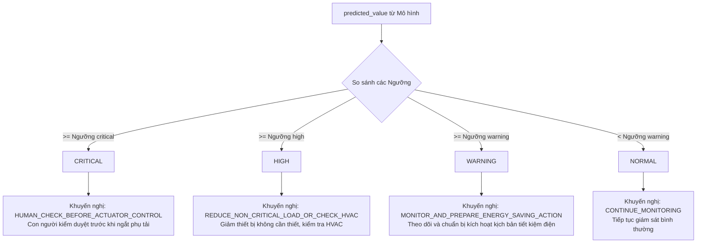

# NHẬT KÝ DỰ BÁO & TẦNG RA QUYẾT ĐỊNH VẬN HÀNH THÔNG MINH

Dự báo số lượng phụ tải điện trong tương lai bằng học máy chỉ là bước trung gian. Trong một hệ thống AIoT hoàn chỉnh, mô hình cần cung cấp khả năng chuyển đổi các con số dự báo thô thành các **quyết định hành động và cảnh báo rủi ro an toàn** mà con người hoặc bộ chấp hành tự động có thể hiểu và thực thi.

Tài liệu này phân tích chi tiết cơ chế hoạt động của Tầng ra quyết định (Decision Layer) và cấu trúc nhật ký vận hành `forecast_log.csv` trong **Lab 4**.

---

## 1. Cơ chế Phân cấp Rủi ro dựa trên Phân vị Thống kê (Statistical Percentiles)

Thay vì đặt các ngưỡng cảnh báo rủi ro một cách cảm tính (hard-coded tĩnh, ví dụ: cứ > 100 Wh là nguy hiểm), Lab 4 áp dụng phương pháp tiếp cận chuẩn khoa học dữ liệu: **Thiết lập ngưỡng rủi ro động dựa trên phân vị xác suất của dữ liệu huấn luyện lịch sử**.

Trong quá trình huấn luyện offline (`train_forecast.py`), hệ thống phân tích phân phối công suất tiêu thụ của tập huấn luyện `y_train` và xác định 3 ngưỡng cắt tương ứng với 3 cấp độ cảnh báo:
*   **Ngưỡng Cảnh báo (Warning Threshold)**: Đặt ở phân vị **$70\%$ (70th percentile)** của tập huấn luyện. Có nghĩa là mức phụ tải này cao hơn $70\%$ số ngày hoạt động bình thường trong lịch sử.
*   **Ngưỡng Cao (High Threshold)**: Đặt ở phân vị **$90\%$ (90th percentile)** của tập huấn luyện. Mức phụ tải cực kỳ hiếm gặp, chỉ xảy ra trong $10\%$ tổng thời gian lịch sử.
*   **Ngưỡng Tới hạn (Critical Threshold)**: Đặt ở phân vị **$97\%$ (97th percentile)** của tập huấn luyện. Mức quá tải nghiêm trọng, chỉ xảy ra trong $3\%$ thời gian vận hành hệ thống.

```python
risk_thresholds = {
    "warning": float(np.quantile(y_train, 0.70)),
    "high": float(np.quantile(y_train, 0.90)),
    "critical": float(np.quantile(y_train, 0.97)),
}
```

### Ngưỡng phân vị là tĩnh, nhưng mang tính thích ứng động:
*   **Tính thích ứng cao**: Khi di chuyển mô hình sang một ngôi nhà khác có quy mô tiêu thụ điện hoàn toàn khác (ví dụ: biệt thự to tiêu thụ trung bình 500 Wh so với căn hộ nhỏ tiêu thụ trung bình 50 Wh), hệ thống chỉ cần huấn luyện lại và tự động xác định lại các ngưỡng thích ứng một cách hoàn toàn tự động mà không cần kỹ sư phải cấu hình lại mã nguồn.

---

## 2. Ánh xạ từ Dự báo sang Cấp độ Rủi ro & Hành động Khuyến nghị

Tại thời điểm API `/forecast` thực hiện suy diễn và nhận được giá trị dự báo năng lượng tiêu thụ cho 10 phút tiếp theo là `predicted_value`, giá trị này sẽ được đưa qua Tầng ra quyết định (Decision Layer) cài đặt trong `utils.py`:



### Chi tiết các Cấp độ Quyết định:

1.  **Cấp độ NORMAL (Bình thường)**:
    *   *Điều kiện*: `predicted_value` < Ngưỡng Warning.
    *   *Khuyến nghị*: `CONTINUE_MONITORING` - Hệ thống hoạt động trong vùng xanh an toàn, tiếp tục duy trì trạng thái đo đạc.
2.  **Cấp độ WARNING (Cảnh báo)**:
    *   *Điều kiện*: Ngưỡng Warning $\le$ `predicted_value` < Ngưỡng High.
    *   *Khuyến nghị*: `MONITOR_AND_PREPARE_ENERGY_SAVING_ACTION` - Phụ tải bắt đầu vượt trung bình lịch sử. Hệ thống chuẩn bị sẵn kịch bản dịch chuyển phụ tải hoặc tắt bớt bóng đèn không dùng.
3.  **Cấp độ HIGH (Rủi ro cao)**:
    *   *Điều kiện*: Ngưỡng High $\le$ `predicted_value` < Ngưỡng Critical.
    *   *Khuyến nghị*: `REDUCE_NON_CRITICAL_LOAD_OR_CHECK_HVAC` - Phụ tải ở mức rất cao. Đề xuất tự động tắt các thiết bị không thiết yếu (bình nước nóng, máy sấy) hoặc chuyển điều hòa sang chế độ tiết kiệm điện (Eco mode) để hạ phụ tải tổng.
4.  **Cấp độ CRITICAL (Rủi ro tới hạn)**:
    *   *Điều kiện*: `predicted_value` $\ge$ Ngưỡng Critical.
    *   *Khuyến nghị*: `HUMAN_CHECK_BEFORE_ACTUATOR_CONTROL` - Dự báo quá tải nghiêm trọng đe dọa an toàn aptomat tổng. Yêu cầu cảnh báo khẩn cấp tới ứng dụng của người dùng hoặc kỹ sư vận hành tòa nhà kiểm tra thủ công trước khi kích hoạt rơ-le ngắt nguồn thiết bị công suất lớn nhằm tránh ngắt nguồn đột ngột ngoài ý muốn.

---

## 3. Cấu trúc lưu trữ Nhật ký dự báo `forecast_log.csv`

Nhật ký dự báo là tài sản dữ liệu vô giá. Nó ghi lại toàn bộ lịch sử suy diễn của mô hình thời gian thực để phục vụ quá trình hậu kiểm (backtesting), đối soát sai số thực tế và phát hiện hiện tượng lệch mô hình (model drift).

Mỗi hàng dữ liệu trong `forecast_log.csv` có schema cấu trúc như sau:

| Tên Cột | Ý nghĩa chi tiết | Ví dụ | Tác dụng trong đối soát AIoT |
| :--- | :--- | :--- | :--- |
| **`timestamp`** | Thời mốc thực hiện dự báo | 2016-04-12 14:20:00 | Trục thời gian đối chiếu kết quả. |
| **`actual_value`** | **Giá trị thực tế** đo được sau đó | 90.0 | Dùng làm nhãn đối chuẩn (ground-truth). |
| **`predicted_value`** | **Giá trị mô hình dự báo** trước đó | 95.42 | Kết quả suy diễn của mô hình. |
| **`forecast_error`** | Sai số thực tế (Dự báo - Thực tế) | 5.42 | Đánh giá mô hình đoán lệch cao hay thấp tại điểm đó. |
| **`abs_error`** | Trị tuyệt đối sai số | 5.42 | Tính toán trực tiếp MAE tức thời. |
| **`risk_level`** | Phân cấp rủi ro an toàn gán nhãn | WARNING | Kiểm tra tính chính xác của bộ phân cấp rủi ro. |
| **`recommendation`** | Hành động khuyến nghị phản hồi | MONITOR... | Kiểm tra logic nghiệp vụ điều khiển. |
| **`reason`** | Giải thích chi tiết bằng tiếng Anh | Predicted... thresholds are... | Phục vụ Explainable AI (XAI) cho người dùng. |
| **`model_version`** | Phiên bản mô hình được nạp | gradient_boosting_advanced_v1 | Hỗ trợ đối soát kiểm thử A/B nhiều phiên bản model. |

Nhờ có file log này, kỹ sư AIoT có thể lập lịch định kỳ (ví dụ cuối mỗi tuần) chạy một script tự động tính toán lại MAE/RMSE trên toàn bộ file log của tuần đó. Nếu thấy sai số tăng vọt so với lúc huấn luyện offline, đó là chỉ báo rõ ràng cho thấy môi trường sinh hoạt của ngôi nhà đã thay đổi và hệ thống cần kích hoạt quy trình tái huấn luyện mô hình (Model Retraining).
