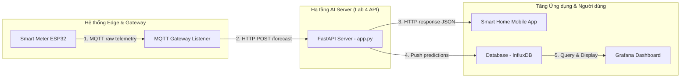

# TRIỂN KHAI VÀ VẬN HÀNH ENDPOINT DỰ BÁO TRÊN FASTAPI API

Khi đưa mô hình học máy vào vận hành thực tế trong hệ sinh thái AIoT, ta cần đóng gói mô hình dưới dạng một **Dịch vụ Web (Web Service API)** gọn nhẹ nhưng mạnh mẽ. API đóng vai trò là cầu nối tiếp nhận dữ liệu đo đạc trực tuyến từ các Gateway ở biên, thực hiện tính toán đặc trưng động, suy diễn mô hình và trả về các chỉ đạo vận hành tức thời.

Tài liệu này giải thích chi tiết quy trình đóng gói mô hình, cách FastAPI nạp và phục vụ suy diễn thời gian thực, chi tiết các endpoint, cấu trúc các gói tin JSON mẫu, sự khác biệt giữa pha thử nghiệm và triển khai, cùng phương pháp kết nối API vào các hệ thống bên thứ ba.

---

## 1. Cơ chế đóng gói Mô hình thành file `.joblib`

Trong học máy chuỗi thời gian, mô hình dự báo không thể chạy đơn độc. Nó luôn cần đi kèm với các siêu tham số phụ trợ được tính toán trong pha huấn luyện offline.

Trong file `train_forecast.py`, hệ thống không chỉ lưu một mô hình học máy duy nhất, mà đóng gói toàn bộ các cấu phần liên quan thành một **Model Bundle** (dạng Dictionary của Python) và xuất ra file nhị phân nén bằng thư viện `joblib`:

```python
model_bundle = {
    "model": trained_models[best_model_name],               # Mô hình học máy tốt nhất (Gradient Boosting...)
    "trained_models": trained_models,                       # Lưu tất cả các mô hình để phục vụ so sánh A/B
    "feature_columns": FEATURE_COLUMNS,                     # Danh sách các đặc trưng đầu vào chuẩn tắc
    "feature_medians": {k: float(v) for k, v in feature_medians.items()}, # Trung vị đặc trưng để điền khuyết thế
    "raw_medians": {k: float(v) for k, v in raw_medians.items()},         # Trung vị dữ liệu cảm biến thô
    "risk_thresholds": risk_thresholds,                     # Các ngưỡng phân vị cảnh báo rủi ro động
    "target": TARGET_COL,                                   # Tên cột biến mục tiêu (Appliances)
    "forecast_horizon_steps": HORIZON_STEPS,                # Số bước chân trời dự báo (1 bước)
    "forecast_horizon_minutes": HORIZON_MINUTES,            # Số phút chân trời dự báo (10 phút)
    "model_version": best_model_name,                       # Phiên bản mô hình được chọn
    "lab_version": MODEL_VERSION,                           # Phiên bản Lab
    "metrics_by_model": metrics,                            # Sai số chi tiết của từng mô hình
}
joblib.dump(model_bundle, MODEL_BUNDLE_PATH)
```

### Tại sao lại đóng gói dạng Bundle?
*   **Tránh Training-Serving Skew (Lệch dữ liệu)**: Giúp đảm bảo rằng các tham số điền khuyết thiếu (`raw_medians`) dùng ở thời điểm chạy trực tuyến hoàn toàn trùng khớp với các tham số đã tính toán trong pha huấn luyện ngoại tuyến.
*   **Dễ dàng bảo trì & xuất bản**: Khi muốn nâng cấp mô hình mới (ví dụ thay đổi ngưỡng rủi ro hoặc đặc trưng đầu vào), ta chỉ cần ghi đè file `.joblib` mới mà không cần phải thay đổi một dòng code logic nào của Server API.

---

## 2. Cách FastAPI nạp và quản lý Mô hình Bundle

Trong file `src/app.py`, việc nạp mô hình được thực hiện ở mức độ phạm vi toàn cục (Global Scope) của tiến trình ngay khi khởi động Server (**Cold Start**):

```python
MODEL_BUNDLE_PATH = MODEL_DIR / "forecast_model_bundle_v1.joblib"

model_bundle = None
if MODEL_BUNDLE_PATH.exists():
    model_bundle = joblib.load(MODEL_BUNDLE_PATH)
```

### Ưu điểm kỹ thuật vận hành:
1.  **Độ trễ phản hồi siêu thấp (Low Latency Serving)**: Việc nạp tệp nhị phân từ ổ đĩa cứng vào bộ nhớ RAM mất khoảng vài trăm mili-giây. Bằng cách nạp mô hình một lần duy nhất khi khởi động, các yêu cầu suy diễn API sau đó chỉ cần truy xuất trực tiếp mô hình trên RAM, giúp thời gian xử lý cực kỳ nhanh (< 50ms).
2.  **Quản lý luồng an toàn (Thread Safe)**: Đối với các mô hình của `scikit-learn`, phương thức `.predict()` hoàn toàn an toàn khi xử lý đồng thời nhiều luồng request gọi đến (multi-threading), giúp Server chịu tải tốt khi scale.

---

## 3. Chi tiết 3 Endpoints của Hệ thống API

FastAPI cung cấp 3 endpoint chuẩn phục vụ cho các mục đích quản lý và vận hành:

### 1. Endpoint `/health` (Kiểm tra sức khỏe)
*   **Phương thức**: `GET`
*   **Mục đích**: Dùng cho các bộ giám sát tự động (Load Balancer, Kubernetes Probe) để kiểm tra xem microservice có đang sống và mô hình đã được nạp thành công vào bộ nhớ hay chưa.
*   **Phản hồi mẫu**:
    ```json
    {
      "status": "ok",
      "model_loaded": true,
      "model_bundle_path": "E:\\AIoT\\Day-4\\lab4_aiot_forecasting_predictive_analytics_uci_appliances_code\\lab4_aiot_forecasting_predictive_analytics_uci_appliances\\models\\forecast_model_bundle_v1.joblib"
    }
    ```

### 2. Endpoint `/model-info` (Thông tin chi tiết mô hình)
*   **Phương thức**: `GET`
*   **Mục đích**: Cung cấp tri thức cho kỹ sư vận hành về cấu hình chi tiết của mô hình đang chạy trực tuyến, các ngưỡng rủi ro hiện tại và bảng sai số đối chứng thu được lúc kiểm thử ngoại tuyến.
*   **Nội dung phản hồi**: Tên thuật toán, phiên bản, chân trời dự báo (10 phút), số lượng đặc trưng đầu vào, các ngưỡng rủi ro thống kê và toàn bộ ma trận sai số MAE/RMSE/MAPE của tất cả các mô hình.

### 3. Endpoint `/forecast` (Suy diễn thời gian thực)
*   **Phương thức**: `POST`
*   **Mục đích**: Điểm tiếp nhận dữ liệu lịch sử thô từ Gateway gửi lên để tính toán và trả về kết quả dự báo an toàn.
*   **Logic xử lý**:
    1.  Nhận gói tin JSON lịch sử telemetry gần nhất.
    2.  Chuyển thành DataFrame, sắp xếp thời gian.
    3.  Làm sạch và điền khuyết thiếu dữ liệu thô bằng `raw_medians`.
    4.  Tính toán các đặc trưng chuỗi thời gian (Lag, Rolling, Delta, Cyclic).
    5.  Rút trích bản ghi cuối cùng tại thời điểm $t$ và điền khuyết đặc trưng bằng `feature_medians`.
    6.  Gọi `model.predict(X)` để suy diễn công suất.
    7.  Ánh xạ sang rủi ro, khuyến nghị và phản hồi.

---

## 4. Gói tin Yêu cầu mẫu (Example Input JSON Payload)

Client (Edge Gateway) cần gửi HTTP POST lên `/forecast` kèm body chứa chuỗi lịch sử đo đạc gần nhất (khuyến nghị $\ge 24$ điểm dữ liệu thô để đảm bảo tính toán đầy đủ các đặc trưng trễ/trượt 4 tiếng).

### JSON Request Payload gửi lên API:
```json
{
  "history": [
    {
      "date": "2016-01-21 11:00:00",
      "Appliances": 80.0,
      "lights": 10.0,
      "T1": 21.5,
      "RH_1": 45.2,
      "T_out": 6.2
    },
    {
      "date": "2016-01-21 11:10:00",
      "Appliances": 90.0,
      "lights": 10.0,
      "T1": 21.6,
      "RH_1": 45.3,
      "T_out": 6.5
    },
    "...[Gửi tiếp 21 điểm trung gian từ 11:20 đến 14:40 để đủ cửa sổ lịch sử]...",
    {
      "date": "2016-01-21 14:50:00",
      "Appliances": 120.0,
      "lights": 20.0,
      "T1": 22.1,
      "RH_1": 46.1,
      "T_out": 7.8
    }
  ]
}
```

---

## 5. Gói tin Phản hồi mẫu (Example Output JSON Response)

Sau khi xử lý, API trả về gói tin JSON cấu trúc cực kỳ trực quan chứa đầy đủ thông tin mô hình và chỉ dẫn an toàn vận hành:

### JSON Response trả về từ API:
```json
{
  "model_output": {
    "target": "Appliances",
    "forecast_horizon_minutes": 10,
    "predicted_value": 135.4215,
    "unit": "Wh per 10-minute interval",
    "model_version": "gradient_boosting_advanced_v1"
  },
  "evaluation_hint": {
    "metrics_file": "outputs/forecast_metrics.json",
    "best_model_mae": 32.4512,
    "best_model_rmse": 52.1245
  },
  "decision": {
    "risk_level": "WARNING",
    "recommendation": "MONITOR_AND_PREPARE_ENERGY_SAVING_ACTION",
    "reason": "Predicted appliance energy is 135.42 Wh; warning/high/critical thresholds are 80.25/142.10/225.40 Wh.",
    "safety_note": "Forecast output is a recommendation signal, not an automatic actuator command. Apply safety rules and human confirmation before control."
  },
  "api_check": {
    "latency_ms": 14.25,
    "input_points": 24,
    "warnings": []
  }
}
```

---

## 6. Giải thích Ý nghĩa các Trường thông tin Quyết định

1.  **`predicted_value`**: Lượng điện tiêu thụ dự báo của các thiết bị gia dụng trong 10 phút tiếp theo, đo bằng đơn vị Watt-giờ (Wh). Đây là đầu ra số thực liên tục của mô hình học máy.
2.  **`forecast_horizon_minutes`**: Chân trời dự báo (đặt là $10$ phút). Cho biết mô hình đang nhìn xa bao lâu vào tương lai.
3.  **`risk_level`**: Cấp độ rủi ro tương ứng với công suất dự báo (`NORMAL`, `WARNING`, `HIGH`, `CRITICAL`), tính toán bằng cách so sánh `predicted_value` với các phân vị xác suất thống kê của tập huấn luyện.
4.  **`recommendation`**: Hành động khuyến nghị vận hành chi tiết tương ứng với cấp rủi ro (ví dụ: ngắt bớt tải phụ để tránh quá tải điện năng).
5.  **`safety_note`**: Dòng lưu ý pháp lý bắt buộc kỹ sư vận hành phải tuân thủ: Tuyệt đối không được thiết lập cho mô hình AI trực tiếp ngắt điện phần cứng tự động mà không qua con người xác nhận hoặc qua các quy tắc khóa cứng (HITL).

---

## 7. Khác biệt cốt lõi: Thử nghiệm trong Notebook vs Triển khai qua API

Sự khác biệt giữa việc huấn luyện trong Notebook và chạy API thời gian thực phản ánh khoảng cách giữa môi trường nghiên cứu (R&D) và môi trường vận hành thực tế (Production):

| Tiêu chí | Pha Thử nghiệm (Jupyter Notebook) | Giai đoạn Triển khai (FastAPI Web Service) |
| :--- | :--- | :--- |
| **Bản chất luồng** | **Batch Processing (Xử lý theo lô)**: Mô hình thực hiện nạp toàn bộ một file lớn chứa hàng vạn dòng dữ liệu thô cùng lúc. | **Stream/Point Processing (Xử lý đơn điểm)**: API chỉ tiếp nhận một chuỗi lịch sử cực ngắn chứa 24 dòng của một ngôi nhà duy nhất tại thời điểm hiện tại $t$. |
| **Tính năng động** | Các đặc trưng Lag, Rolling được tính toán tĩnh một lần trên toàn bộ tập dữ liệu (nhìn được cả tương lai nếu dùng shift ngẫu nhiên). | Các đặc trưng phải tính toán hoàn toàn động trên RAM tại điểm biên chuỗi thời gian của mốc hiện tại $t$ mà không biết trước tương lai $t+1$. |
| **Yêu cầu làm sạch** | Loại bỏ dễ dàng các dòng NaN bằng cách xóa nguyên cột hoặc xóa nguyên dòng của file CSV lớn. | Không thể xóa dòng khuyết thiếu biên. Bắt buộc phải dùng chiến lược **imputation** (điền khuyết thông minh) để đảm bảo mô hình luôn có đủ đầu vào. |
| **Độ trễ (Latency)** | Không yêu cầu (huấn luyện và kiểm thử có thể chạy mất vài phút đến vài tiếng). | Yêu cầu nghiêm ngặt về thời gian thực: Thời gian phản hồi API bắt buộc phải **< 50 mili-giây** để đảm bảo không bị nghẽn mạng. |
| **Mục đích sử dụng** | Phân tích hồi quy, so sánh thuật toán, vẽ biểu đồ nghiên cứu khoa học. | Ra quyết định điều khiển thiết bị, cảnh báo rủi ro an toàn cho người dùng cuối thời gian thực. |

---

## 8. Phương pháp Kết nối API vào các Hệ thống bên thứ ba

FastAPI API có thể dễ dàng tích hợp vào hệ thống AIoT Smart Building quy mô lớn thông qua 3 kênh kết nối chuẩn:



### 1. Kết nối đến Giao diện Giám sát (Dashboard / Grafana)
*   **Cách thức**: Sau khi nhận kết quả JSON từ API, một script phụ trợ sẽ tự động ghi cả giá trị thực tế lẫn giá trị dự báo vào cơ sở dữ liệu chuỗi thời gian như **InfluxDB** hoặc **TimescaleDB**.
*   **Hiển thị**: **Grafana Dashboard** được cấu hình để truy vấn hai Database này và hiển thị hai đường đồ thị đè lên nhau (Actual vs Forecasted). Kỹ sư trực ca có thể nhìn trực quan thấy sai số mô hình tức thời trên màn hình điều khiển trung tâm.

### 2. Kết nối đến Bộ thu nhận MQTT (MQTT Gateway Listener Bridge)
*   **Cách thức**: Viết một script listener chạy nền (ví dụ bằng thư viện `paho-mqtt` của Python) đóng vai trò là cầu nối (Bridge):
    1.  Listener đăng ký nhận dữ liệu từ cảm biến gửi lên MQTT broker.
    2.  Khi nhận được bản tin thô, Listener tích lũy 24 điểm vào một cache cục bộ (hoặc bộ nhớ Redis).
    3.  Listener thực hiện một cú gọi REST API (HTTP POST JSON) lên endpoint `/forecast` của FastAPI.
    4.  Nhận phản hồi JSON, kiểm tra nếu `risk_level` là `CRITICAL` $\rightarrow$ Gửi thông báo đẩy khẩn cấp lên điện thoại của chủ nhà và xuất bản một lệnh MQTT xuống rơ-le để ngắt tải an toàn.

### 3. Kết nối đến Hệ thống Quản trị trung tâm (Backend DB Audit)
*   **Cách thức**: Kết quả dự báo của FastAPI được ghi đè liên tục vào một hàng đợi tin nhắn (Message Queue như Apache Kafka hoặc RabbitMQ).
*   **Tác dụng**: Lớp Backend trung tâm tiêu thụ tin nhắn này và lưu vào hệ thống kho dữ liệu lớn (Elasticsearch / ClickHouse) để phục vụ cho các thuật toán hậu kiểm tự động (Audit checking) và phát hiện lệch mô hình (Model Drift Tracking).
