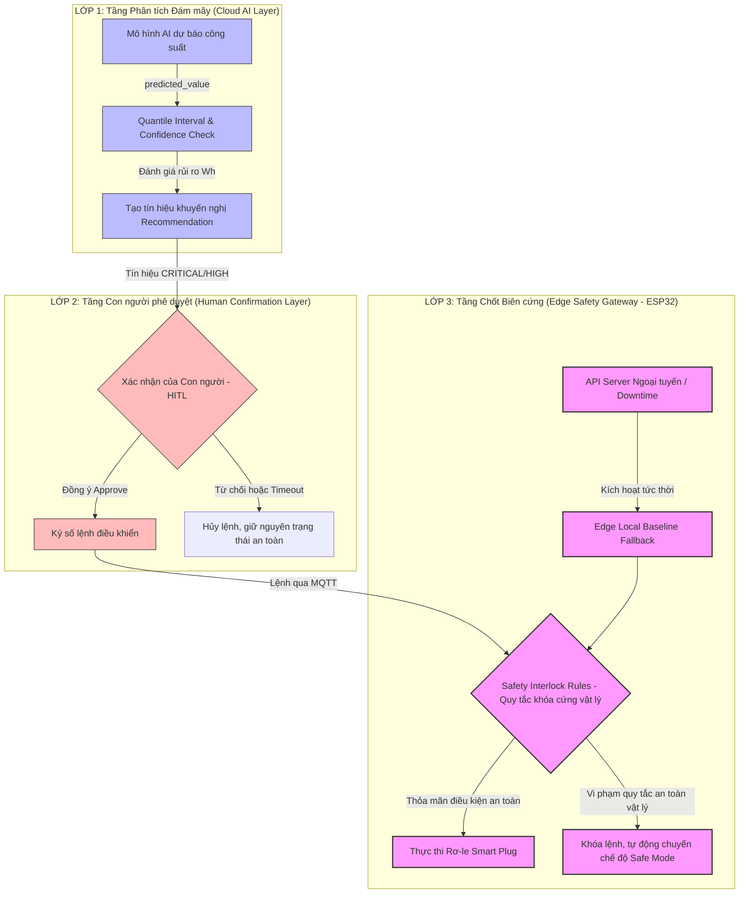
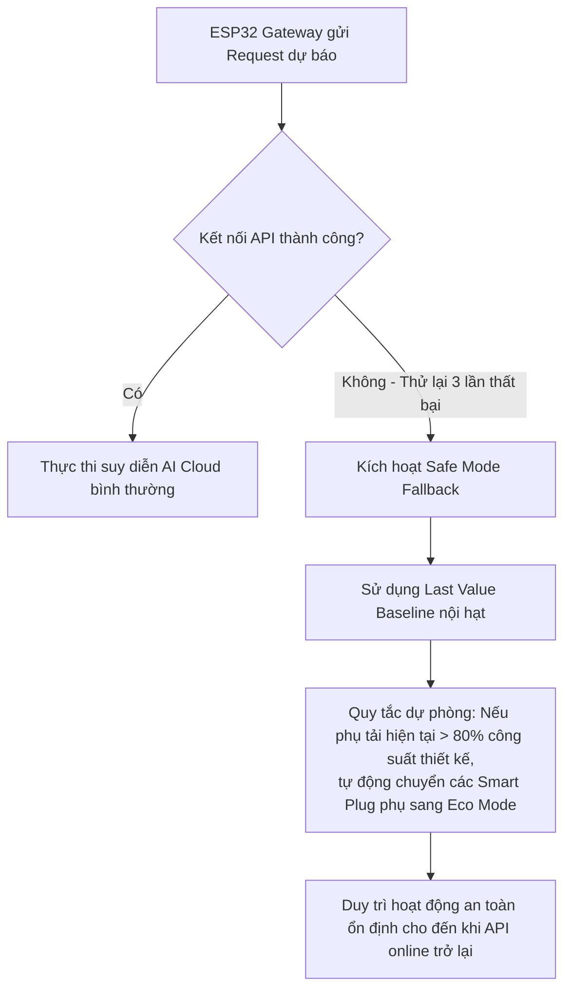

# THIẾT KẾ CƠ CHẾ PHÒNG VỆ AN TOÀN VÀ FAIL-SAFE TRONG HỆ THỐNG AIoT

Trong các hệ thống học máy thông thường (như hệ thống gợi ý phim hay nhận diện khuôn mặt), lỗi dự báo chỉ mang lại trải nghiệm không tốt cho người dùng. Tuy nhiên, trong các hệ thống **AIoT điều khiển cơ điện vật lý (Cyber-Physical Systems)** như quản lý năng lượng thông minh, một lỗi hệ thống hoặc sai số dự báo có thể dẫn đến quá tải lưới điện, sập nguồn toàn bộ tòa nhà, phá hủy thiết bị phần cứng đắt tiền, hoặc thậm chí gây chập điện cháy nổ.

Tài liệu này phân tích chi tiết 8 nhóm rủi ro an toàn lớn trong hệ thống dự báo của **Lab 4**, và thiết kế một kiến trúc bảo vệ đa lớp **Fail-Safe & Safety Gateway** sử dụng các ví dụ AIoT thực tế.

---

## 1. Sơ đồ Kiến trúc Phòng vệ An toàn 3 Lớp (3-Tier Fail-Safe Architecture)

Để đảm bảo an toàn tuyệt đối, hệ thống được thiết kế theo nguyên lý **Phòng thủ chiều sâu (Defense in Depth)** chia làm 3 lớp phòng vệ độc lập:



---

## 2. Phân tích 8 Rủi ro An toàn cốt lõi trong Lab 4

---

### Rủi ro 1: False Prediction (Dự báo sai lệch cực đoan)
*   **Hiện tượng**: Mô hình dự báo phụ tải điện năng Wh trong 10 phút tới là thấp ($80$ Wh), nhưng thực tế công suất tăng vọt lên tới $400$ Wh do chủ nhà đột ngột bật đồng thời bếp từ và bình nóng lạnh ngoài kịch bản lịch sử.
*   **Hậu quả**: Hệ thống quản lý năng lượng (BEMS) không chuẩn bị trước nguồn điện phụ trợ hoặc không chủ động tiết giảm tải phụ, dẫn đến **quá tải Aptomat (Circuit Breaker) tổng**, gây sập nguồn toàn bộ tòa nhà hoặc chập cháy cáp nguồn.
*   **Ví dụ thực tế**: Một tòa nhà văn phòng có hệ thống pin lưu trữ điện (ESS) sạc/xả tự động dựa trên dự báo AI. AI dự báo tải thấp nên cho xả pin bán điện lên lưới. Đúng lúc đó, hệ thống thang máy và điều hòa trung tâm khởi động đồng loạt, gây sụt áp nghiêm trọng và nhảy aptomat tổng, làm tê liệt hoạt động của toàn văn phòng.

---

### Rủi ro 2: Delayed Prediction (Dự báo bị trễ hạn / quá giờ)
*   **Hiện tượng**: API `/forecast` bị nghẽn mạng hoặc tài nguyên CPU quá tải, dẫn đến thời gian phản hồi (latency) kéo dài hơn 1 phút, vượt quá chu kỳ ra quyết định tức thời.
*   **Hậu quả**: Lớp chấp hành (Actuator) không nhận được chỉ thị điều khiển đúng lúc, tiếp tục duy trì trạng thái quá tải kéo dài dẫn đến phá hủy thiết bị.
*   **Ví dụ thực tế**: Lưới điện microgrid thông minh yêu cầu điều chỉnh giảm tải sưởi trong vòng 30 giây khi phát hiện tần số lưới sụt giảm. Dự báo AI bị trễ 2 phút do nghẽn CPU, khiến hệ thống Microgrid không kịp phản ứng và buộc phải ngắt điện toàn bộ khu vực để tránh rã lưới.

---

### Rủi ro 3: Unstable Telemetry (Tín hiệu cảm biến không ổn định/nhiễu)
*   **Hiện tượng**: Cảm biến đo dòng điện bị chập chờn, sinh ra các giá trị gai nhọn cực đoan (ví dụ: dòng điện nhảy vọt lên 500A trong 1 mili-giây do nhiễu cảm ứng điện từ), hoặc cảm biến nhiệt độ bếp nhảy vọt lên 150°C.
*   **Hậu quả**: Các đặc trưng trễ (`lag`) và đặc trưng trượt (`rolling`) bị bóp méo hoàn toàn bởi các giá trị ngoại lai (outliers), khiến mô hình AI đưa ra các cảnh báo rủi ro CRITICAL giả, gây ngắt điện vô cớ cho các thiết bị quan trọng.
*   **Ví dụ thực tế**: Máy hàn hồ quang trong xưởng cơ khí khởi động tạo ra xung nhiễu điện từ cực lớn lan truyền trong dây điện, làm cảm biến đo điện năng của tủ lạnh thông minh bên cạnh ghi nhận giá trị ảo 2000W. Hệ thống AI tin vào con số này và ngắt nguồn tủ lạnh ngay lập tức, làm hỏng toàn bộ thực phẩm lưu trữ.

---

### Rủi ro 4: Missing Data (Mất tín hiệu truyền tin/khuyết thiếu dữ liệu)
*   **Hiện tượng**: Cảm biến nhiệt độ phòng ngủ hoặc trạm thời tiết ngoài trời bị hết pin hoặc mất kết nối mạng Wi-Fi/Zigbee tạm thời, gửi lên giá trị trống `NaN` trong payload API.
*   **Hậu quả**: Mô hình hồi quy hoặc cây quyết định trực tuyến bị lỗi crash hệ thống do không thể tính toán trên giá trị rỗng, làm gián đoạn hoàn toàn dịch vụ dự báo.
*   **Ví dụ thực tế**: Mất kết nối Wi-Fi tại khu vực tầng hầm khiến cảm biến đo nhiệt độ phòng máy chủ không gửi được dữ liệu. FastAPI bị lỗi crash vì nhận giá trị trống, hệ thống điều hòa dự phòng không được bật lên kịp thời, dẫn đến dàn máy chủ bị quá nhiệt tự tắt.

---

### Rủi ro 5: Model Drift (Độ lệch mô hình giảm độ chính xác)
*   **Hiện tượng**: Thói quen sinh hoạt của gia đình thay đổi hoàn toàn (ví dụ: mùa đông chuyển sang mùa hè, hoặc nhà có thêm thành viên mới sử dụng thêm nhiều thiết bị điện). Phân phối dữ liệu thực tế lệch hoàn toàn so với lúc huấn luyện offline.
*   **Hậu quả**: Sai số MAE của mô hình tăng vọt từ $30$ Wh lên $150$ Wh, các cảnh báo rủi ro hoàn toàn sai lệch thực tế.
*   **Ví dụ thực tế**: Mô hình AI dự báo phụ tải được huấn luyện vào mùa đông (khi không dùng điều hòa). Khi mùa hè đến, mô hình liên tục dự báo phụ tải thấp và coi lượng điện sưởi là bằng 0, dẫn đến việc không tính toán đúng công suất làm lạnh tăng vọt của điều hòa, gây mất an toàn lưới điện.

---

### Rủi ro 6: API Downtime (Dịch vụ API bị sập hoàn toàn)
*   **Hiện tượng**: Máy chủ chạy FastAPI bị sập nguồn, cháy linh kiện, mất kết nối internet hoặc bị tấn công DDoS ngoại tuyến.
*   **Hậu quả**: Gateway biên hoàn toàn mất liên lạc với bộ não AI, không có bất kỳ tín hiệu dự báo hay khuyến nghị nào được đưa ra.
*   **Ví dụ thực tế**: Một trận bão lớn làm đứt đường truyền cáp quang của tòa nhà lên Cloud Server. API dự báo nằm trên Cloud bị cô lập. Hệ thống quản lý tòa nhà thông minh bị "mù" thông tin hoàn toàn, mất khả năng tự động tối ưu hóa điện năng trong giờ cao điểm.

---

### Rủi ro 7: Dangerous Automatic Control (Điều khiển tự động nguy hiểm)
*   **Hiện tượng**: Hệ thống AIoT được thiết kế tự động hoàn toàn (Closed-loop automation) mà không có sự kiểm duyệt của con người hay các giới hạn vật lý cứng.
*   **Hậu quả**: Mô hình AI bị lỗi nhiễu tự ý ra lệnh ngắt nguồn các thiết bị quan trọng đe dọa trực tiếp an sinh xã hội hoặc tính mạng con người (ví dụ: ngắt nguồn thiết bị y tế tại nhà, ngắt nguồn tủ lạnh bảo quản vaccine, tắt camera an ninh).
*   **Ví dụ thực tế**: AI dự báo tòa nhà sắp quá tải điện nghiêm trọng lúc 19:00 tối, tự động ngắt điện của toàn bộ hệ thống sưởi và thông gió tầng hầm chung cư khi có hàng trăm người đang đỗ xe, gây nguy cơ ngộ độc khí thải CO.

---

### Rủi ro 8: Dashboard Misinterpretation (Người dùng hiểu sai giao diện)
*   **Hiện tượng**: Giao diện hiển thị đồ thị dự báo không ghi rõ sai số khoảng bất định, chỉ vẽ một đường dự báo Wh cứng nhắc hoặc sử dụng màu sắc cảnh báo gây hiểu lầm.
*   **Hậu quả**: Người vận hành tin tưởng tuyệt đối vào con số dự báo Wh chính xác, đưa ra các quyết định đóng ngắt cầu dao tải lớn một cách liều lĩnh mà không biết rằng mô hình đang có độ tin cậy cực thấp tại thời điểm đó.
*   **Ví dụ thực tế**: Màn hình giám sát vẽ đường dự báo công suất sẽ giảm mạnh lúc 15:00. Người trực ca tin tưởng nên ngắt bớt máy phát điện dự phòng. Thực tế mô hình đang có độ tin cậy thấp và phụ tải vọt lên, gây mất điện đột ngột toàn khu vực do thiếu công suất.

---

## 3. Thiết kế Cơ chế Phòng vệ Fail-Safe & Safety Gateway

Để triệt tiêu hoàn toàn 8 rủi ro trên, chúng ta thiết kế bộ 5 cơ chế phòng vệ an toàn thực tế sau:

---

### 1. Kiến trúc Khóa chốt an toàn vật lý Biên (Edge Safety Gateway)
Chúng ta không tin tưởng tuyệt đối vào lệnh điều khiển gửi từ Cloud/Server API xuống. Tại thiết bị phần cứng Edge Gateway (hoặc chip nhúng **ESP32** trực tiếp điều khiển Smart Plug), chúng ta lập trình sẵn một **lớp quy tắc khóa cứng (Hard-coded safety rules)** độc lập hoàn toàn bằng C++/MicroPython:

#### Mã nguồn ESP32 nhúng Safe Interlock (Ví dụ thực tế):
```cpp
// ESP32 Code - Edge Safety Interlock Rules
const float MAX_PHYSICAL_CURRENT = 16.0; // Giới hạn dòng điện định mức an toàn 16 Ampe
const float CRITICAL_TEMPERATURE = 60.0; // Ngưỡng nhiệt độ cháy nổ thiết bị 60°C
bool refrigerator_power_state = true;    // Trạng thái nguồn tủ lạnh

void execute_actuator_control(String json_command) {
    // Giải mã JSON lệnh điều khiển nhận từ Cloud API
    DynamicJsonDocument doc(1024);
    deserializeJson(doc, json_command);
    String target_device = doc["device"];
    String requested_action = doc["action"]; // "ON" hoặc "OFF"

    // Đọc cảm biến vật lý trực tiếp tại biên thời gian thực
    float current_temp = read_dht22_temp();
    float current_load = read_ct_sensor_current();

    // RÀNG BUỘC KHÓA CỨNG AN TOÀN 1: Bảo vệ quá tải dòng điện vật lý tức thời
    if (current_load > MAX_PHYSICAL_CURRENT) {
        emergency_shutdown("OVERCURRENT_PROTECTION_ACTIVATED");
        return; 
    }

    // RÀNG BUỘC KHÓA CỨNG AN TOÀN 2: Bảo vệ tủ lạnh/thiết bị y tế quan trọng
    if (target_device == "refrigerator" && requested_action == "OFF") {
        if (current_temp > 6.0) { // Nếu tủ lạnh đang ấm dần lên (>6 độ C), cấm ngắt điện!
            log_safety_violation("REJECTED_OFF_COMMAND: Refrigerator temp is too warm.");
            return; // Hủy lệnh điều khiển của AI, giữ nguyên trạng thái bật nguồn
        }
    }

    // Nếu vượt qua tất cả các ràng buộc, mới cho phép đóng ngắt rơ-le vật lý
    if (requested_action == "OFF") {
        digitalWrite(RELAY_PIN, LOW);
    } else {
        digitalWrite(RELAY_PIN, HIGH);
    }
}
```

---

### 2. Logic dự phòng khi API ngoại tuyến (Edge Baseline Fallback)
Khi mất mạng Internet hoặc Server API FastAPI bị sập (Downtime), Edge Gateway biên phát hiện thông qua cơ chế **ping timeout (3 lần liên tiếp không nhận được phản hồi HTTP 200)**. 
Gateway lập tức tự động kích hoạt **logic dự phòng nội hạt (Local Fallback)** mà không cần AI:



---

### 3. Quy tắc khoảng tin cậy & Ngưỡng bất định (Confidence Threshold Rules)
Thay vì sử dụng kết quả dự báo điểm, mô hình Gradient Boosting được cấu hình để huấn luyện Hồi quy phân vị (**Quantile Regression**) cho ra 3 giá trị dự báo:
*   `pred_low` (Phân vị $0.1$): Công suất tối thiểu.
*   `pred_mean` (Phân vị $0.5$): Công suất trung bình dự kiến.
*   `pred_high` (Phân vị $0.9$): Công suất tối đa dự kiến với độ tin cậy $90\%$ của mẫu.

#### Quy tắc quyết định an toàn (Confidence rule):
*   Nếu khoảng bất định $\Delta_{\text{uncertainty}} = (\text{pred\_high} - \text{pred\_low})$ quá lớn (ví dụ $> 100$ Wh), chứng tỏ mô hình đang cực kỳ bối rối và có độ tin cậy rất thấp.
*   **Hành động fail-safe**: Hệ thống tự động **bỏ qua giá trị dự báo trung bình** `pred_mean` và sử dụng giá trị cận trên an toàn nhất **`pred_high`** để tính toán cấp độ rủi ro, bảo đảm luôn chuẩn bị dư công suất phòng ngừa rủi ro quá tải điện năng.

---

### 4. Quy tắc xác nhận của Con người (Human-in-the-Loop Workflow)
Thiết lập bộ quy tắc bắt buộc phê duyệt thủ công nhằm kiểm soát hiện tượng bão hòa cảnh báo (Alert Fatigue):

*   **Quy tắc 1: Cảnh báo đa điểm**: Chỉ phát tín hiệu cảnh báo mức **CRITICAL** tới người dùng nếu giá trị dự báo vượt ngưỡng liên tục trong **3 chu kỳ đo liên tiếp (30 phút)**. Loại bỏ hoàn toàn các cảnh báo giả do phụ tải tăng vọt tức thời trong vài giây.
*   **Quy tắc 2: Phê duyệt hai hướng**: Khi có lệnh ngắt tải lớn (ví dụ tắt hệ thống HVAC sảnh chính tòa nhà), FastAPI gửi thông báo xác nhận kèm mã PIN an toàn lên ứng dụng di động của kỹ sư trưởng:
    *   Nếu kỹ sư nhấn **"XÁC NHẬN" (Approve)** trong vòng 120 giây $\rightarrow$ Gửi lệnh MQTT xuống ESP32 đóng rơ-le.
    *   Nếu kỹ sư nhấn **"HỦY" (Reject)** hoặc **quá 120 giây không phản hồi (Timeout)** $\rightarrow$ Hủy lệnh hoàn toàn, duy trì trạng thái cũ và ghi nhận lỗi vào log file hệ thống.

---

### 5. Logic Ngắt khẩn cấp Phòng vệ An toàn (Emergency Shutdown Logic)
Đây là chốt chặn an toàn cuối cùng (Last Line of Defense) bảo vệ tính mạng con người và phòng chống hỏa hoạn cháy nổ lưới điện:
*   Mạng lưới ESP32 liên tục lắng nghe tín hiệu từ **Cảm biến khói (Smoke sensor)** và **Cảm biến rò rỉ dòng điện (RCD)** tại tủ điện tổng.
*   **Quy tắc ngắt khẩn cấp**: Ngay khi phát hiện nồng độ khói vượt ngưỡng an toàn ($>300$ ppm) hoặc phát hiện rò dòng điện vượt quá $30$ mA:
    1.  ESP32 tự động **cắt nguồn điện rơ-le tổng lập tức** (trong vòng < 10 mili-giây) bằng ngắt cứng phần cứng (Hardware Interrupt), bỏ qua hoàn toàn mọi chỉ dẫn, lệnh điều khiển từ API hay xác nhận của con người.
    2.  Đồng thời, ESP32 chuyển sang chế độ phát tín hiệu cảnh báo còi hú và gửi bản tin MQTT khẩn cấp `topic: smarthome/emergency` phát báo động đỏ lên toàn hệ thống đám mây.
