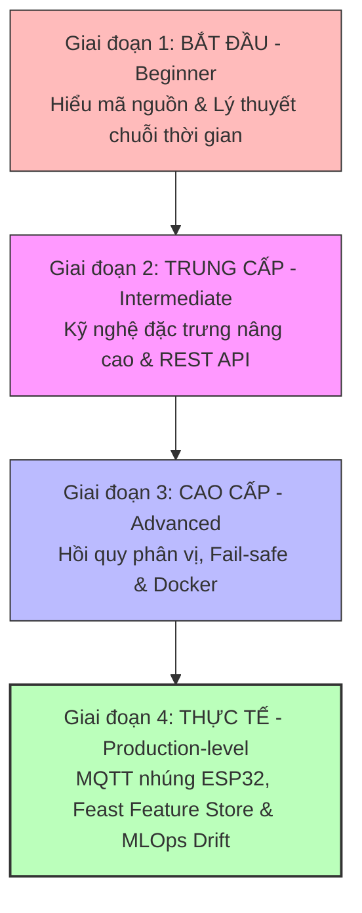

# LỘ TRÌNH PHÁT TRIỂN & ĐƯỜNG DẪN HỌC TẬP AIoT FORECASTING

Để nâng cấp toàn diện dự án từ một mô hình giả lập lớp học thử nghiệm (POC) lên một hệ thống **Học máy vận hành thực tế chuẩn công nghiệp (Production MLOps AIoT)**, kỹ sư cần có lộ trình rõ ràng. 

Tài liệu này tích hợp hai cấu phần quan trọng nhất: **Lộ trình nâng cấp hệ thống MLOps 3 cấp độ** dành cho doanh nghiệp, và **Đường dẫn học tập phễu 4 giai đoạn** dành cho học viên muốn mở rộng nghiên cứu phát triển dự án.

---

## 🗺️ PHẦN I: SƠ ĐỒ PHỄU ĐƯỜNG DẪN HỌC TẬP (LEARNING FUNNEL)

Dưới đây là sơ đồ rèn luyện năng lực của học viên từ người mới bắt đầu đến chuyên gia MLOps AIoT thông qua 4 giai đoạn phát triển:

---

## CHI TIẾT 4 GIAI ĐOẠN PHÁT TRIỂN NĂNG LỰC HỌC VIÊN

### GIAI ĐOẠN 1: BẮT ĐẦU (BEGINNER PHASE)
*Mục tiêu: Đọc hiểu trọn vẹn mã nguồn bài mẫu, giải thích được các phép biến đổi toán học cơ bản và chạy thành công pipeline ngoại tuyến.*

*   **Các khái niệm cần nghiên cứu**: Tự tương quan (Autocorrelation) chuỗi thời gian, bài toán hồi quy (Regression) vs phân loại, ý nghĩa vật lý của MAE/RMSE/MAPE/Bias, rò rỉ dữ liệu (Data Leakage) và Time-series Split.
*   **Các file cần đọc hiểu**: `notebooks/01_forecasting_predictive_analytics.ipynb`, `src/utils.py`, `docs/00_project_overview.md`, `docs/06_model_training_and_metrics.md`.
*   **Các thử nghiệm cần làm**: Chạy huấn luyện offline để tạo tệp `.joblib` và chạy script `plot_results.py` xuất ảnh đồ thị trong `figures/`.
*   **Bài tập lập trình**: Viết thêm chỉ số R-squared vào hàm `regression_metrics` trong `utils.py` và in kết quả.
*   **Bài tập gỡ lỗi**: Đổi hàm chia dữ liệu thành `train_test_split(..., shuffle=True)` để quan sát hiện tượng tụt giảm MAE ảo (rò rỉ dữ liệu).
*   **Bài tập thiết kế kiến trúc**: Vẽ lại sơ đồ luồng luân chuyển của một telemetry point từ khi nạp CSV đến khi API phản hồi.
*   **Bài tập triển khai**: Chạy thành công Server FastAPI bằng uvicorn cục bộ, sử dụng `/docs` Swagger UI để xem 3 endpoints.

---

### GIAI ĐOẠN 2: TRUNG CẤP (INTERMEDIATE PHASE)
*Mục tiêu: Biết cách chỉnh sửa đặc trưng chuỗi thời gian, cải tiến logic phân cấp rủi ro quyết định và kiểm thử API thời gian thực.*

*   **Các khái niệm cần nghiên cứu**: Cơ chế lượng giác Sin/Cos của Cyclic Time, logic điền khuyết dữ liệu thô (`raw_medians`) và đặc trưng (`feature_medians`), Pydantic request validation, và phân vị thống kê rủi ro.
*   **Các file cần đọc hiểu**: `src/utils.py` (hàm Lag, Rolling, Delta), `src/app.py` (schema & endpoint `/forecast`), `src/test_api_local.py`.
*   **Các thử nghiệm cần làm**: Đổi window rolling từ 6 lên 12 bước, huấn luyện lại mô hình và ghi nhận MAE biến động. Gửi thử payload rỗng cột cảm biến lên API Swagger UI xem điền khuyết thiếu hoạt động.
*   **Bài tập lập trình**: 
    1. Bổ sung đặc trưng tương tác nhiệt độ `temp_diff = T_indoor - T_out` vào hàm `add_lag_rolling_features` trong `utils.py`.
    2. Hạ thấp ngưỡng WARNING vào giờ cao điểm điện đắt (18:00 - 21:00) trong hàm `risk_from_prediction`.
*   **Bài tập gỡ lỗi**: Gửi chuỗi lịch sử cực ngắn (10 điểm đo), đặt breakpoint tại `app.py` để xem `fillna` đặc trưng bằng `feature_medians` hoạt động cứu nguy sập mô hình.
*   **Bài tập thiết kế kiến trúc**: Thiết kế cấu trúc bảng Database PostgreSQL/TimescaleDB lưu telemetry và nhật ký dự báo.
*   **Bài tập triển khai**: Chạy script test API trực tuyến `python src/test_api.py` qua giao thức mạng HTTP thực tế.

---

### GIAI ĐOẠN 3: CAO CẤP (ADVANCED PHASE)
*Mục tiêu: Đóng gói container hóa ứng dụng, nâng cấp giải thuật khoảng tin cậy và viết Unit Test cho toàn bộ lõi toán học.*

*   **Các khái niệm cần nghiên cứu**: Hồi quy phân vị (Quantile Regression), Prediction Intervals, khóa chốt quy tắc cứng an toàn nhúng, Docker containerization, và Unit Testing với PyTest.
*   **Các file cần đọc hiểu**: `docs/09_safety_and_risk.md` (HITL), `docs/code_review.md` (Restructuring).
*   **Các thử nghiệm cần làm**: Huấn luyện Gradient Boosting với `loss="quantile"` để lấy cận trên dự báo an toàn `pred_high`, mô phỏng sập mạng kiểm thử logic Edge Fallback nội hạt.
*   **Bài tập lập trình**: 
    1. Viết `Dockerfile` và `docker-compose.yml` đóng gói dịch vụ API chạy trên cổng 8000.
    2. Viết 5 bài Unit Tests trong thư mục `tests/` sử dụng `pytest` kiểm định hàm Sin/Cos và điền khuyết thiếu của `utils.py`.
*   **Bài tập gỡ lỗi**: Gửi giá trị nhiệt độ kitchen nhiễu ảo âm 100°C và viết Pydantic validator từ chối request, bảo vệ mô hình khỏi dữ liệu rác.
*   **Bài tập thiết kế kiến trúc**: Thiết kế kiến trúc chốt chốt chặn an toàn phối hợp ngắt nguồn khẩn cấp (RCD/Smoke sensor) độc lập biên.
*   **Bài tập triển khai**: Build Docker image thành công và chạy container FastAPI phục vụ dự báo Wh trên cloud server AWS EC2.

---

### GIAI ĐOẠN 4: VẬN HÀNH THỰC TẾ (PRODUCTION-LEVEL PHASE)
*Mục tiêu: Tích hợp ESP32 thực tế qua MQTT broker EMQX, thiết lập Feature Store Feast (Redis) và xây dựng quy trình tự động MLOps khép kín.*

*   **Các khái niệm cần nghiên cứu**: MQTT EMQX, Feast Feature Store, Apache Flink / Faust Stream processing, đo lường trôi lệch dữ liệu ( Wasserstein Distance ), và MLflow Model Registry.
*   **Các file cần đọc hiểu**: `docs/11_development_roadmap.md`, `docs/reverse_engineering_analysis.md`.
*   **Các thử nghiệm cần làm**: So sánh độ trễ truy vấn đặc trưng giữa Feast Feature Store (Redis) so với tính Pandas trong RAM.
*   **Bài tập lập trình**:
    1. Viết mã nhúng C++ cho **ESP32** đo CT dòng điện, đóng gói JSON và Publish lên EMQX Broker 10 phút một lần.
    2. Viết listener bridge Subscribe nhận tin MQTT, lưu TimescaleDB, gọi API dự báo Wh và Publish lệnh Smart Plug phản hồi.
*   **Bài tập gỡ lỗi**: Sử dụng **Evidently AI** viết script chạy nền định kỳ kiểm tra trôi lệch dữ liệu (Data Drift).
*   **Bài tập thiết kế kiến trúc**: Thiết kế kiến trúc MLOps khép kín: Kafka $\rightarrow$ Feast $\rightarrow$ Triton serving $\rightarrow$ MLflow $\rightarrow$ Prometheus/Grafana.
*   **Bài tập triển khai**: Triển khai cụm EMQX, TimescaleDB, Redis Cluster và Feast Feature Store phân tán. Thiết lập Alert Manager tự động gửi cảnh báo Slack/Telegram khi phát hiện model drift.

---
---

## 🚀 PHẦN II: LỘ TRÌNH CẢI TIẾN HỆ THỐNG MLOps DOANH NGHIỆP

Đối với doanh nghiệp muốn phát triển mã nguồn hiện tại thành một nền tảng quy mô lớn thương mại, dưới đây là các cấu phần cần nâng cấp trong 3 cấp độ:

### CẤP ĐỘ 1: BÀI TẬP MỞ RỘNG CHO SINH VIÊN (STUDENT EXTENSION)

#### 1. Thay đổi Chân trời dự báo (Change Forecast Horizon)
*   **Mục đích**: Thay đổi chân trời dự báo $h$ để dự đoán xa hơn (dự báo trước 1 tiếng, tương ứng $h = 6$ bước thời gian).
*   **Tại sao lại quan trọng**: Giúp người quản lý tòa nhà có đủ thời gian (1 tiếng) chuẩn bị kịch bản tối ưu hóa phụ tải hoặc huy động pin dự trữ.
*   **Các file gợi ý chỉnh sửa**: `src/utils.py` (sửa `HORIZON_STEPS = 6`), `src/train_forecast.py`.
*   **Độ khó**: Thấp.
*   **Sản phẩm mong đợi**: Mô hình huấn luyện thành công đoán trước 1 tiếng, sai số MAE được cập nhật trên tập kiểm thử mới.

#### 2. Bổ sung đặc trưng nâng cao (Add More Features)
*   **Mục đích**: Tạo ra đặc trưng chênh lệch nhiệt độ trong/ngoài nhà `temp_diff = T_indoor - T_out`.
*   **Tại sao lại quan trọng**: Cho thấy tương tác vật lý trực tiếp lên hiệu năng tiêu thụ điện của điều hòa HVAC.
*   **Các file gợi ý chỉnh sửa**: `src/utils.py` (hàm `add_lag_rolling_features`).
*   **Độ khó**: Trung bình.
*   **Sản phẩm mong đợi**: Mô hình học máy Gradient Boosting giảm MAE nhờ đặc trưng tương tác nhiệt chất lượng.

---

### CẤP ĐỘ 2: MỞ RỘNG QUY MÔ KỸ THUẬT HỆ THỐNG (ENGINEERING EXTENSION)

#### 1. Endpoint dự báo hàng loạt (Batch Forecast Endpoint)
*   **Mục đích**: Tạo endpoint REST `/forecast-batch` cho phép Gateway gửi lên mảng JSON lịch sử của hàng trăm ngôi nhà đồng thời.
*   **Tại sao lại quan trọng**: Giảm số lượng request HTTP mạng, tối ưu hóa suy diễn song song của CPU/GPU.
*   **Các file gợi ý chỉnh sửa**: `src/app.py`.
*   **Độ khó**: Trung bình.
*   **Sản phẩm mong đợi**: API `/forecast-batch` chấp nhận payload đa chiều và trả phản hồi song song ổn định.

#### 2. Đóng gói Container hóa với Docker (Docker Deployment)
*   **Mục đích**: Đóng gói microservice FastAPI thành container chạy độc lập qua Dockerfile và docker-compose.yml.
*   **Tại sao lại quan trọng**: Bảo đảm tính đồng nhất môi trường thư viện Python khi deploy lên Edge Gateway biên hoặc Cloud Server.
*   **Các file gợi ý chỉnh sửa**: Tạo file `Dockerfile` và `docker-compose.yml` ở thư mục gốc.
*   **Độ khó**: Thấp.
*   **Sản phẩm mong đợi**: Container Docker chạy dịch vụ API dự báo Wh mượt mà trên cổng 8000.

---

### CẤP ĐỘ 3: MỞ RỘNG CÔNG NGHIỆP THỰC TẾ (PRODUCTION AIoT EXTENSION)

#### 1. Thu thập Telemetry qua MQTT thực tế (MQTT Telemetry Ingestion)
*   **Mục đích**: Kết nối truyền tin không dây không chạm từ ESP32 vật lý lên MQTT Broker EMQX và Bridge Listener.
*   **Tại sao lại quan trọng**: Tiết kiệm 90% băng thông truyền dẫn và năng lượng tiêu thụ của Edge Gateway so với HTTP REST truyền thống.
*   **Các file gợi ý chỉnh sửa**: Tạo file mới `src/mqtt_bridge.py`.
*   **Độ khó**: Cao.
*   **Sản phẩm mong đợi**: Luồng MQTT gửi nhận Wh thô $\rightarrow$ gọi API dự báo $\rightarrow$ trả chỉ thị đóng ngắt Smart Plug khép kín thời gian thực.

#### 2. Giám sát trôi lệch dữ liệu & tự động retrain (Drift & Auto Retrain CT)
*   **Mục đích**: Tích hợp công cụ giám sát drift (Wasserstein Distance) và cron job tự động (Apache Airflow) huấn luyện lại mô hình mỗi tháng.
*   **Tại sao lại quan trọng**: Bảo đảm mô hình không bị giảm sút độ chính xác theo mùa và tự thích ứng thích nghi 100% tự động.
*   **Các file gợi ý chỉnh sửa**: Tạo file mới `src/retrain_pipeline.py` và `src/monitor_drift.py`.
*   **Độ khó**: Cao.
*   **Sản phẩm mong đợi**: Pipeline MLOps CT tự chạy định kỳ, Grafana Dashboard hiển thị cảnh báo Drift khi p-value sụt giảm dưới ngưỡng an toàn.
