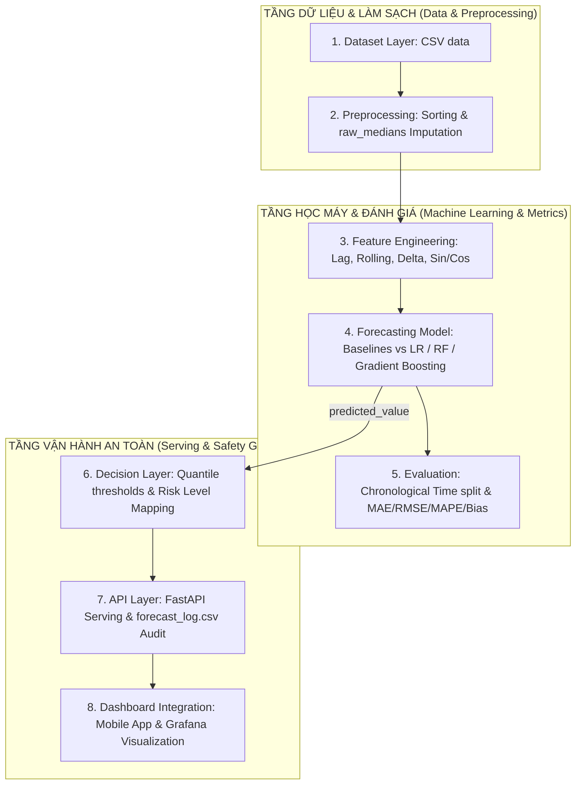
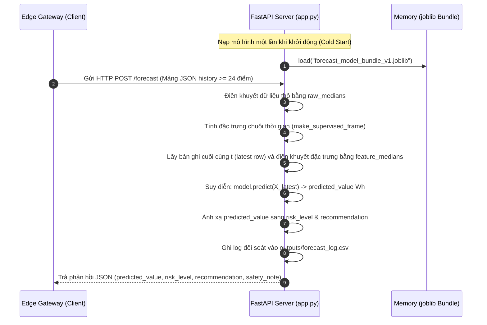

# SÁCH HƯỚNG DẪN KỸ THUẬT: PHÂN TÍCH DỰ BÁO NĂNG LƯỢNG CHO HỆ THỐNG AIoT (SMART HOME BEMS)

---

## 🧭 LỜI MỞ ĐẦU & HƯỚNG DẪN TIẾP CẬN

Chào mừng các kỹ sư AI trẻ, các nhà nghiên cứu nhúng và kiến trúc sư hệ thống AIoT tương lai đến với **Sách hướng dẫn Kỹ thuật chuyên sâu (Technical Handbook)** của dự án **Lab 4: Forecasting & Predictive Analytics**.

Dự án này là một mô hình thu nhỏ hoàn hảo (Digital Twin) của một hệ thống quản lý năng lượng tòa nhà thông minh thực tế (BEMS - Building Energy Management System). Cuốn sách hướng dẫn này được biên soạn nhằm chuyển đổi tri thức của toàn bộ 16 tệp tài liệu riêng lẻ thành một bộ cẩm nang duy nhất, dẫn dắt tư duy của người học một cách tuần tự từ lý thuyết học máy chuỗi thời gian đến thực tế chốt chặn an toàn vật lý và MLOps quy mô công nghiệp.

---

## 📌 MỤC LỤC (TABLE OF CONTENTS)

1.  **[Từ điển Thuật ngữ Chuyên ngành (Glossary)](#sec-1)**
2.  **[Tóm tắt Kiến trúc Hệ thống 8 Lớp (Architecture Summary)](#sec-2)**
3.  **[Kỹ nghệ Đặc trưng & Pipeline học có giám sát (Feature Engineering & Pipeline)](#sec-3)**
4.  **[Mô hình hóa & Đánh giá sai số toán học (Modeling & Metrics)](#sec-4)**
5.  **[Quy trình Hoạt động API FastAPI thời gian thực (FastAPI Serving)](#sec-5)**
6.  **[Thiết kế An toàn, Fail-safe & Khóa chốt Biên nhúng (Safety & Fail-safe)](#sec-6)**
7.  **[Kịch bản Gỡ lỗi & Khắc phục Sự cố chi tiết (Debugging & Troubleshooting)](#sec-7)**
8.  **[Lỗi Thường Gặp & Câu hỏi Thường Gặp (Common Mistakes & FAQ)](#sec-8)**
9.  **[Lưu ý Triển khai & Lộ trình Nâng cấp Doanh nghiệp (Deployment & Roadmap)](#sec-9)**

---

## 1. TỪ ĐIỂN THUẬT NGỮ CHUYÊN NGÀNH (GLOSSARY) {: #sec-1 }

*   **AIoT (Artificial Intelligence of Things)**: Sự kết hợp giữa Trí tuệ nhân tạo (AI) và Internet vạn vật (IoT) nhằm tạo ra các hệ thống có khả năng tự cảm nhận, tự học hỏi và ra quyết định thông minh trực tiếp trên các thiết bị biên hoặc đám mây.
*   **BEMS (Building Energy Management System)**: Hệ thống quản lý năng lượng tòa nhà, tích hợp phần cứng và phần mềm để giám sát, điều khiển và tối ưu hóa việc tiêu thụ điện năng của HVAC, chiếu sáng và các thiết bị công suất lớn.
*   **Lag Feature (Đặc trưng trễ)**: Phép toán lấy giá trị của một biến số trong quá khứ ($t-k$) làm đặc trưng đầu vào để mô hình hóa xu thế quán tính tại thời điểm hiện tại $t$.
*   **Rolling Feature (Đặc trưng cửa sổ trượt)**: Các chỉ số thống kê (như trung bình cộng hoặc độ lệch chuẩn) tính toán trên một cửa sổ thời gian có độ rộng $W$ trượt lùi về quá khứ từ mốc hiện tại $t$.
*   **Delta Feature (Đặc trưng sai phân/vi phân)**: Mức độ thay đổi giá trị của thông số so với một khoảng thời gian trước đó, thể hiện gia tốc hay tốc độ biến động của hệ thống.
*   **Cyclic Time Feature (Đặc trưng thời gian tuần hoàn lượng giác)**: Phép chiếu các mốc thời gian (như giờ, ngày) lên vòng tròn lượng giác thông qua hàm số Sin và Cos để bảo toàn khoảng cách địa lý liền kề giữa thời điểm đầu ngày và cuối ngày.
*   **Forecasting Horizon (Chân trời dự báo)**: Khoảng thời gian xa nhất trong tương lai mà mô hình được yêu cầu đưa ra dự báo chính xác (Trong bài lab, Horizon là 1 bước thời gian = 10 phút).
*   **Data Leakage (Rò rỉ dữ liệu tương lai)**: Hiện tượng thông tin của tập kiểm thử hoặc dữ liệu tương lai vô tình lọt vào quá trình huấn luyện mô hình, khiến kết quả đánh giá ngoại tuyến đạt điểm số cao giả lập nhưng mô hình hoàn toàn thất bại khi chạy thực tế.
*   **Underestimation (Dự báo lệch thấp)**: Sai số dự báo có xu hướng âm ($\text{Bias} < 0$), khi mô hình dự báo công suất tiêu thụ điện sắp tới thấp hơn nhiều so với thực tế xảy ra, đe dọa an toàn cháy nổ do quá tải aptomat tổng.
*   **Overestimation (Dự báo lệch cao)**: Sai số dự báo có xu hướng dương ($\text{Bias} > 0$), khi mô hình dự báo quá tải ảo khiến hệ thống tự động tiết giảm phụ tải thừa thãi, gây bất tiện sinh hoạt cho con người.
*   **Human-in-the-Loop (HITL - Vòng lặp phê duyệt của con người)**: Triết lý thiết kế hệ thống thông minh yêu cầu phải có sự xác nhận chủ động của con người đối với các quyết định điều khiển vật lý mang tính critical (nguy hiểm) trước khi lệnh được gửi xuống thiết bị phần cứng.
*   **Safety Gateway (Cổng an toàn vật lý cứng)**: Thiết bị biên nhúng độc lập (như ESP32 Gateway) áp dụng các quy tắc logic cứng (hard-coded safety rules) để kiểm định chéo các lệnh nhận từ đám mây, bảo đảm an toàn điện kể cả khi mất kết nối mạng.
*   **Model Drift (Độ lệch mô hình)**: Hiện tượng hiệu năng dự báo của mô hình bị suy giảm nghiêm trọng theo thời gian do sự thay đổi phân phối dữ liệu thực tế (Data Drift) so với dữ liệu huấn luyện lịch sử.

---

## 2. TÓM TẮT KIẾN TRÚC HỆ THỐNG 8 LỚP (ARCHITECTURE SUMMARY) {: #sec-2 }

Hệ thống được thiết kế theo mô hình kiến trúc phân tầng độc lập chặt chẽ từ sensor thô biên nhúng lên API đệm và hiển thị:



### Chi tiết 8 Lớp:
1.  **Dataset Layer**: UCI Appliances Dataset đo đạc chu kỳ 10 phút lượng điện thiết bị gia dụng tiêu thụ, nhiệt độ/độ ẩm các phòng và các biến khí tượng ngoài trời.
2.  **Preprocessing Layer**: Định dạng kiểu thời gian, triệt tiêu dữ liệu trùng lặp và điền khuyết thiếu dữ liệu thô thời gian thực bằng bộ trung vị thô `raw_medians`.
3.  **Feature Engineering Layer**: Tính toán đặc trưng chuỗi thời gian động biểu diễn quán tính, xu hướng, gia tốc và vòng lặp ngày/đêm tuần hoàn lượng giác.
4.  **Forecasting Model Layer**: Chứa 5 mô hình baselines và học máy. Mô hình tốt nhất (Gradient Boosting) được nạp trực tiếp vào RAM để phục vụ dự báo Wh cho 10 phút sau.
5.  **Evaluation Layer**: Phân chia mốc cắt thời gian tuyến tính (Time-series Split) và đo lường khoảng cách sai lệch thực tế bằng các chỉ số hồi quy MAE, RMSE, MAPE và xu hướng lệch Bias.
6.  **Decision Layer**: Ánh xạ giá trị dự báo Wh sang 4 cấp rủi ro (NORMAL, WARNING, HIGH, CRITICAL) và chỉ thị khuyến nghị hành động tương ứng thông qua phân vị thống kê ($70\%, 90\%, 97\%$).
7.  **API Layer**: Triển khai microservice FastAPI phơi mô hình ra môi trường mạng qua `/forecast` endpoint và lưu nhật ký đối soát vào `forecast_log.csv`.
8.  **Dashboard Integration**: Cung cấp đồ thị hiển thị Actual vs Forecasted cho Grafana Dashboard hoặc giao diện di động BEMS.

---

## 3. KỸ NGHỆ ĐẶC TRƯNG & PIPELINE HỌC CÓ GIÁM SÁT (FEATURE ENGINEERING & PIPELINE) {: #sec-3 }

### 1. Tại sao Telemetry thô là KHÔNG ĐỦ?
Nếu chỉ cung cấp công suất điện tại thời điểm hiện tại $t$ (ví dụ: $80$ Wh), mô hình không thể biết phụ tải đang tăng vọt đột ngột hay đang giảm mạnh, làm mất đi khả năng ngoại suy xu hướng.

### 2. Chi tiết 4 Nhóm Đặc trưng được kiến nghệ hóa:

#### Nhóm A: Lag Features (Quán tính hành vi)
Lấy giá trị lượng điện của quá khứ để đoán tương lai:
$$\text{Lag}_k(y_t) = y_{t-k}$$

| Thời gian | Appliances thực tế | appliances_lag_1 | appliances_lag_2 |
| :--- | :--- | :--- | :--- |
| 12:00:00 | **60 Wh** | NaN | NaN |
| 12:10:00 | **80 Wh** | **60 Wh** | NaN |
| 12:20:00 | **110 Wh** | **80 Wh** | **60 Wh** |

#### Nhóm B: Rolling Features (Trung bình trượt mịn nhiễu)
Tính thống kê trên cửa sổ trượt $W$ lùi về quá khứ để lọc gai nhiễu tức thời:
$$\text{Rolling Mean}_3(y_t) = \frac{50 + 60 + 100}{3} = 70\text{ Wh}$$

#### Nhóm C: Delta Features (Gia tốc biến động)
Đo lường mức chênh lệch phụ tải so với mốc trước đó để phát hiện khoảnh khắc đóng ngắt thiết bị lớn:
$$\Delta_1(y_t) = y_t - y_{t-1}$$

#### Nhóm D: Cyclic Time Features (Tuần hoàn lượng giác Sin/Cos)
Khắc phục lỗi đứt gãy khoảng cách thời gian cuối ngày cũ (23:50) và đầu ngày mới (00:10). Chiếu mốc thời gian lên vòng tròn lượng giác chu kỳ 24 giờ:
$$\theta = \frac{2\pi \cdot \text{Hour}}{24.0}, \quad Hour\_Sin = \sin(\theta), \quad Hour\_Cos = \cos(\theta)$$
*Ý nghĩa*: Giúp mô hình hiểu được tính chất liên tục của chu kỳ sinh hoạt sinh học ngày/đêm và các ngày trong tuần (`is_weekend`).

### 3. Tạo nhãn Học có giám sát bằng dịch chuyển Shifting
Ta dịch chuyển âm (shift ngược tương lai) cột phụ tải điện $h=1$ bước thời gian:
$$\text{target\_future}_t = y_{t+1}$$
Tại thời điểm hiện tại $t$, ta sử dụng các đặc trưng Lag/Rolling quá khứ để huấn luyện mô hình đi tìm ánh xạ dự báo nhãn của tương lai $t+1$ một cách chính xác nhất. Hàm `clean_supervised_frame` tự động loại bỏ 24 dòng đầu (thiếu Lag) và 1 dòng cuối (chưa có nhãn tương lai) để ma trận dữ liệu toán học không bị khuyết rỗng `NaN`.

### 4. Cơ chế phòng chống Rò rỉ dữ liệu (Data Leakage)
1.  **Tuyệt đối không dùng shift âm cho đặc trưng**: Chỉ duy nhất nhãn `target_future` được dùng shift âm. Tất cả các đặc trưng Lag/Rolling phải dùng shift dương hoặc trượt về quá khứ.
2.  **Bắt buộc chia dữ liệu theo dòng thời gian (Chronological Split)**: Cắt bảng dữ liệu tuyến tính 75% Train quá khứ và 25% Test tương lai. Cấm dùng `train_test_split(..., shuffle=True)` vì sẽ làm tráo đổi trật tự thời gian và rò rỉ dữ liệu tương lai vào tập huấn luyện.

---

## 4. MÔ HÌNH HÓA & ĐÁNH GIÁ SAI SỐ TOÁN HỌC (MODELING & METRICS) {: #sec-4 }

### 1. Phân tích 5 Thuật toán Hồi quy (Regressors)
*   **Last Value Baseline**: $\hat{y}_{t+1} = y_t$. Mốc đối chứng tối thiểu, mô hình AI chỉ có giá trị khi vượt qua được Last Value.
*   **Moving Average 6 Baseline**: Dự báo bằng trung bình 1 tiếng gần nhất. Lọc nhiễu gai tức thời.
*   **Linear Regression + Scaler**: Mô hình hồi quy tuyến tính dễ giải giải thích hệ số ảnh hưởng vật lý của nhiệt độ phòng lên phụ tải Wh. Yêu cầu chuẩn hóa StandardScaler.
*   **Random Forest Regressor**: Thuật toán phi tuyến mạnh mẽ sử dụng phương pháp Bagging ngẫu nhiên hóa đặc trưng tại các nút cây quyết định, chống quá khớp vượt trội.
*   **Gradient Boosting Regressor**: Thuật toán phi tuyến sử dụng phương pháp Boosting, huấn luyện các cây quyết định tuần tự để cây sau liên tục sửa sai phần dư cho cây trước, mang lại độ chính xác dự báo cao nhất trên dữ liệu dạng bảng.

### 2. Các chỉ số Sai số Toán học & Ý nghĩa Vật lý AIoT

#### Chỉ số A: MAE (Mean Absolute Error - Sai số tuyệt đối trung bình)
$$\text{MAE} = \frac{1}{N} \sum_{i=1}^{N} |y_i - \hat{y}_i|$$
*Ý nghĩa*: Độ lệch trung bình Wh vật lý thực tế trên mỗi điểm dự báo. Rất dễ giải thích cho khách hàng (ví dụ: trung bình đoán lệch khoảng 30 Wh điện).

#### Chỉ số B: RMSE (Root Mean Squared Error - Căn bậc hai sai số bình phương trung bình)
$$\text{RMSE} = \sqrt{\frac{1}{N} \sum_{i=1}^{N} (y_i - \hat{y}_i)^2}$$
*Ý nghĩa*: Phạt rất nặng các **sai số lệch cực đoan (outliers)** do có phép bình phương. Trong AIoT, RMSE là chỉ số tối mật vì một sai lệch dự báo cực lớn (quá tải đột ngột) sẽ đe dọa trực tiếp an toàn aptomat tổng gây cháy nổ lưới điện.

#### Chỉ số C: MAPE (Mean Absolute Percentage Error - Sai số phần trăm tuyệt đối trung bình)
$$\text{MAPE (\%)} = \frac{100\%}{N} \sum_{i=1}^{N} \frac{|y_i - \hat{y}_i|}{|y_i|}$$
*Ý nghĩa*: Đánh giá sai số độc lập với quy mô hệ thống. Lệch 10 Wh khi thiết bị tiêu thụ 20 Wh là cực lớn ($50\%$), nhưng lệch 10 Wh khi phụ tải tòa nhà đang là 1000 Wh lại là vô cùng nhỏ ($1\%$).

#### Chỉ số D: Forecast Bias (Xu hướng lệch dự báo)
$$\text{Forecast Bias} = \frac{1}{N} \sum_{i=1}^{N} (\hat{y}_i - y_i)$$
*Ý nghĩa*: Giữ nguyên dấu để đo lường xu hướng hệ thống:
*   $\text{Bias} > 0$ (Overestimation): Mô hình đang có xu hướng đoán cao hơn thực tế (gây cảnh báo giả, ngắt tải phụ thừa thãi).
*   $\text{Bias} < 0$ (Underestimation): Mô hình đang đoán thấp hơn thực tế (cực kỳ nguy hiểm, gây bất ngờ quá tải dòng điện vật lý làm sập nhảy aptomat).

---

## 5. QUY TRÌNH HOẠT ĐỘNG API FASTAPI THỜI GIAN THỰC (FASTAPI SERVING) {: #sec-5 }

FastAPI Server (`app.py`) phơi mô hình toán học ra môi trường mạng để Gateway biên gửi telemetry lên phục vụ dự báo.

### 1. Sơ đồ Tuần tự của Luồng API (Sequence Serving Flow)



### 2. Gói tin Yêu cầu Mẫu (JSON Request Payload)
Client (Gateway) gửi POST lên endpoint `/forecast`:
```json
{
  "history": [
    {
      "date": "2016-01-21 12:00:00",
      "Appliances": 80.0,
      "lights": 10.0,
      "T1": 21.5,
      "RH_1": 45.2,
      "T_out": 6.2
    },
    "...[Gửi tiếp 22 điểm đo trung gian cách nhau 10 phút]...",
    {
      "date": "2016-01-21 15:50:00",
      "Appliances": 120.0,
      "lights": 20.0,
      "T1": 22.1,
      "RH_1": 46.1,
      "T_out": 7.8
    }
  ]
}
```

### 3. Gói tin Phản hồi Mẫu (JSON Response Payload)
```json
{
  "model_output": {
    "target": "Appliances",
    "forecast_horizon_minutes": 10,
    "predicted_value": 135.4215,
    "unit": "Wh per 10-minute interval",
    "model_version": "gradient_boosting_advanced_v1"
  },
  "decision": {
    "risk_level": "WARNING",
    "recommendation": "MONITOR_AND_PREPARE_ENERGY_SAVING_ACTION",
    "reason": "Predicted appliance energy is 135.42 Wh; warning/high/critical thresholds are 80.25/142.10/225.40 Wh.",
    "safety_note": "Forecast output is a recommendation signal, not an automatic actuator command. Apply safety rules and human confirmation before control."
  },
  "api_check": {
    "latency_ms": 14.25,
    "input_points": 24,
    "warnings": []
  }
}
```

---

## 6. THIẾT KẾ AN TOÀN, FAIL-SAFE & KHÓA CHỐT BIÊN NHÚNG (SAFETY & FAIL-SAFE) {: #sec-6 }

Học máy luôn có xác suất dự báo sai số cực đoan. Trong hệ thống AIoT điều khiển cơ điện vật lý, chúng ta áp dụng triết lý thiết kế bảo vệ đa lớp:

### 1. Kiến trúc Safety Gateway khóa cứng nhúng (ESP32 C++)
Gateway ở biên (ESP32) trực tiếp ngắt/bật Rơ-le (Smart Plug) không tin tưởng tuyệt đối vào Cloud API. ESP32 được lập trình sẵn các **quy tắc khóa cứng an toàn vật lý (Hard-coded safety rules)**:
*   *Quy tắc 1 (Bảo vệ tủ lạnh)*: Không bao giờ ngắt nguồn tủ lạnh (`refrigerator`) nếu nhiệt độ thực tế của tủ đang ấm lên ($T_{\text{tủ}} > 6^{\circ}\text{C}$), bất chấp mô hình AI dự báo quá tải nghiêm trọng ra sao.
*   *Quy tắc 2 (Ngắt dòng khẩn cấp)*: Ngắt nguồn Rơ-le lập tức nếu cảm biến CT đo dòng điện vượt dòng định mức định mức vật lý ($I > 16.0$ Ampe) để phòng chống cháy nổ đường dây.

### 2. Logic dự phòng sụp mạng nội hạt (Edge Local Baseline Fallback)
Nếu mất kết nối mạng Wi-Fi hoặc API Server bị sập (ping timeout 3 lần liên tiếp), Gateway ở biên tự động chuyển sang chế độ **Safe Mode cục bộ**:
*   Sử dụng thuật toán đơn giản **Last Value Baseline** ngay trên chip nhúng.
*   Nếu dòng điện hiện tại $> 80\%$ công suất an toàn thiết kế $\rightarrow$ Tự động tiết giảm Eco Mode cho các Smart Plug phụ tải không quan trọng.

### 3. Quy tắc Hồi quy phân vị chống rủi ro lệch thấp (Prediction Intervals)
Huấn luyện mô hình Gradient Boosting với hàm mất mát Quantile Loss để xuất ra 3 giá trị cận: tối thiểu (`pred_low`), trung bình (`pred_mean`), và tối đa (`pred_high`) với độ tin cậy $90\%$.
*   *Quy tắc*: Nếu khoảng dao động bất định quá lớn (mô hình bị bối rối), hệ thống bỏ qua giá trị trung bình và sử dụng cận trên **`pred_high`** để tính toán cấp rủi ro, bảo đảm luôn dự phòng dư công suất an toàn nhất.

### 4. Quy tắc Con người kiểm duyệt (Human-in-the-loop)
*   Chỉ phát cảnh báo rủi ro tới người dùng nếu giá trị dự báo vượt ngưỡng liên tục trong 3 chu kỳ đo liên tiếp (30 phút) để loại bỏ cảnh báo giả gây bão hòa cảnh báo (Alert Fatigue).
*   Khi có tín hiệu cảnh báo quá tải **CRITICAL**: Hệ thống gửi thông báo đẩy (Push Notification) lên App điện thoại chờ kỹ sư trực vận hành bấm **"XÁC NHẬN" (Approve)** trong 120 giây mới đóng rơ-le. Quá thời gian timeout tự động hủy lệnh để giữ nguyên trạng thái an toàn vật lý.

---

## 7. KỊCH BẢN GỠ LỖI & KHẮC PHỤC SỰ CỐ CHI TIẾT (DEBUGGING & TROUBLESHOOTING) {: #sec-7 }

Khi chạy hệ thống hoặc phát triển mở rộng, hãy tham khảo cẩm nang debug dưới đây:

### Kịch bản 1: Lỗi `KeyError: 'lights'` hoặc `KeyError: 'T_out'` khi gọi API
*   **Nguyên nhân**: Client (Gateway) gửi payload JSON bị thiếu một hoặc nhiều trường dữ liệu tùy chọn do cảm biến ở biên bị hỏng hóc hoặc rơi gói tin mạng.
*   **Cách Debug**: Chèn lệnh in DataFrame ngay sau khi tiếp nhận request trong `app.py`: `print(df.isnull().sum())`.
*   **Giải pháp**: Đảm bảo đã gọi hàm `fill_missing_for_api(df, model_bundle["raw_medians"])` đầu tiên trong hàm API `/forecast`. Hàm này sẽ tự động tạo các cột bị thiếu và điền giá trị trung vị tĩnh lịch sử để tránh lỗi crash hệ thống.

### Kịch bản 2: Giá trị `predicted_value` trả về `NaN` hoặc `Null` ở thời gian thực
*   **Nguyên nhân**: Client gửi chuỗi lịch sử quá ngắn (ví dụ < 24 điểm đo thô). Hàm `.rolling(window=24).mean()` thiếu dữ liệu lịch sử nên trả về đặc trưng `NaN`, kéo theo mô hình hồi quy tính toán ra kết quả `NaN`.
*   **Cách Debug**: Kiểm tra chiều dài chuỗi trong log API: `print(len(payload.history))`.
*   **Giải pháp**: Tích hợp lớp phòng vệ thứ hai điền khuyết đặc trưng bằng trung vị đặc trưng lịch sử (`feature_medians`) trước khi gọi predict:
    ```python
    X = latest[feature_columns].fillna(model_bundle["feature_medians"]).fillna(0.0)
    ```

### Kịch bản 3: Thời gian xử lý API bị trễ quá lâu (> 1 giây)
*   **Nguyên nhân**: Nạp mô hình nhị phân `.joblib` trong mỗi vòng lặp gọi hàm của request, hoặc thực hiện tính toán đặc trưng chuỗi lớn trực tiếp bằng Pandas trong RAM.
*   **Cách Debug**: Sử dụng thư viện `time` đo đạc latency tức thời của API.
*   **Giải pháp**: Bảo đảm nạp `joblib.load()` ở phạm vi biến toàn cục (Global Scope) một lần duy nhất khi khởi động Server FastAPI (Cold Start), giúp thời gian suy diễn tức thời đạt < 50ms.

---

## 8. LỖI THƯỜNG GẶP & CÂU HỎI THƯỜNG GẶP (COMMON MISTAKES & FAQ) {: #sec-8 }

### Lỗi thường gặp (Common Mistakes)
1.  **Sử dụng Random Split để huấn luyện chuỗi thời gian**: Khiến mô hình bị rò rỉ dữ liệu tương lai (Data Leakage), dẫn đến sai số MAE lúc kiểm thử gần như bằng 0 nhưng sụp đổ hoàn toàn khi chạy thực tế. *Khắc phục*: Luôn sử dụng `time_split()`.
2.  **Tự động ngắt điện thiết bị bằng AI**: Cho phép mô hình dự báo trực tiếp kích hoạt rơ-le ngắt nguồn thiết bị quan trọng mà không qua lớp kiểm định an toàn vật lý biên cứng và phê duyệt con người. *Khắc phục*: Tích hợp Safety Gateway nhúng và quy trình duyệt HITL.
3.  **Chỉnh sửa trực tiếp file `src/utils.py` trên server trực tuyến**: Làm lệch cấu trúc đặc trưng đầu vào (`FEATURE_COLUMNS`) khiến mô hình đã huấn luyện bị lệch pha và crash hệ thống tức thời. *Khắc phục*: Thử nghiệm trong Notebook trước, tái huấn luyện và đóng gói `.joblib` mới đồng bộ.

### Câu hỏi thường gặp (FAQ)
*   **Q: Tại sao Lab 4 không dùng các chỉ số Precision, Recall, F1 như Lab 3?**
    *   *A*: Lab 3 (Anomaly Detection) là bài toán phân loại nhị phân (Bất thường vs Bình thường), nên dùng các chỉ số đếm đúng/sai của nhãn phân loại. Lab 4 là bài toán hồi quy (Regression) dự báo giá trị số thực liên tục Wh trong tương lai, nên bắt buộc dùng các chỉ số đo khoảng cách sai lệch vật lý như MAE, RMSE, MAPE.
*   **Q: Tại sao sử dụng Median (Trung vị) để điền khuyết thay vì Mean (Trung bình)?**
    *   *A*: Trong dữ liệu AIoT, cảm biến thường bị nhiễu tạo ra các gai nhọn cực đoan (outliers, ví dụ lỗi nhiệt độ vọt lên 100°C). Giá trị trung bình (Mean) bị kéo lệch rất mạnh bởi các outliers này, trong khi Trung vị (Median) chọn giá trị đứng ở giữa phân phối nên hoàn toàn chống chịu tốt với nhiễu, giúp mô hình đạt sự ổn định cực cao.
*   **Q: Tại sao ESP32 Edge Gateway cần gửi tối thiểu 24 điểm đo thô trong request API?**
    *   *A*: Vì các đặc trưng cửa sổ trượt lớn nhất trong code là trung bình trượt 4 tiếng (`rolling_mean_24`) và độ trễ 4 tiếng (`lag_24`). Với chu kỳ đo 10 phút một lần, 24 điểm là độ dài tối thiểu để tính toán đầy đủ các đặc trưng này mà không bị giá trị rỗng `NaN`.

---

## 9. LƯU Ý TRIỂN KHAI & LỘ TRÌNH NÂNG CẤP DOANH NGHIỆP (DEPLOYMENT & ROADMAP) {: #sec-9 }

Để chuyển đổi một bài lab lớp học (POC) thành một hệ sinh thái AIoT quản lý năng lượng quy mô doanh nghiệp phục vụ hàng triệu tòa nhà thông minh đồng thời, kỹ sư cần thực hiện lộ trình nâng cấp 3 giai đoạn:

### 1. Giai đoạn 1: Triển khai Caching lịch sử bằng Redis nội hạt
*   **Hành động**: Tích hợp cơ sở dữ liệu đệm **Redis** ngay tại FastAPI Backend.
*   **Tác dụng**: Edge Gateway biên **chỉ cần gửi duy nhất 1 điểm dữ liệu mới nhất** thời điểm $t$ lên API (tiết kiệm 95% băng thông mạng 3G/4G). Server FastAPI tự động ghi đè điểm mới vào danh sách liên kết trượt (Redis List) có độ dài cố định 24 phần tử để tính toán đặc trưng.

### 2. Giai đoạn 2: Tách biệt Feature Store & TimeSeries DB phân tán
*   **Hành động**: Triển khai cơ sở dữ liệu chuỗi thời gian chuyên dụng **TimescaleDB** để ghi vĩnh viễn toàn bộ nhật ký telemetry. Tích hợp **Feast Feature Store** (online store chạy bằng Redis Cluster).
*   **Tác dụng**: Một tiến trình tính toán luồng chạy nền (**Apache Flink / Faust**) liên tục tính sẵn các đặc trưng Lag, Rolling và ghi vào Feast Store. FastAPI khi cần dự báo chỉ việc truy vấn Feast lấy nhanh véc-tơ đặc trưng tính sẵn trong < 2ms, giải phóng hoàn toàn tài nguyên CPU cho API Server.

### 3. Giai đoạn 3: MLOps tự động hóa & Triton Serving tải cao
*   **Hành động**: Tích hợp **MLflow Model Registry** để tự động lưu lịch sử huấn luyện và đánh số phiên bản mô hình. Chuyển giao phục vụ mô hình cho **Triton Model Server** (NVIDIA) để tối ưu luồng suy diễn phần cứng.
*   **Tác dụng**: Tích hợp Prometheus/Grafana để đo lường độ lệch phân phối dữ liệu (Data Drift) và sai số dự báo thời gian thực từ clickhouse log. Tự động kích hoạt pipeline huấn luyện lại mô hình (Continuous Training) khi sai số vượt ngưỡng an toàn, thiết lập vòng lặp AIoT khép kín tự vận hành $24/7$.
