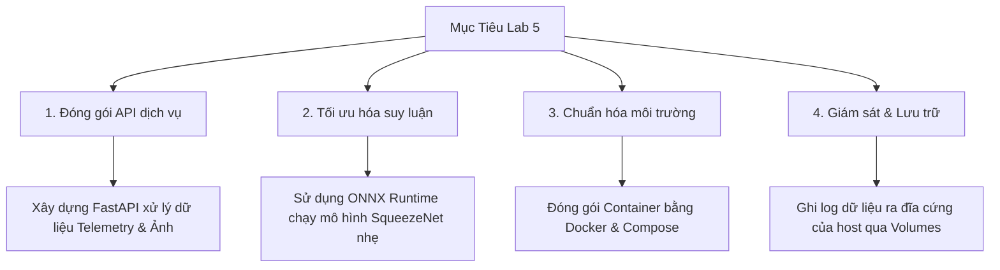

# 01. Tổng Quan Dự Án (Project Overview)

Chào mừng bạn đến với tài liệu hướng dẫn kỹ thuật cho dự án **Lab 5: Dịch vụ suy luận AIoT đa mô hình được Docker hóa (Dockerized Multi-Model AIoT Inference Service)**.

Tài liệu này được biên soạn bởi **Senior AIoT Architect** nhằm mục đích hướng dẫn chi tiết từ cấp độ cơ bản (dành cho học viên/sinh viên) đến nâng cao (chuẩn triển khai doanh nghiệp) về cách đưa các mô hình trí tuệ nhân tạo (AI/ML) từ môi trường nghiên cứu (Jupyter Notebook) lên hệ thống vận hành thực tế (Production).

---

## 1. Vấn Đề Thực Tế và Bối Cảnh Dự Án

Trong chu trình phát triển sản phẩm AIoT, việc huấn luyện mô hình (Model Training) chỉ chiếm khoảng 10-20% công sức. Thách thức lớn nhất nằm ở khâu **Triển khai (Deployment)**. 

### Thách thức 1: Khoảng cách giữa Nghiên cứu và Vận hành
* **Notebook**: Các kỹ sư AI thường viết code trên Jupyter Notebook (`.ipynb`), sử dụng các thư viện huấn luyện nặng như PyTorch, TensorFlow.
* **Production**: Các thiết bị phần cứng IoT (như cảm biến, vi điều khiển, camera IP) không thể tự chạy file `.ipynb`. Chúng cần các điểm cuối kết nối mạng dạng Web API (như REST API) để gửi dữ liệu và nhận kết quả dự báo tức thời.

### Thách thức 2: Sự khác biệt về môi trường ("Works on my machine")
* Code chạy tốt trên máy tính của kỹ sư phát triển nhưng gặp lỗi khi chạy trên máy chủ (Server) hoặc máy tính nhúng ở biên (Edge device) do lệch phiên bản thư viện, xung đột cổng mạng hoặc khác biệt hệ điều hành (Windows vs Linux).

### Thách thức 3: Hiệu năng phần cứng giới hạn ở biên
* Các thiết bị IoT biên thường chạy chip CPU cấu hình thấp. Việc cài đặt các framework học sâu nặng nề (PyTorch/TensorFlow) để chạy suy luận (Inference) là bất khả thi về mặt tài nguyên bộ nhớ và tốc độ xử lý.

---

## 2. Mục Tiêu của Dự Án Lab 5

Dự án này được thiết kế nhằm giải quyết các thách thức trên thông qua các mục tiêu cốt lõi:

* **API hóa mô hình**: Sử dụng **FastAPI** để xây dựng các API Endpoint nhận dữ liệu số cảm biến và dữ liệu hình ảnh.
* **Tối ưu hóa mô hình**: Chuyển đổi mô hình phân loại ảnh sang định dạng mở **ONNX** để chạy siêu nhẹ trên CPU.
* **Docker hóa dịch vụ**: Viết công thức **Dockerfile** và **Docker Compose** để đóng gói toàn bộ runtime, giúp ứng dụng có thể chạy nhất quán ở mọi nơi.
* **Giám sát hoạt động**: Thiết lập hệ thống ghi nhật ký (logging) tự động xuất ra file CSV để theo dõi sức khỏe và độ chính xác của mô hình.

---

## 3. Các Tính Năng Nổi Bật của Hệ Thống

1. **Xử lý đa luồng dữ liệu (Multi-Model Service)**:
   * **Telemetry (Dữ liệu số)**: Dự báo chỉ số cảm biến (Moving Average) và phát hiện dị thường (Z-Score Rule).
   * **Vision (Dữ liệu ảnh)**: Phân loại hình ảnh bằng mạng SqueezeNet pre-trained trên tập dữ liệu 1000 lớp ImageNet-1K.
2. **Giao diện Web trực quan (Embedded Demo UI)**:
   * Một trang giao diện tối (Dark mode) sang trọng, ứng dụng thiết kế kính mờ (Glassmorphism), cho phép người dùng kéo thả ảnh để test suy luận thời gian thực mà không cần viết code.
3. **Cơ chế lưu trữ log bền vững (Persistent Logging)**:
   * Đồng bộ hóa log từ container ra đĩa cứng vật lý của máy chủ để truy vết request và phục vụ cho việc cải tiến mô hình sau này.
