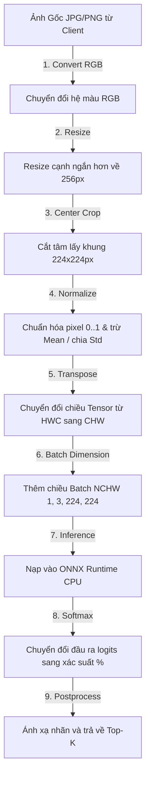

# 05. Quy Trình Suy Luận Của Mô Hình (Model Pipeline)

Dự án này tích hợp song song hai loại đường ống xử lý mô hình (Model Pipelines): xử lý dữ liệu telemetry cảm biến số và xử lý hình ảnh qua mô hình mạng nơ-ron tích chập (CNN) định dạng ONNX.

---

## 1. Đường Ống Xử Lý Dữ Liệu Cảm Biến (Sensor Pipeline)

Dữ liệu từ cảm biến gửi lên được xử lý bằng các quy tắc toán học nhanh gọn nhằm phát hiện dị thường và dự báo ngắn hạn.

### A. Phát hiện dị thường bằng thuật toán Z-Score
Thuật toán đo lường mức độ sai lệch của giá trị hiện tại ($x_{current}$) so với giá trị trung bình lịch sử ($\mu$) thông qua độ lệch chuẩn ($\sigma$):

$$\text{Score (Z)} = \frac{|x_{current} - \mu|}{\sigma}$$

* **Cơ chế xử lý**:
  1. Nhận chuỗi giá trị lịch sử `recent_values` (Yêu cầu $\ge 3$ điểm dữ liệu).
  2. Tính giá trị trung bình ($\mu$) và độ lệch chuẩn ($\sigma$). Nếu $\sigma \approx 0$, gán độ lệch chuẩn tối thiểu là $1e-6$ để tránh lỗi chia cho $0$.
  3. Tính điểm $Z$. Nếu $Z \ge \text{threshold\_z}$ (mặc định là 2.5), điểm dữ liệu được coi là **Dị thường (Anomaly)**.
  4. Trả về mức độ nghiêm trọng (`NORMAL`, `WARNING`, `HIGH`) để hỗ trợ ra quyết định.

---

## 2. Đường Ống Xử Lý Hình Ảnh (Vision Pipeline)

Mô hình phân loại ảnh được xây dựng trên cấu trúc mạng **SqueezeNet 1.1** lưu ở định dạng **ONNX**. 

### A. Chi tiết các bước tiền xử lý ảnh (Image Preprocessing)
Mô hình SqueezeNet được huấn luyện trên tập dữ liệu ImageNet yêu cầu đầu vào có định dạng ma trận rất nghiêm ngặt. Việc tiền xử lý được lập trình trong tệp `app/vision_inference.py`:

1. **Chuẩn hóa kích thước (Resizing & Cropping)**:
   * Giữ nguyên tỷ lệ ảnh gốc, thay đổi kích thước sao cho cạnh ngắn nhất bằng $256$ pixel.
   * Tiến hành cắt lấy trung tâm (Center Crop) một khung hình vuông kích thước $224 \times 224$ pixel.
2. **Chuẩn hóa giá trị Pixel (Normalization)**:
   * Quy đổi giá trị các điểm ảnh từ dải $[0, 255]$ về $[0.0, 1.0]$.
   * Thực hiện trừ giá trị trung bình (Mean) và chia cho độ lệch chuẩn (Standard Deviation) trên từng kênh màu R-G-B của tập ImageNet:
     $$\text{Pixel}_{\text{normalized}} = \frac{\text{Pixel} - \text{Mean}}{\text{Std}}$$
     * $\text{Mean} = [0.485, 0.456, 0.406]$
     * $\text{Std} = [0.229, 0.224, 0.225]$
3. **Chuyển đổi chiều mảng (Transpose & Batch Dimension)**:
   * Chuyển đổi định dạng lưu trữ từ `HWC` (Chiều cao, Chiều rộng, Số kênh màu) sang `CHW` (Kênh màu, Chiều cao, Chiều rộng).
   * Thêm một chiều ảo ở đầu (Batch size) để đưa Tensor về cấu hình đầu vào `[1, 3, 224, 224]` sẵn sàng đưa vào ONNX Session.

### B. Chạy suy luận & Hậu xử lý (Inference & Softmax)
* **ONNX Runtime**: Gọi hàm `session.run()` để thực thi suy luận trên CPU. Đầu ra trả về là một mảng 1000 giá trị điểm số (Logits) đại diện cho 1000 lớp đối tượng.
* **Hàm Softmax**: Để chuyển đổi các logits thô ($z_i$) thành xác suất phần trăm dễ hiểu ($p_i$), ta áp dụng công thức Softmax:
  $$p_i = \frac{e^{z_i}}{\sum_{j=1}^{1000} e^{z_j}}$$
* **Kết quả**: Sắp xếp các nhãn theo xác suất giảm dần và lấy ra Top-K phần tử đầu tiên để phản hồi cho client.
