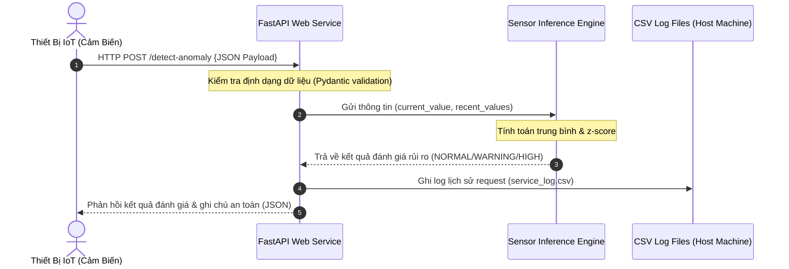
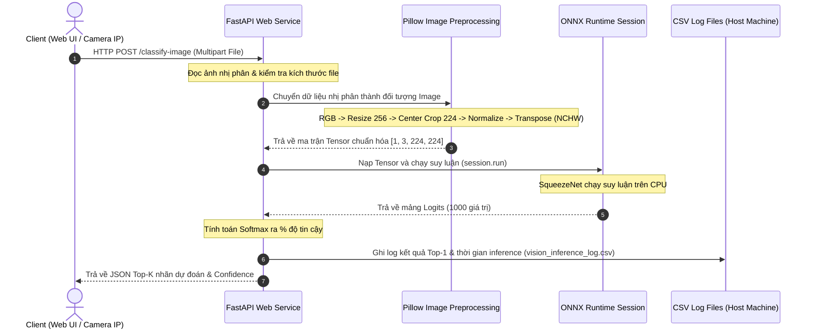

# 07. Luồng Dữ Liệu Trong Hệ Thống (Data Flow)

Hiểu rõ luồng dữ liệu (Data Flow) giúp bạn dễ dàng theo dõi đường đi của thông tin từ thiết bị IoT gửi lên, qua bộ xử lý AI, đến nơi lưu trữ log và quay ngược về người dùng dưới dạng kết quả hiển thị.

---

## 1. Luồng Dữ Liệu Cảm Biến (Telemetry Data Flow)

Dữ liệu cảm biến số đi qua quy trình xử lý tuần tự sau:

1. **Sinh dữ liệu**: Thiết bị IoT cảm biến (ví dụ cảm biến đo nhiệt độ) đo được chỉ số hiện tại và gửi gói tin JSON kèm lịch sử đo đạc trước đó lên API qua phương thức POST.
2. **Tiếp nhận & Validate**: FastAPI nhận gói tin, sử dụng Pydantic để kiểm tra xem dữ liệu gửi lên có đầy đủ và đúng định dạng số (`float`/`int`) hay không.
3. **Chạy suy luận**: FastAPI gọi module `sensor_inference.py`. Hệ thống tính toán điểm z-score và đưa ra mức độ cảnh báo.
4. **Lưu trữ lịch sử (Ghi Log)**: FastAPI gọi module `logging_utils.py` để bổ sung (append) thông tin gồm mốc thời gian (timestamp), endpoint được gọi, tên cảm biến và mức độ cảnh báo vào tệp `outputs/service_log.csv` nằm trên đĩa cứng máy host.
5. **Trả kết quả**: API đóng gói kết quả và gửi lại gói phản hồi JSON cho thiết bị IoT.

---

## 2. Luồng Dữ Liệu Hình Ảnh (Vision Data Flow)

Hình ảnh được gửi từ camera giám sát IoT hoặc giao diện kéo thả web chạy qua luồng xử lý song song phức tạp hơn:

1. **Upload ảnh**: Người dùng chọn ảnh hoặc camera gửi ảnh chụp nhị phân (Multipart Form Data) lên API `/classify-image`.
2. **Đọc và Tiền xử lý (Pillow)**: API nhận file, dùng thư viện Pillow để chuyển thành ảnh màu RGB, tiến hành resize, cắt tâm (center crop), chuẩn hóa kênh màu và đổi chiều ma trận để tạo thành Tensor chuẩn đầu vào.
3. **Suy luận (ONNX Runtime)**: Tensor được đưa vào phiên chạy của ONNX Runtime CPU. Mô hình SqueezeNet phân tích các đặc trưng hình học trong ảnh và xuất ra mảng điểm số logits của 1000 lớp.
4. **Hậu xử lý (Softmax)**: API áp dụng hàm Softmax để quy đổi logits thành tỷ lệ xác suất (%) tự tin, sắp xếp và lọc ra Top-K nhãn cao nhất.
5. **Ghi nhật ký hệ thống**: Log chi tiết (Tên tệp, Định dạng ảnh, Nhãn dự đoán Top-1, Tỷ lệ %, Thời gian suy luận bằng mili-giây) được ghi ngay vào tệp `outputs/vision_inference_log.csv`.
6. **Vẽ kết quả lên ảnh (Tùy chọn)**: Nếu Client gọi endpoint `/classify-image-annotated`, API sẽ vẽ nhãn Top-1 lên góc ảnh nhờ Pillow và gửi trả về luồng ảnh PNG (StreamingResponse) để người dùng xem trực quan.
