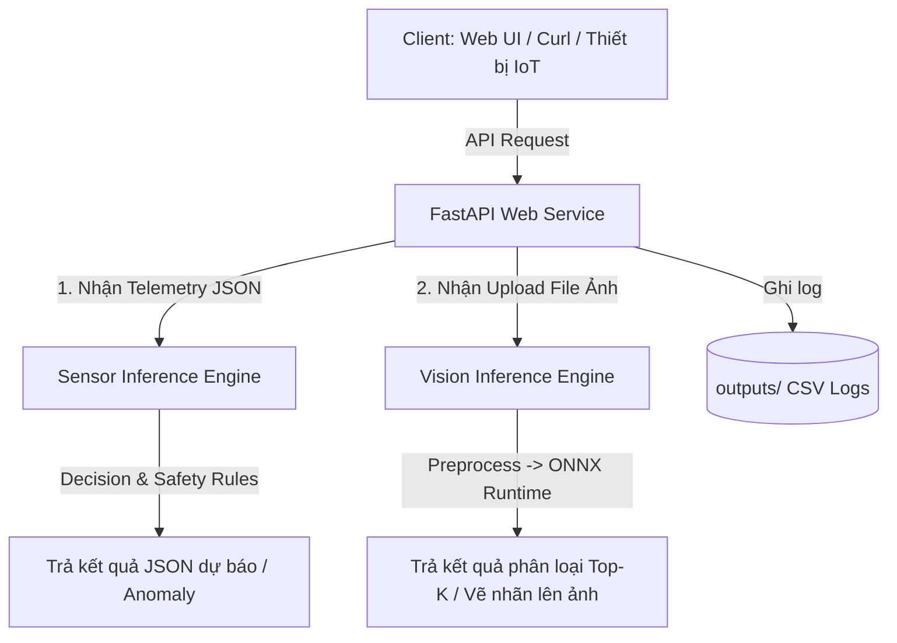

# Hướng Dẫn Phân Tích, Nghiên Cứu và Tìm Hiểu Lab 5 (Day-5)

Tài liệu này đóng vai trò là cẩm nang học tập giúp bạn nắm vững kiến trúc, luồng đi của dữ liệu và các công nghệ cốt lõi được áp dụng trong **Day-5 / Lab 5: Dockerized Multi-Model AI Inference Service for AIoT**.

---

## 1. Mục Tiêu của Lab 5

Trọng tâm của Lab 5 không phải là huấn luyện (training) AI model, mà là **triển khai (deployment) và đóng gói (packaging)**. Nó kết nối các kiến thức từ các ngày trước đó (dữ liệu cảm biến, phân tích dự báo) để đưa lên một hệ thống chạy dịch vụ thực tế.

* **Multi-Model**: Dịch vụ xử lý đồng thời cả dữ liệu dạng chuỗi thời gian (time-series) từ cảm biến và dữ liệu dạng hình ảnh (computer vision).
* **Dockerization**: Đóng gói toàn bộ runtime (Python, thư viện, model weights, API logic) thành một Docker Container độc lập, nhất quán, có thể chạy ở mọi nơi mà không bị lỗi môi trường.

---

## 2. Giải Mã Cấu Trúc Thư Mục

Thư mục `Day-5` bao gồm các tệp tin tài liệu lý thuyết và một dự án mẫu hoàn chỉnh:

```text
Day-5/
├── docs/                                   # Tài liệu hướng dẫn môn học (Word)
│   └── Lab_5_v4_Dockerized_Multi_Model_AI_Inference_Service_AIOT.docx
├── lab5_dockerized_multimodel_aiot_inference_service_v4_code.zip # Code dự án dạng nén
└── lab5_dockerized_multimodel_aiot_inference_service_v4/         # Mã nguồn giải nén (Dự án chính)
    ├── Dockerfile                          # Công thức đóng gói Docker Image
    ├── docker-compose.yml                  # Cấu hình điều phối chạy container
    ├── requirements.txt                    # Khai báo các thư viện Python cần thiết
    ├── RUN_GUIDE.md                        # Hướng dẫn chạy nhanh và debug
    ├── app/                                # Mã nguồn FastAPI
    ├── models/                             # Nơi lưu trữ Model AI
    ├── sample_images/                      # Ảnh mẫu để test upload
    ├── sample_requests/                    # Dữ liệu JSON mẫu để test API
    ├── outputs/                            # Nơi ghi log hoạt động của hệ thống
    ├── scripts/                            # Các kịch bản tự động tải model và test nhanh
    ├── tests/                              # Bộ kiểm thử tự động (Unit Tests)
    └── docs/                               # Tài liệu học tập chuyên sâu
```

---

## 3. Luồng Hoạt Động của Hệ Thống (Workflow)

Hệ thống hoạt động theo mô hình **Client - Server (API-driven)**:



### Chi tiết các luồng xử lý chính:

#### A. Luồng Xử Lý Dữ Liệu Cảm Biến (Sensor Inference)
* **Các Endpoint**: `/detect-anomaly` (phát hiện dị thường), `/forecast` (dự báo xu hướng chuỗi thời gian), `/predict-risk` (đánh giá mức độ rủi ro).
* **Cơ chế**: Nhận dữ liệu telemetry thời gian thực qua định dạng JSON, chạy thuật toán tính toán nhanh (Z-Score, Moving Average) và đưa ra quyết định cảnh báo dựa trên quy tắc an toàn (safety rules).

#### B. Luồng Xử Lý Hình Ảnh (Computer Vision Inference)
* **Các Endpoint**: `/classify-image` (trả về JSON Top-K nhãn dự đoán), `/classify-image-annotated` (trả về ảnh PNG đã được vẽ nhãn dự đoán trực tiếp lên góc ảnh).
* **Cơ chế**: 
  1. Client upload tệp tin ảnh qua API Multipart Form.
  2. Ảnh được PIL (Pillow) đọc và thực hiện **tiền xử lý (preprocess)**: resize về kích thước $224 \times 224$ px, chuẩn hóa kênh màu (mean, std) theo phân phối của tập ImageNet.
  3. Đưa Tensor ảnh vào **ONNX Runtime** để chạy suy luận (inference) cực nhanh thông qua model **SqueezeNet**.
  4. Trả về nhãn có xác suất cao nhất.

---

## 4. Phân Tích Sâu Các Tệp Tin Quan Trọng

### 1. `Dockerfile` - Công thức Đóng Gói
* Dự án sử dụng base image `python:3.11-slim` để giảm dung lượng tải xuống và tăng tốc độ khởi động.
* Cài đặt thêm thư viện `curl` phục vụ cho việc kiểm tra sức khỏe hệ thống (healthcheck).
* Sử dụng lệnh `pip install --no-cache-dir -r requirements.txt` để cài đặt thư viện sạch sẽ, không lưu bộ nhớ đệm (giúp image có dung lượng nhỏ hơn).
* Thiết lập các biến môi trường cấu hình đường dẫn (`MODEL_DIR`, `OUTPUT_DIR`,...) để code Python dễ dàng truy cập.

### 2. `docker-compose.yml` - Người Điều Phối
* Giúp quản lý việc khởi chạy container bằng file cấu hình thay vì gõ dòng lệnh `docker run` quá dài.
* **Volume Mapping** (`./outputs:/app/outputs`): Tạo đường liên kết dữ liệu giữa máy host và container. Khi container ghi log vào `/app/outputs/service_log.csv`, tệp tin này sẽ xuất hiện và được lưu trữ ngay trên ổ đĩa vật lý của máy bạn, tránh việc dữ liệu bị xóa mất khi tắt container.
* **Port Mapping** (`8001:8000`): Chuyển tiếp cổng `8001` của máy bạn vào cổng `8000` bên trong container.

### 3. `app/main.py` - Bộ Não của API
* Khởi tạo đối tượng `FastAPI` và định nghĩa các route cho ứng dụng.
* Tích hợp giao diện HTML đơn giản tại `/classify-image-demo` để người dùng không cần cài postman vẫn có thể trực quan hóa việc upload ảnh và kiểm tra độ chính xác của model.

### 4. `app/vision_inference.py` - Logic Suy Luận
* Chứa lớp `VisionClassifier`. Đây là nơi nạp model ONNX (`onnxruntime.InferenceSession`), thực hiện các công thức toán học tiền xử lý ảnh (chuyển đổi chiều kênh màu, crop ảnh) và thuật toán **Softmax** để quy đổi đầu ra (logits) của model thành xác suất (confidence) từ $0$ đến $1$.

---

## 5. Các Chủ Đề Nghiên Cứu và Học Tập Chuyên Sâu Từ Thư Mục Này

Để hiểu sâu hơn về kiến trúc hệ thống AIoT trong doanh nghiệp, bạn nên tự nghiên cứu các câu hỏi sau:

1. **Tính linh hoạt (Interoperability)**: Tại sao dự án lại chuyển đổi model sang định dạng `.onnx` thay vì chạy file `.pth` trực tiếp từ PyTorch? (Đọc thêm tài liệu: [model_formats_for_students.md](file:///e:/AIoT/Home-Work/Day-5/lab5_dockerized_multimodel_aiot_inference_service_v4/docs/model_formats_for_students.md)).
2. **Ảo hóa & Đóng gói**: Sự khác biệt cốt lõi về hiệu năng và tài nguyên khi deploy ứng dụng bằng Docker Container so với máy ảo VM truyền thống là gì? (Đọc thêm tài liệu: [docker_environment_comparison.md](file:///e:/AIoT/Home-Work/Day-5/lab5_dockerized_multimodel_aiot_inference_service_v4/docs/docker_environment_comparison.md)).
3. **Quy tắc an toàn (Decision Safety)**: Tại sao đầu ra của các thuật toán ML cảm biến không được truyền trực tiếp xuống cơ cấu chấp hành (actuators/relays) mà phải thông qua một tầng quy tắc đánh giá rủi ro (như hàm `risk_from_forecast`)?
