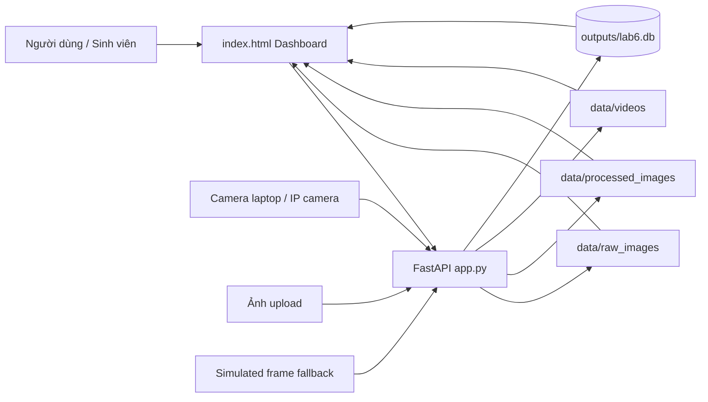

# Lab 6 - Tổng quan Computer Vision như cảm biến IoT

## 1. Mục tiêu của Lab 6

Lab 6 mô phỏng một hệ thống AIoT trong đó camera hoặc ảnh upload được xem như một cảm biến trực quan.

Trong các lab IoT truyền thống, cảm biến có thể là nhiệt độ, độ ẩm, ánh sáng hoặc chuyển động. Ở Lab 6, nguồn dữ liệu là hình ảnh. Backend nhận ảnh từ camera, upload hoặc luồng mô phỏng, sau đó lưu ảnh gốc, tạo ảnh xử lý, ghi metadata và sinh event để dashboard quan sát.

Mục tiêu học tập chính:

- Hiểu camera như một nguồn dữ liệu IoT.
- Biết cách backend nhận, xử lý và lưu ảnh.
- Phân biệt dữ liệu ảnh thô, ảnh đã xử lý, metadata và event.
- Quan sát pipeline xử lý ảnh đơn giản trước khi đi đến object detection ở các lab sau.
- Làm quen với FastAPI, OpenCV, PIL, SQLite database, WebSocket và dashboard HTML.

## 2. Thành phần chính

```text
lab6_cv_as_iot_sensor/
├── app.py
├── index.html
├── run_lab6_demo.py
├── requirements.txt
├── data/
│   ├── raw_images/
│   ├── processed_images/
│   └── videos/
├── outputs/
│   ├── lab6.db
│   └── lab6.log
└── docs/
```

Ý nghĩa từng nhóm:

- `app.py`: backend FastAPI, xử lý camera, upload, video, motion, metadata và event.
- `index.html`: dashboard web để sinh viên thao tác và quan sát kết quả.
- `run_lab6_demo.py`: script chạy thử nhanh không cần mở server hoặc camera thật.
- `data/raw_images/`: nơi lưu ảnh gốc.
- `data/processed_images/`: nơi lưu ảnh tổng hợp các bước xử lý.
- `data/videos/`: nơi lưu video ngắn.
- `outputs/lab6.db`: database SQLite lưu trữ thông tin camera, metadata ảnh, events và detections.
- `outputs/lab6.log`: file log hoạt động của hệ thống.

## 3. Ý tưởng kiến trúc

Lab này dùng kiến trúc đơn giản để dễ học:

- Frontend là một file HTML tĩnh kết nối WebSocket thời gian thực đến backend.
- Backend là một file Python FastAPI kết hợp OpenCV và SQLite.
- Dữ liệu được lưu trữ trực tiếp trong cơ sở dữ liệu SQLite cục bộ (`outputs/lab6.db`).
- Ảnh và video được lưu trực tiếp trên filesystem.
- Nếu không mở được camera thật, hệ thống dùng frame mô phỏng để bài lab vẫn chạy được.

Kiến trúc này rất phù hợp để học nguyên lý AIoT vì dữ liệu lưu trữ trực quan và giao diện phản hồi tức thì nhờ WebSocket.

## 4. Diagram tổng quan



## 5. Cách đọc Lab 6 theo tư duy AIoT

Một hệ thống AIoT thường có các lớp:

| Lớp | Trong Lab 6 |
|---|---|
| Sensor layer | Camera, ảnh upload, simulated frame |
| Ingestion layer | API `/snapshot`, `/upload-image`, `/motion-capture`, `/video_feed` |
| Processing layer | OpenCV resize, grayscale, threshold, edge, motion diff, ONNX YOLO |
| Storage layer | `data/` và `outputs/lab6.db` |
| Event layer | WebSocket real-time alerts & SQLite events table |
| Visualization layer | `index.html` dashboard |

Điểm quan trọng: ảnh không chỉ là file media. Trong AIoT, ảnh trở thành dữ liệu cảm biến có thể đo, ghi log, phân tích chất lượng và sinh event.
