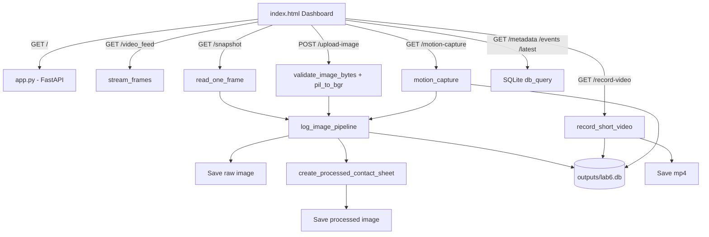

# Kiến trúc Lab 6

## 1. Kiến trúc tổng thể

Lab 6 được thiết kế theo mô hình client-server đơn giản:

- Client: `index.html`, chạy trong trình duyệt.
- Server: `app.py`, chạy FastAPI bằng `uvicorn`.
- Storage: thư mục local `data/` và `outputs/`.

Backend vừa phục vụ giao diện, vừa cung cấp API xử lý ảnh.



## 2. Vai trò từng file chính

### `app.py`

`app.py` là backend trung tâm của Lab 6.

Nhiệm vụ:

- Khởi tạo thư mục dữ liệu.
- Định nghĩa và khởi tạo SQLite schema (bảng cameras, images, events, detections).
- Cung cấp API FastAPI.
- Đọc camera thật hoặc tạo frame mô phỏng qua CameraManager.
- Nhận ảnh upload.
- Ghi ảnh gốc vào `data/raw_images/`.
- Tạo ảnh xử lý bốn bước vào `data/processed_images/`.
- Ghi video vào `data/videos/`.
- Ghi metadata, event và kết quả detection vào `outputs/lab6.db`.
- Trả dữ liệu JSON cho dashboard.

Các nhóm hàm trong `app.py`:

| Nhóm | Hàm tiêu biểu | Vai trò |
|---|---|---|
| Time/DB/path | `now_iso`, `get_db`, `db_insert`, `db_query`, `relative_url` | Hỗ trợ tương tác SQLite và tạo URL file |
| Image validation/conversion | `validate_image_bytes`, `pil_to_bgr`, `frame_to_jpeg_bytes` | Đọc và chuyển đổi ảnh |
| Image processing | `compute_brightness`, `create_processed_contact_sheet`, `log_image_pipeline` | Xử lý ảnh và ghi dữ liệu |
| Camera/video | `simulated_frame`, `open_capture`, `stream_frames`, `record_short_video` | Làm việc với camera hoặc frame mô phỏng |
| Motion | `motion_capture` | Phát hiện chuyển động bằng MOG2 hoặc frame diff |
| API endpoints | các hàm có decorator `@app.get`, `@app.post` | Giao tiếp với frontend |

### `index.html`

`index.html` là dashboard frontend.

Nhiệm vụ:

- Hiển thị giao diện điều khiển camera.
- Cho nhập `source` camera.
- Bật/tắt live stream.
- Gọi snapshot.
- Gọi ghi video 5 giây.
- Gọi motion capture.
- Upload ảnh từ máy.
- Hiển thị ảnh gốc mới nhất.
- Hiển thị ảnh xử lý bốn bước.
- Hiển thị số lượng metadata và event.
- Hiển thị bảng metadata/event mới nhất.
- Kết nối WebSocket để cập nhật real-time dữ liệu mà không cần polling liên tục.
- Tự động đồng bộ hóa dữ liệu định kỳ mỗi 3 giây thông qua `refreshDashboard()`.

Frontend không xử lý ảnh trực tiếp. Nó chỉ gọi API và hiển thị kết quả backend trả về.

### `run_lab6_demo.py`

`run_lab6_demo.py` là script kiểm tra nhanh pipeline local.

Nhiệm vụ:

- Import trực tiếp các hàm từ `app.py`.
- Tạo hai frame mô phỏng bằng `simulated_frame`.
- Gọi `log_image_pipeline` để sinh ảnh, metadata và event.
- Gọi `record_short_video` với fallback camera.
- Gọi `motion_capture` với fallback camera.
- Ghi kết quả vào `RUN_TEST_LOG.txt`.

Script này hữu ích khi:

- Chưa muốn chạy server.
- Máy không có camera.
- Muốn kiểm tra nhanh thư mục output có được tạo không.
- Muốn xác minh pipeline ảnh/video/event chạy được.

## 3. Các thư mục dữ liệu

### `data/raw_images/`

Chứa ảnh gốc do hệ thống nhận được. Ảnh có thể đến từ:

- Upload file.
- Snapshot camera.
- Motion capture.
- Frame mô phỏng.

Tên file dạng:

```text
img_<10 ký tự uuid>.jpg
```

### `data/processed_images/`

Chứa contact sheet xử lý ảnh. Mỗi ảnh là một ảnh tổng hợp 2x2:

- Resize.
- Grayscale.
- Threshold.
- Edge.

Tên file dạng:

```text
img_<10 ký tự uuid>_processed_steps.jpg
```

### `data/videos/`

Chứa video ngắn được ghi từ camera hoặc simulated stream.

Tên file dạng:

```text
vid_<10 ký tự uuid>.mp4
```

### `outputs/`

Chứa cơ sở dữ liệu và file log:

- `lab6.db`: Database SQLite chứa các bảng `cameras`, `images`, `events`, `detections`.
- `lab6.log`: File ghi log hoạt động của backend.

## 4. Vì sao dùng SQLite thay vì CSV?

SQLite giúp bài lab tiệm cận thiết kế AIoT thực tế hơn:

- Query linh hoạt: Cho phép phân tích dữ liệu, đếm số lượng bản ghi bằng câu lệnh SQL (`GET /stats`).
- Concurrent safe: Tránh xung đột ghi file khi nhiều camera/luồng hoạt động đồng thời (bật chế độ WAL).
- Dữ liệu có cấu trúc rõ ràng: Định nghĩa kiểu dữ liệu và chỉ mục (Index) giúp tìm kiếm nhanh.
