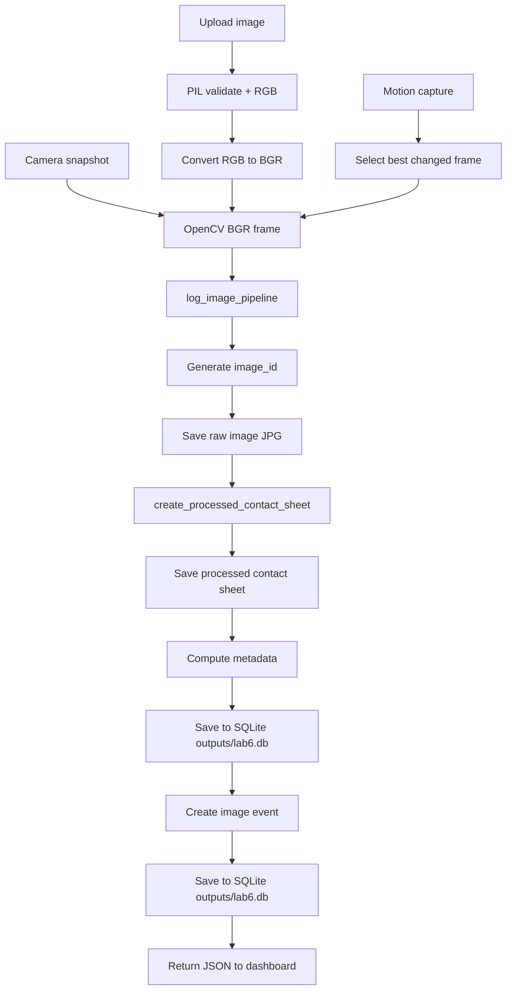
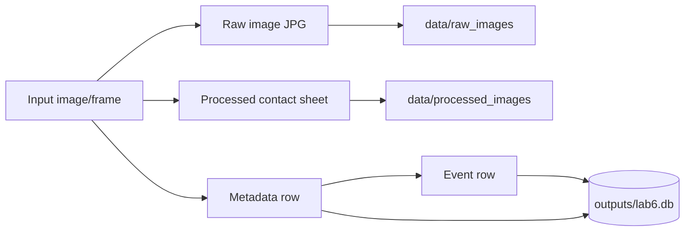

# Image Pipeline Lab 6

## 1. Luồng dữ liệu ảnh

Lab 6 có ba nguồn ảnh chính:

- Upload ảnh từ dashboard.
- Snapshot từ camera.
- Frame được chọn trong motion capture.

Sau khi có frame OpenCV BGR, hệ thống chạy chung qua `log_image_pipeline()`.



## 2. Hàm `log_image_pipeline()`

Vai trò: đây là hàm trung tâm của pipeline ảnh.

Input:

| Tham số | Ý nghĩa |
|---|---|
| `frame_bgr` | Ảnh dạng OpenCV BGR |
| `source_type` | Nguồn ảnh: `upload`, `camera`, `simulated`, `motion_capture`, `demo_script` |
| `device_id` | Định danh thiết bị hoặc client |
| `note` | Ghi chú thêm, ví dụ filename hoặc motion score |

Các bước xử lý:

1. Tạo `image_id` dạng `img_<uuid>`.
2. Lấy timestamp hiện tại bằng `now_iso()`.
3. Lưu ảnh gốc vào `data/raw_images/`.
4. Gọi `create_processed_contact_sheet()` để tạo ảnh xử lý.
5. Lấy brightness, width, height, processing time.
6. Tạo một dòng metadata.
7. Ghi metadata vào bảng `images` của SQLite database (`outputs/lab6.db`).
8. Dựa vào brightness để tạo event:
   - Nếu brightness `< 70`: event `LOW_LIGHT`, severity `WARNING`.
   - Ngược lại: event `IMAGE_PROCESSED`, severity `NORMAL`.
9. Ghi event vào bảng `events` của SQLite database (`outputs/lab6.db`).
10. Trả JSON cho API caller.

Output chính:

```json
{
  "image_id": "img_xxxxxxxxxx",
  "metadata": {},
  "event": {},
  "raw_image_url": "/files/data/raw_images/img_xxxxxxxxxx.jpg",
  "processed_image_url": "/files/data/processed_images/img_xxxxxxxxxx_processed_steps.jpg"
}
```

Ý nghĩa học tập:

- Đây là điểm nối giữa computer vision và IoT logging.
- Một frame ảnh được biến thành cả file ảnh, metadata và event.
- Sinh viên có thể thấy rõ một input ảnh tạo ra nhiều loại output khác nhau.

## 3. Hàm `create_processed_contact_sheet()`

Vai trò: tạo một ảnh tổng hợp để quan sát các bước tiền xử lý ảnh.

Input:

| Tham số | Ý nghĩa |
|---|---|
| `frame_bgr` | Ảnh gốc dạng OpenCV BGR |
| `image_id` | ID để đặt tên file output |

Các bước:

1. Bắt đầu đo thời gian bằng `time.perf_counter()`.
2. Resize ảnh về `320x240`.
3. Chuyển ảnh sang grayscale.
4. Threshold grayscale với ngưỡng cố định `120`.
5. Chạy Canny edge detection với ngưỡng `80` và `160`.
6. Chuyển grayscale, threshold và edge về BGR để ghép ảnh.
7. Thêm label vào từng tile.
8. Ghép thành contact sheet 2x2:
   - `1. RESIZE`
   - `2. GRAYSCALE`
   - `3. THRESHOLD`
   - `4. EDGE`
9. Lưu file vào `data/processed_images/`.
10. Tính `processing_time_ms`.
11. Tính thống kê: brightness, width, height.

Output:

```text
(processed_path, elapsed_ms, stats)
```

Trong đó:

- `processed_path`: đường dẫn ảnh xử lý.
- `elapsed_ms`: thời gian xử lý tính bằng millisecond.
- `stats`: gồm `brightness`, `width`, `height`.

Ý nghĩa từng bước xử lý:

| Bước | Ý nghĩa |
|---|---|
| Resize | Chuẩn hóa kích thước để xử lý nhanh hơn |
| Grayscale | Giảm ảnh màu thành ảnh một kênh để xử lý đơn giản hơn |
| Threshold | Tách vùng sáng/tối theo ngưỡng |
| Edge | Tìm biên, cạnh, đường viền trong ảnh |

Đây chưa phải mô hình AI, nhưng là tiền xử lý nền tảng trước object detection hoặc segmentation.

## 4. Hàm `motion_capture()`

Vai trò: phát hiện chuyển động đơn giản bằng cách so sánh frame liên tiếp.

Input:

| Tham số | Ý nghĩa |
|---|---|
| `source` | Camera index hoặc URL |
| `seconds` | Thời gian quan sát |
| `threshold` | Ngưỡng khác biệt pixel |
| `min_area` | Tổng diện tích chuyển động tối thiểu để coi là có motion |

Các bước:

1. Giới hạn `seconds` trong khoảng 1 đến 30.
2. Mở camera bằng `open_capture(source)`.
3. Nếu không mở được camera, dùng `simulated_frame()`.
4. Với mỗi frame:
   - Resize về `320x240`.
   - Chuyển sang grayscale.
   - So sánh với frame trước bằng `cv2.absdiff`.
   - Threshold ảnh difference.
   - Tìm contour vùng thay đổi.
   - Tính `score` bằng tổng diện tích contour.
5. Lưu lại frame có `score` lớn nhất.
6. Gọi `log_image_pipeline()` để lưu frame tốt nhất.
7. So sánh `best_score` với `min_area`.
8. Ghi thêm motion event:
   - `MOTION_DETECTED` nếu `best_score >= min_area`.
   - `NO_SIGNIFICANT_MOTION` nếu nhỏ hơn.

Điểm cần chú ý:

- `threshold` quyết định pixel thay đổi bao nhiêu thì được xem là khác.
- `min_area` quyết định thay đổi lớn bao nhiêu thì được xem là motion đáng kể.
- Hàm này sinh hai event khi có ảnh motion:
  - Event từ `log_image_pipeline()`, ví dụ `IMAGE_PROCESSED`.
  - Event motion riêng, ví dụ `MOTION_DETECTED`.

## 5. Raw image, processed image, metadata và event log



Phân biệt nhanh:

| Output | Bản chất | Dùng để làm gì |
|---|---|---|
| Raw image | File ảnh gốc | Xem lại dữ liệu đầu vào |
| Processed image | File ảnh minh họa xử lý | Học và debug pipeline CV |
| Metadata | Dòng mô tả ảnh | Truy vấn, thống kê, audit |
| Event | Dòng sự kiện | Cảnh báo, dashboard, automation |
