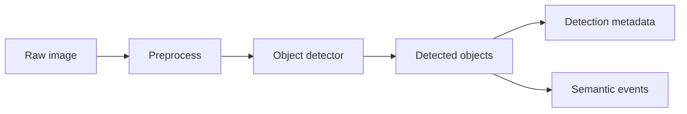

# Development Roadmap cho Lab 6

## 1. Mục tiêu nâng cấp

Lab 6 hiện phù hợp cho học tập vì đơn giản, dễ chạy và dễ quan sát. Nếu phát triển theo hướng sản phẩm AIoT, có thể nâng cấp theo các hướng sau:

- Dashboard tốt hơn.
- API schema rõ hơn.
- Event severity chi tiết hơn.
- Image quality check đầy đủ hơn.
- Object detection.
- Docker hóa.
- Lưu trữ bằng database.
- Tách module backend.

## 2. Nâng cấp dashboard

Hiện tại dashboard đã có:

- Live stream.
- Snapshot.
- Upload ảnh.
- Ghi video 5 giây.
- Motion capture.
- Ảnh gốc mới nhất.
- Ảnh xử lý mới nhất.
- Bảng metadata/event.

Hướng nâng cấp:

- Thêm filter theo `source_type`, `device_id`, `event_type`, `severity`.
- Thêm timeline event.
- Thêm preview nhiều ảnh gần nhất thay vì chỉ ảnh mới nhất.
- Thêm trạng thái camera online/offline.
- Thêm biểu đồ brightness theo thời gian.
- Thêm biểu đồ số event theo loại.
- Thêm modal xem chi tiết một ảnh.
- Thêm nút download raw image, processed image, CSV log.
- Thêm trạng thái loading/error rõ ràng cho mỗi thao tác API.

## 3. Nâng cấp API schema

Hiện tại API trả dict Python trực tiếp. Với sản phẩm thật, nên định nghĩa schema bằng Pydantic.

Đề xuất:

- `ImageMetadata`
- `ImageEvent`
- `ImagePipelineResponse`
- `VideoRecordResponse`
- `MotionCaptureResponse`
- `ErrorResponse`

Lợi ích:

- API docs `/docs` rõ hơn.
- Frontend dễ biết field nào tồn tại.
- Giảm lỗi khi thay đổi response.
- Dễ test tự động.

Ví dụ hướng thiết kế:

```text
ImagePipelineResponse
├── image_id
├── metadata
├── event
├── raw_image_url
└── processed_image_url
```

## 4. Nâng cấp event severity

Hiện tại chỉ có `NORMAL` và `WARNING`.

Có thể mở rộng:

| Severity | Ý nghĩa |
|---|---|
| `INFO` | Thông tin bình thường |
| `NORMAL` | Trạng thái ổn |
| `WARNING` | Cần chú ý |
| `CRITICAL` | Cần phản ứng ngay |
| `ERROR` | Lỗi hệ thống hoặc pipeline |

Ví dụ rule:

- Brightness dưới 70: `WARNING`.
- Brightness dưới 20: `CRITICAL`.
- Không đọc được camera: `ERROR` hoặc `WARNING`.
- Object detection thấy người trong khu vực cấm: `CRITICAL`.
- Upload file không hợp lệ: `ERROR`.

## 5. Nâng cấp image quality check

Hiện tại chỉ kiểm tra brightness.

Có thể thêm:

- Blur detection bằng variance of Laplacian.
- Độ tương phản.
- Kích thước tối thiểu.
- Tỷ lệ ảnh bất thường.
- Tỷ lệ vùng quá tối/quá sáng.
- Kiểm tra ảnh toàn đen/toàn trắng.
- Kiểm tra file quá lớn.
- Kiểm tra định dạng ảnh.

Ví dụ metadata mở rộng:

| Field | Ý nghĩa |
|---|---|
| `blur_score` | Độ nét |
| `contrast_score` | Độ tương phản |
| `quality_status` | `good`, `low_light`, `blurry`, `overexposed` |
| `quality_warnings` | Danh sách cảnh báo |

## 6. Nâng cấp object detection

Lab 6 mới làm preprocessing. Bước tiếp theo hợp lý là object detection.

Có thể dùng:

- YOLOv8/YOLOv11.
- OpenCV DNN.
- MediaPipe.
- TensorFlow Lite nếu muốn triển khai edge.

Pipeline mở rộng:



Event mới có thể là:

- `PERSON_DETECTED`
- `VEHICLE_DETECTED`
- `UNKNOWN_OBJECT`
- `NO_OBJECT_DETECTED`
- `ZONE_INTRUSION`

Metadata mới có thể lưu:

- `object_count`
- `classes`
- `confidence_avg`
- `bounding_boxes_path`
- `annotated_image_path`

## 7. Docker hóa

Docker giúp chạy thống nhất giữa các máy.

Đề xuất file:

```text
Dockerfile
docker-compose.yml
.dockerignore
```

Dockerfile nên:

- Dùng Python image ổn định.
- Cài dependency từ `requirements.txt`.
- Copy source.
- Expose port `8000`.
- Chạy `uvicorn app:app --host 0.0.0.0 --port 8000`.

Lưu ý camera trong Docker:

- Camera laptop trên Windows/macOS khó map trực tiếp vào container.
- IP camera/RTSP phù hợp hơn với Docker.
- Nếu cần camera USB trên Linux, phải mount device như `/dev/video0`.

## 8. Nâng cấp lưu trữ

CSV phù hợp cho lab. Sản phẩm thật nên cân nhắc:

- SQLite cho demo local.
- PostgreSQL cho backend sản phẩm.
- Object storage cho ảnh/video.
- TimescaleDB hoặc event store nếu event nhiều.

Thiết kế bảng cơ bản:

```text
images
├── image_id
├── device_id
├── timestamp
├── source_type
├── image_path
├── processed_path
├── width
├── height
└── brightness

events
├── event_id
├── image_id
├── timestamp
├── event_type
├── score
├── severity
├── explanation
└── action_hint
```

## 9. Tách module backend

Hiện tại `app.py` chứa mọi thứ để dễ học. Khi lớn hơn, nên tách:

```text
app/
├── main.py
├── config.py
├── api/
│   ├── image.py
│   ├── camera.py
│   └── logs.py
├── services/
│   ├── image_pipeline.py
│   ├── motion.py
│   └── video.py
├── repositories/
│   └── csv_store.py
└── schemas/
    └── models.py
```

Lợi ích:

- Dễ test từng phần.
- Dễ mở rộng.
- Dễ thay CSV bằng database.
- Dễ cho nhiều sinh viên cùng phát triển.

## 10. Roadmap đề xuất theo giai đoạn

### Giai đoạn 1: Củng cố lab

- Thêm Pydantic response models.
- Thêm test cho `create_processed_contact_sheet`.
- Thêm test cho `log_image_pipeline`.
- Thêm validate file upload size/type.

### Giai đoạn 2: Dashboard học tập

- Thêm filter event.
- Thêm chart brightness.
- Thêm gallery ảnh mới nhất.
- Thêm trạng thái camera.

### Giai đoạn 3: AI inference

- Thêm object detection.
- Lưu ảnh annotated.
- Ghi detection metadata.
- Sinh event theo object class.

### Giai đoạn 4: Productization

- Docker.
- Database.
- Authentication.
- Device registry.
- Alert notification.
- Deployment lên edge device hoặc cloud.
