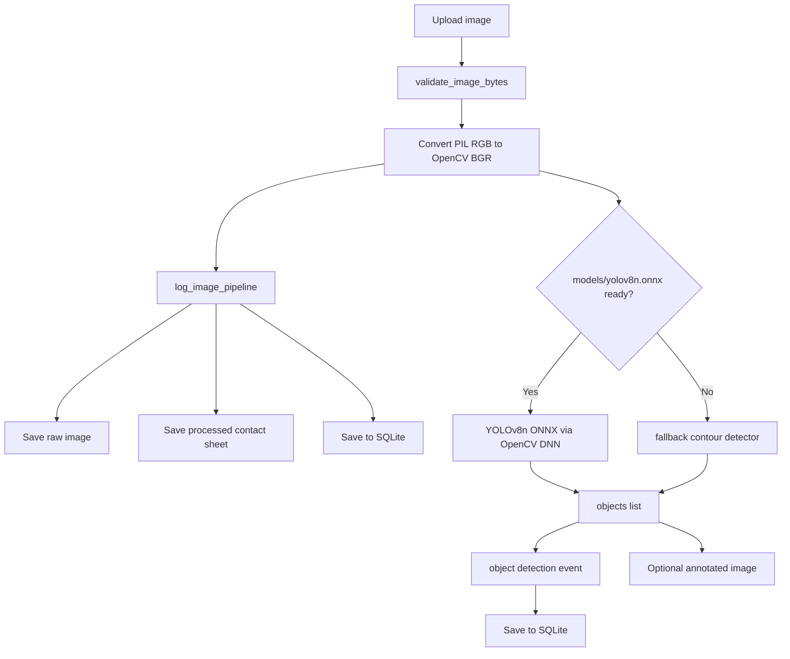

# Object Detection Upgrade cho Lab 6

## 1. Mục tiêu

Bản nâng cấp này mở rộng Lab 6 từ motion detection cơ bản sang object detection để chuẩn bị cho Lab 7.

Lab 6 gốc vẫn giữ nguyên:

- Camera stream.
- Snapshot.
- Upload image.
- Motion capture.
- Raw image.
- Processed image.
- SQLite Database.

Phần mới bổ sung:

- Endpoint detect object.
- Endpoint detect object kèm ảnh annotated.
- Ghi visual event cho object detection.
- Dashboard hiển thị ảnh có bounding box và bảng object list.

## 2. Model YOLOv8n ONNX

Backend ưu tiên dùng file:

```text
models/yolov8n.onnx
```

Nếu file này tồn tại và OpenCV đọc được, hệ thống dùng OpenCV DNN để chạy YOLO.

Nếu file chưa có hoặc load lỗi, backend không crash. Hệ thống chuyển sang fallback detector tên:

```text
fallback_contour
```

Fallback này không phải object detection thật. Nó chỉ tìm các vùng màu/đậm nổi bật bằng contour để sinh bounding box minh họa. Mục đích là giúp sinh viên vẫn quan sát được format response, ảnh annotated và event khi chưa cài model.

## 3. Endpoint mới

### `POST /detect-objects`

Nhận ảnh upload và trả JSON object detection.

Input:

| Field | Loại | Bắt buộc | Mô tả |
|---|---|---:|---|
| `file` | multipart image | Có | Ảnh cần detect |
| `device_id` | query string | Không | Mặc định `object_detection_client` |

Output chính:

```json
{
  "image_id": "img_xxxxxxxxxx",
  "objects": [
    {
      "class_name": "person",
      "confidence": 0.8123,
      "bbox": {"x1": 10, "y1": 20, "x2": 220, "y2": 310}
    }
  ],
  "event_type": "OBJECTS_DETECTED",
  "severity": "NORMAL",
  "decision": "objects_detected",
  "detector_mode": "yolov8n_onnx"
}
```

Endpoint này vẫn lưu raw image, processed contact sheet, metadata và event.

### `POST /detect-objects-annotated`

Giống `/detect-objects`, nhưng còn vẽ bounding box lên ảnh và lưu ảnh annotated.

Output có thêm:

```json
{
  "annotated_image_url": "/files/data/processed_images/img_xxxxxxxxxx_objects_annotated.jpg",
  "annotated_path": "data/processed_images/img_xxxxxxxxxx_objects_annotated.jpg"
}
```

Ảnh annotated được lưu tại:

```text
data/processed_images/
```

## 4. Event mới

Object detection ghi event vào bảng `events` của cơ sở dữ liệu:

```text
outputs/lab6.db
```

Các event type có thể gặp:

| Event type | Ý nghĩa |
|---|---|
| `OBJECTS_DETECTED` | YOLO ONNX phát hiện object |
| `NO_OBJECTS_DETECTED` | Không object nào vượt ngưỡng |
| `OBJECT_DETECTION_FALLBACK` | Chưa có YOLO model, fallback contour tìm được vùng ảnh |

Severity:

| Severity | Ý nghĩa |
|---|---|
| `NORMAL` | YOLO chạy bình thường hoặc không có object là trạng thái hợp lệ |
| `WARNING` | Đang dùng fallback vì model chưa sẵn sàng |

## 5. Luồng xử lý



## 6. Dashboard

Dashboard có thêm:

- Nút `Detect JSON`.
- Nút `Detect annotated`.
- Preview `Object detection`.
- Bảng `Object detection result`.

Cách demo:

1. Chọn ảnh ở khu vực Upload image.
2. Bấm `Detect JSON` để xem response object detection.
3. Bấm `Detect annotated` để vẽ bounding box.
4. Quan sát:
   - `image_id`
   - `event_type`
   - `severity`
   - `decision`
   - `class_name`
   - `confidence`
   - `bbox`

Nếu `detector_mode` là `fallback_contour`, giải thích cho sinh viên rằng hệ thống đang mô phỏng format object detection vì chưa có model YOLO.

## 7. Chuẩn bị cho Lab 7

Trong Lab 7, có thể nâng cấp tiếp:

- Tải YOLOv8n ONNX chính thức vào `models/yolov8n.onnx`.
- Cho phép chỉnh `confidence_threshold` từ dashboard.
- Lưu detection metadata riêng vào database.
- Thêm class filter, ví dụ chỉ cảnh báo khi có `person`.
- Vẽ màu bbox theo class.
- Chạy detection trên snapshot camera thay vì chỉ upload image.
- Nâng cấp tối ưu hóa cơ sở dữ liệu.
